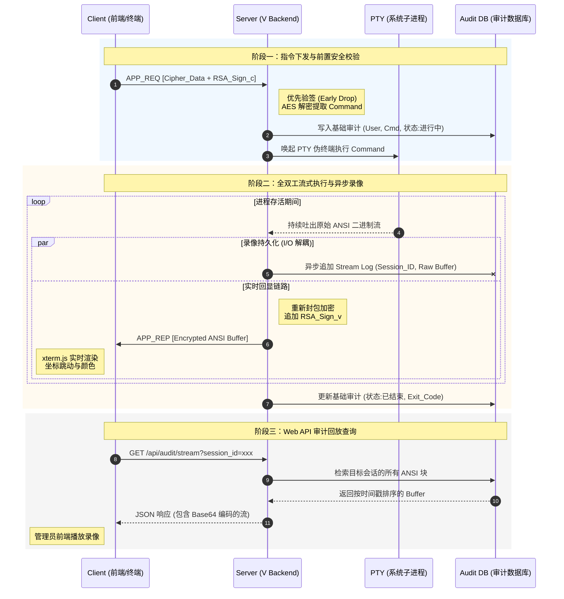
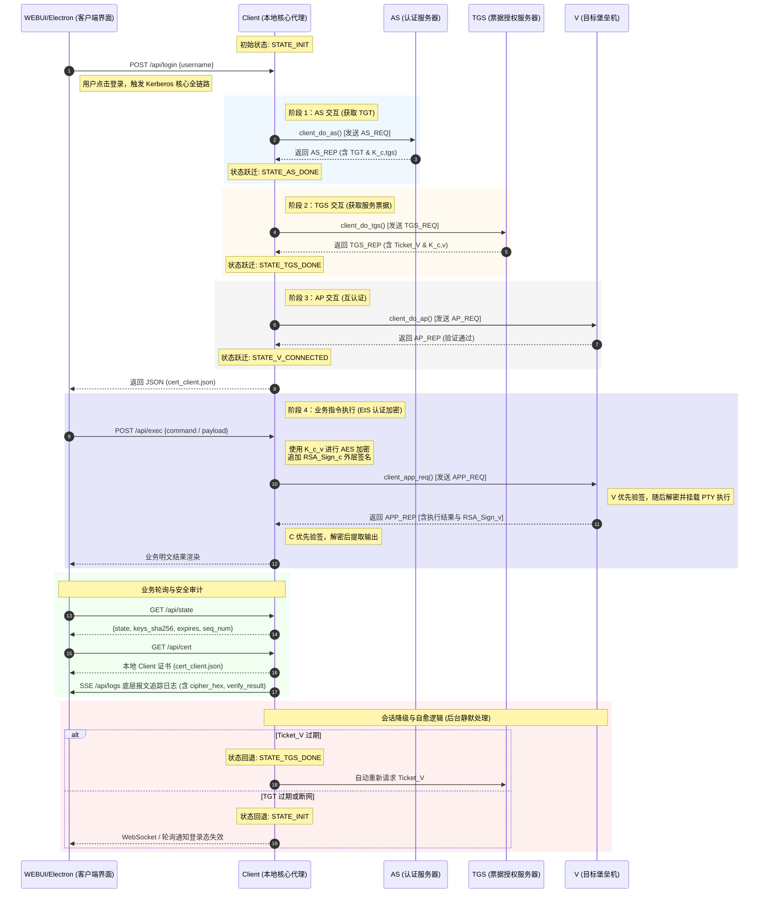

<style>
#write h1, 
#write h2 {
    border-bottom: none ! important; /* 彻底移除标题下方的横线 */
    padding-bottom: 0 ! important;   /* 移除因下划线留出的内边距 */
}
@media print {
    /* 增加段落行高 */
    #write p, #write li {
        line-height: 1.8 ! important;
    }
    /* 增加标题上方间距，防止标题紧贴上方正文 */
    #write h1, #write h2, #write h3 {
        margin-top: 1.6em ! important;
        margin-bottom: 0.8em ! important;
    }
    /* 调整列表项之间的距离 */
    #write li {
        margin-bottom: 0.4em ! important;
    }
}
</style>

# 基于 Kerberos 的安全通信系统 — 详细设计说明书

## 目录

1. [全局统一规范](#第一章全局统一规范)
2. [加密模块设计](#第二章加密模块设计)
3. [AS 认证服务器模块](#第三章as认证服务器模块设计)
4. [TGS 票据许可服务器模块](#第四章tgs票据许可服务器模块设计)
5. [V 应用服务器模块](#第五章v应用服务器模块设计)
6. [Client 客户端模块](#第六章client客户端模块设计)
7. [封包与拆包详细设计](#第七章封包与拆包详细设计)
8. [自定义证书设计](#第八章自定义证书设计)
9. [完整通信时序规范](#第九章完整通信时序规范)
10. [测试用例清单](#第十章测试用例清单)
11. [工程目录结构](#第十一章推荐工程目录结构)
12. [关键算法伪代码](#第十二章关键算法伪代码)

---

## 成员分工

|    小组成员    |                         分工                         |
| :------------: | :--------------------------------------------------: |
| 冯仕杰（组长） |     负责 AS, TGS, V 的通信加密逻辑和 V 业务部署      |
| 施博轩，陶方阳 | 负责 Client 部分的通信加密逻辑，Restful API 接口设计 |
| Sarah Tanujaya |                负责 Client WEBUI 设计                |

---

## 技术栈

- Golang
- typescript (Xterm.js)
- Electron
- python

# 第一章　全局统一规范

## 设计原则与强制约束

在分布式安全系统中，任何细节上的不一致都可能导致严重的安全漏洞或互操作性故障。因此，本项目在工程层面设立以下几条不可违反的强制约束，所有开发成员必须严格遵守。

**字节序约束**：所有整型字段（`uint8_t`、`uint16_t`、`uint32_t`、`uint64_t`）在网络传输中严格采用 **大端序（Big-Endian / Network Byte Order）**。（例如在 C/C++ 中应使用 `htonl()`/`ntohl()` 或自实现的宏完成转换；在 Python 中应使用 `struct.pack('>I', val)` 格式字符串显式指定大端）

**内存对齐约束**：所有协议结构体必须使用 `#pragma pack(push, 1)` / `#pragma pack(pop)` 包裹，完全禁止编译器隐式插入 Padding 字节。协议规范给出了精确的字节偏移布局，任何 Padding 都会导致字段错位。

**版本兼容约束**：协议版本号固定为 `0x01`。若将来需要扩展协议字段，必须同时递增版本号，并更新本文档中的内存布局图。任何接收方在解析报文时，遇到不支持的版本号必须立即返回 `ERR_VERSION_UNSUPPORTED` 并丢弃报文

## 网络与封包拆包错误（-1000 段）

统一的错误码体系是保证系统可调试性的基础。所有节点的所有函数返回 `uint32_t`，其中 `0`（`KRB_OK`）表示成功，所有负数表示不同类别的错误。错误码按模块分段，便于快速定位问题所在层次

### 设计原则与强制约束

| 错误码 | 宏定义 | 适用模块 | 触发场景 | 处理策略 |
|--------|--------|----------|----------|----------|
| `0` | `KRB_OK` | 全局 | 操作成功 | 继续执行 |
| `-1001` | `ERR_MAGIC_MISMATCH` | 拆包 | 接收到的前 2 字节不为 `0x4B45`，说明非 Kerberos 报文或数据被严重损坏 | 立即丢弃该报文，记录 WARN 级别日志（含对端 IP），关闭该连接 |
| `-1002` | `ERR_VERSION_UNSUPPORTED` | 拆包 | Version 字段值不为 `0x01` | 发送错误响应后断开连接，记录日志（含实际版本号） |
| `-1003` | `ERR_MSG_TYPE_INVALID` | 拆包 | MSG_TYPE 超出 `0x01`~`0x04` 已定义范围 | 丢弃报文，记录 WARN 日志 |
| `-1004` | `ERR_PAYLOAD_TOO_LARGE` | 拆包 | `TotalLength` 字段值超过预设上限（建议 64KB） | 拒绝读取后续字节，断开连接，记录 WARN 日志 |
| `-1005` | `ERR_REPLAY_TIMESTAMP` | 防重放 | 报文时间戳与服务端当前时间差值超过 5 秒（无论早于还是晚于） | 丢弃报文，返回 `-1005` 错误响应，记录 WARN 日志（含时间差值） |
| `-1006` | `ERR_REPLAY_SEQ` | 防重放 | 该 `SEQ_NUM` 在滑动窗口内已被处理过（重复序列号） | 丢弃报文，返回 `-1006` 错误响应，记录 WARN 日志 |
| `-1007` | `ERR_BUF_TOO_SMALL` | 封包/拆包 | 调用方提供的输出缓冲区不足以容纳封包结果 | 返回错误码，调用方应扩容缓冲区后重试，最多重试 3 次 |
| `-1008` | `ERR_SOCKET_SEND` | 网络层 | `send()` 系统调用返回 -1 或发送字节数少于预期 | 重试最多 3 次（每次间隔 100ms），失败后清理连接资源，记录 ERROR 日志 |
| `-1009` | `ERR_SOCKET_RECV` | 网络层 | `recv()` 返回 0（对端正常关闭）或 -1（系统错误）| 清理该连接的所有资源（Session、缓冲区等），记录 INFO/ERROR 日志 |
| `-1010` | `ERR_THREAD_CREATE` | 并发 | 线程池工作线程创建失败（系统资源不足） | 返回错误，向管理界面推送告警，记录 ERROR 日志 |

### Kerberos 协议错误（-2000 段）

| 错误码 | 宏定义 | 适用模块 | 触发场景 | 处理策略 |
|--------|--------|----------|----------|----------|
| `-2001` | `ERR_CLIENT_NOT_FOUND` | AS | `ID_Client` 在 AS 的客户端数据库中不存在 | 返回 AS 错误报文（不泄露具体原因），记录 WARN 日志 |
| `-2002` | `ERR_TICKET_EXPIRED` | TGS / V | `Ticket.TS + Ticket.Lifetime < 当前时间`，票据已失效 | 返回票据过期错误响应，Client 应重新走 AS 或 TGS 阶段 |
| `-2003` | `ERR_TICKET_INVALID` | TGS / V | Ticket 解密失败（密钥不匹配）或解密后字段长度非法 | 返回票据无效错误，记录 SECURITY 日志（疑似伪造攻击） |
| `-2004` | `ERR_AUTH_MISMATCH` | TGS / V | `Authenticator.ID_Client` 与 `Ticket.ID_Client` 不一致 | 拒绝请求，记录 SECURITY 日志（身份伪造特征） |
| `-2005` | `ERR_AD_MISMATCH` | TGS / V | `Authenticator.AD_c`（客户端 IP）与 `Ticket.AD_c` 不一致 | 拒绝请求，记录 SECURITY 日志（中间人攻击特征） |
| `-2006` | `ERR_KEY_DERIVE` | AS / TGS | `krb_rand_bytes()` 随机数生成失败，无法生成 Session Key | 返回服务端错误，向运维告警，记录 ERROR 日志 |
| `-2007` | `ERR_SESSION_NOT_FOUND` | V | 收到业务消息但找不到对应 Client 的 Session（Client 未完成 AP 认证）| 要求 Client 重新走 AP 认证阶段 |

### 加密模块错误（-3000 段）

| 错误码 | 宏定义 | 适用模块 | 触发场景 | 处理策略 |
|--------|--------|----------|----------|----------|
| `-3001` | `ERR_AES_KEY_LEN` | AES-256 | 传入的密钥长度不等于 32 字节 | 拒绝加密操作，调用方须检查密钥来源逻辑 |
| `-3002` | `ERR_AES_PADDING` | AES-256 | PKCS7 填充计算异常（明文长度溢出或对齐逻辑错误） | 返回错误，调用方应检查明文缓冲区 |
| `-3003` | `ERR_AES_DECRYPT_FAIL` | AES-256 | 解密后 PKCS7 校验失败：填充字节值不合法（<1 或 > 16）或填充内容不一致 | 丢弃解密结果，返回错误；在 TGS/V 侧记录 SECURITY 日志（疑似密文被篡改）|
| `-3004` | `ERR_RSA_KEY_INVALID` | RSA | RSA Key 结构体中 `n`/`e`/`d` 任一字段为零，或结构未初始化 | 拒绝所有涉及该密钥的操作，记录 ERROR 日志 |
| `-3005` | `ERR_RSA_SIGN_FAIL` | RSA | RSA 模幂运算中出现内部错误（大整数溢出等） | 返回错误，调用方不得发送带有错误签名的消息 |
| `-3006` | `ERR_RSA_VERIFY_FAIL` | RSA | 验签失败：解密后的 EMSA 编码与重新计算的 Hash 不匹配 | 立即拒绝该请求，记录 SECURITY 日志（疑似消息伪造或私钥泄露） |
| `-3007` | `ERR_HMAC_MISMATCH` | HMAC | 接收到的 MAC 值与重新计算的 HMAC 不匹配 | 丢弃整条消息，记录 SECURITY 日志（消息被篡改） |
| `-3008` | `ERR_SHA256_FAIL` | SHA-256 | SHA-256 内部计算异常（极罕见，通常指内存错误）| 返回错误，记录 ERROR 日志 |

### 证书错误（-4000 段）

| 错误码 | 宏定义 | 适用模块 | 触发场景 | 处理策略 |
|--------|--------|----------|----------|----------|
| `-4001` | `ERR_CERT_EXPIRED` | 证书管理 | 证书的 `expire` 日期早于系统当前日期 | 拒绝该证书对应的通信，向 WebUI 推送证书过期告警 |
| `-4002` | `ERR_CERT_SIG_INVALID` | 证书管理 | 证书的 `sign` 字段无法通过证书自身公钥的 RSA 验签 | 拒绝通信，记录 SECURITY 日志（证书被篡改或伪造） |
| `-4003` | `ERR_CERT_ID_MISMATCH` | 证书管理 | 证书中的 `id` 字段与 Ticket 中的 `ID_Client` 不一致 | 拒绝通信，记录 SECURITY 日志 |
| `-4004` | `ERR_CERT_LOAD_FAIL` | 证书管理 | 证书 JSON 文件不存在、格式非法或字段缺失 | 节点启动时若关键证书加载失败，应终止启动并报错 |

**响应方函数调用收到错误码后，响应报文的 `Protocol Header` 中 `msg_type` 填入 `0xff`，同时将错误码按 `int32_t` 写入 `PayLoad` 中发送，随后调用 `关闭 TCP 流` 函数**

---

## 公共模块函数接口(C/C++示例)

这些函数由 `common/` 模块实现，所有节点共享使用。接口设计遵循单一职责原则，每个函数只做一件事，便于单元测试独立验证

（以 c/c++示例仅供参考，不同语言可采用不同风格实现）

### `krb_pack()` — 封包函数

**功能描述**：将业务层已序列化完成的 Payload 字节流，拼装上 20 字节的 Kerberos 协议首部，生成可直接通过 TCP 发送的完整报文字节流。函数内部会自动填充 `Magic Number`、`Version`、`TotalLength`，并根据调用方传入的当前 Unix 时间戳填充 `TIMESTAMP` 字段，`ADDITION` 保留字段填 0。

```c
int32_t krb_pack(
    uint8_t        msg_type,     // [入] 报文类型：0x01 = AS_REQ, 0x02 = AS_REP, 0x03 = TGS_REQ,
                                 //                 0x04 = TGS_REP, 0x05 = AP_REQ, 0x06 = AP_REP, 0x07 = 业务消息,0xff = 非法报文
    uint32_t       seq_num,      // [入] 序列号，由调用方维护单调递增计数器，每次调用后调用方自增
    uint32_t       timestamp,    // [入] 当前 Unix 时间戳（调用 time(NULL) 获得）
    const uint8_t* payload,      // [入] 已序列化的 Payload 字节数组起始指针
    uint32_t       payload_len,  // [入] Payload 的有效字节长度
    uint8_t*       out_buf,      // [出] 输出缓冲区，调用方负责分配，大小必须 ≥ 20 + payload_len
    uint32_t*      out_len       // [出] 输出报文的实际总字节数（= 20 + payload_len）
);
// 返回值：KRB_OK(0) | ERR_MSG_TYPE_INVALID(-1003) | ERR_BUF_TOO_SMALL(-1007)
```

**实现要点**：首部字段写入时必须使用 `WRITE_U16_BE` / `WRITE_U32_BE` 宏完成字节序转换，禁止使用结构体赋值后直接 `memcpy`

`TotalLength` 字段只计 Payload 字节数，不含首部自身的 20 字节。

---

### `krb_unpack()` — 拆包函数（首部解析）

**功能描述**：从 TCP 接收缓冲区中解析固定长度的 20 字节协议首部。该函数只负责解析首部，不负责读取 Payload（Payload 应由调用方根据 `header.total_len` 继续调用 `krb_recv_full()` 读取）

```c
int32_t krb_unpack(
    const uint8_t* raw,            // [入] 原始接收缓冲区，至少包含 20 字节
    uint32_t       raw_len,        // [入] raw 缓冲区的有效字节数，必须 ≥ 20
    Ker_Header*    header_out      // [出] 解析后的首部结构体，调用方分配，函数填充
);
// 返回值：KRB_OK(0) | ERR_MAGIC_MISMATCH(-1001) | ERR_VERSION_UNSUPPORTED(-1002)
//         | ERR_MSG_TYPE_INVALID(-1003) | ERR_PAYLOAD_TOO_LARGE(-1004)
```

**解析后字段已完成字节序转换**：调用方拿到 `Ker_Header` 后，所有字段已是主机字节序，可直接用于逻辑比较（无需再次 `ntohl`）。

---

### `krb_recv_full()` — 保证完整接收

**功能描述**：TCP 的 `recv()` 调用不保证一次性收齐所有字节（可能出现 "TCP 截包"）。此函数循环调用 `recv()` 直到读满 `need` 字节或发生错误，是所有节点 TCP 接收逻辑的基础工具函数。

```c
int32_t krb_recv_full(
    int       fd,    // [入] socket 文件描述符
    uint8_t*  buf,   // [出] 接收缓冲区
    uint32_t  need   // [入] 需要接收的字节数
);
// 返回值：KRB_OK(0) | ERR_SOCKET_RECV(-1009)
```

---

### `krb_antireplay_check()` — 防重放验证（Pass）

**功能描述**：结合时间戳窗口和序列号滑动窗口双重机制，判断一条报文是否为重放攻击。时间戳误差阈值固定为 5 秒，序列号窗口大小为 1024（环形队列实现）。该函数是线程安全的（内含互斥锁）。

```c
// 防重放上下文，每个监听端口一个实例，需在节点初始化时调用 krb_antireplay_init() 初始化
typedef struct {
    uint32_t        window[1024];    // 已处理 SEQ_NUM 的环形队列
    uint32_t        window_head;     // 队列头指针
    uint32_t        window_count;    // 当前队列中元素数量
    pthread_mutex_t lock;            // 保护 window 的互斥锁
} AntiReplay_Ctx;

int32_t krb_antireplay_init(AntiReplay_Ctx* ctx);

int32_t krb_antireplay_check(
    uint32_t        timestamp,  // [入] 报文首部中的 TIMESTAMP 字段（已转为主机序）
    uint32_t        seq_num,    // [入] 报文首部中的 SEQ_NUM 字段（已转为主机序）
    AntiReplay_Ctx* ctx         // [入/出] 防重放上下文，函数内部加锁操作
);
// 返回值：KRB_OK(0) | ERR_REPLAY_TIMESTAMP(-1005) | ERR_REPLAY_SEQ(-1006)
```

**实现细节**：时间戳检查使用 `abs((int32_t)(timestamp - (uint32_t)time(NULL))) > 5` 判断；序列号检查在 `window[1024]` 数组中顺序扫描（窗口较小时线性扫描性能可接受），找到重复则拒绝，否则将新 SEQ 写入窗口并淘汰最旧记录。

---

### 证书管理接口

```c
// 证书内存结构（见第八章）
typedef struct { ... } Cert_t;

int32_t cert_load(const char* json_path, Cert_t* out);
// 从 JSON 文件加载证书，解析 id、public_key（n/e）、expire、sign 字段到结构体
// 返回：KRB_OK | ERR_CERT_LOAD_FAIL(-4004) | ERR_CERT_SIG_INVALID(-4002)

int32_t cert_verify(const Cert_t* cert);
// 验证证书有效期（expire >= 当前日期）和自签名（用证书自身公钥验 sign 字段）
// 返回：KRB_OK | ERR_CERT_EXPIRED(-4001) | ERR_CERT_SIG_INVALID(-4002)

int32_t cert_get_pubkey(const Cert_t* cert, RSA_Key_t* out_pub);
// 从 Cert_t 中提取公钥到 RSA_Key_t 结构（仅填充 n 和 e 字段）
// 返回：KRB_OK | ERR_RSA_KEY_INVALID(-3004)

int32_t cert_find_by_id(const char* id, const Cert_t* cert_db, uint32_t db_count, Cert_t* out);
// 在内存证书库数组中按 id 字段查找，找到后拷贝到 out
// 返回：KRB_OK | ERR_CLIENT_NOT_FOUND(-2001)
```

---

## 通用协议首部结构体

```c
#pragma pack(push, 1)
struct Ker_Header {
    uint16_t magic;      // 固定值 0x4B45，标识 Kerberos 协议报文
    uint8_t  version;    // 协议版本，当前固定为 0x01
    uint8_t  msg_type;   // 报文类型（见下表）
    uint32_t total_len;  // Payload 字节数（不含首部的 20 字节本身）
    uint32_t seq_num;    // 序列号，发送方维护，单调递增，用于防重放
    uint32_t timestamp;  // 发送方当前 Unix 时间戳，用于时钟同步和防重放
    uint32_t addition;   // 保留字段，当前全填 0x00000000，用于后续版本扩展
};
#pragma pack(pop)
// sizeof(Ker_Header) 必须恰好等于 20 字节，请在编译期用 static_assert 验证
```

| `msg_type` 值 | 含义 |
|:---:|---|
| `0x01` | AS_REQ（Client → AS） |
| `0x02` | AS_REP（AS → Client） |
| `0x03` | TGS_REQ（Client → TGS） |
| `0x04` | TGS_REP（TGS → Client） |
| `0x05` | AP_REQ（Client → V） |
| `0x06` | AP_REP（V → Client） |
| `0x07` | 业务消息（Client → V，认证后） |
| `0xff` | 错误响应（任意节点发出） |

---

## 统一日志格式规范

日志是系统调试与验收的核心手段。所有节点使用同一结构化日志格式，确保可用 `grep` 或简单的日志分析工具进行全链路问题定位。

**日志行格式**：

```
[TIMESTAMP_ISO8601] [LEVEL] [NODE] [CLIENT_ID] [MSG_TYPE] [SEQ=N] [FUNC_NAME] MESSAGE
```

**字段说明**：

- `TIMESTAMP_ISO8601`：精确到毫秒，如 `2026-05-01T10:23:45.123Z`
- `LEVEL`：`DEBUG` / `INFO` / `WARN` / `ERROR` / `SECURITY`。其中 `SECURITY` 级别专用于安全事件（验签失败、身份伪造嫌疑、HMAC 校验失败等）
- `NODE`：节点标识，如 `AS`、`TGS`、`V`、`CLIENT_1`
- `CLIENT_ID`：当前操作关联的客户端 ID，无关联时填 `-`
- `MSG_TYPE`：当前处理的报文类型，如 `AS_REQ`、`AP_REQ`，无关联时填 `-`

**示例**：

```
[2026-05-01T10:23:45.123Z] [INFO]     [AS]      [CLIENT_1] [AS_REQ]  [SEQ=42]  [krb_handle_as_req]
    TGT issued successfully. K_c_tgs_sha256=a1b2c3d4..., lifetime=28800s, expire=1746441825

[2026-05-01T10:23:45.456Z] [SECURITY] [V]       [CLIENT_2] [AP_REQ]  [SEQ=7]   [krb_rsa_verify]
    RSA signature verification FAILED. err=-3006. Possible forgery attack. client_ip=192.168.1.102

[2026-05-01T10:23:45.789Z] [WARN]     [TGS]     [CLIENT_3] [TGS_REQ] [SEQ=15]  [krb_antireplay_check]
    Replay attack detected. ERR_REPLAY_TIMESTAMP. ts_diff=8s, client_ip=192.168.1.103

[2026-05-01T10:23:46.001Z] [INFO]     [CLIENT_1] [-]        [-]       [-]       [client_do_ap]
    AP authentication complete. Double-sided RSA verification passed. Session established.
```

**注意事项**：

- 日志中 **禁止记录任何明文密钥**（Kc、K_c, tgs、K_c, v 等）。若需记录密钥用于调试，只能记录其 SHA-256 摘要（前 8 字节的十六进制表示）
- 日志中 **禁止记录明文 CLI 指令的完整内容**，只记录指令的哈希值和执行结果状态（成功/失败）
- 加密性能敏感路径（AES 加解密、RSA 模幂）需记录 `DEBUG` 级别耗时日志，格式：`[elapsed=12.3ms]`
- 日志必须持久化到独立的 `security.log` 文件，且该文件不可通过 WebUI 删除

---

## 配置文件模板

各节点使用 JSON 格式配置文件，路径通过命令行参数 `--config` 指定，默认查找当前目录下的 `config.json`。

```json
{
  "node_id": "AS",
  "listen_host": "0.0.0.0",
  "listen_port": 8881,
  "thread_pool_size": 8,
  "anti_replay_window_size": 1024,
  "ticket_lifetime_sec": 28800,
  "max_clients": 16,
  "cert_path": "./certs/as_cert.json",
  "privkey_path": "./keys/as_priv.json",
  "log_level": "INFO",
  "log_file": "./logs/as.log",
  "security_log_file": "./logs/security.log",
  "webui_host": "0.0.0.0",
  "webui_port": 9881,
  "k_tgs_path": "./keys/k_tgs.bin",
  "client_db": [
    { "id": "CLIENT_1", "kc_path": "./keys/kc_client1.bin", "cert_path": "./certs/client1_cert.json" },
    { "id": "CLIENT_2", "kc_path": "./keys/kc_client2.bin", "cert_path": "./certs/client2_cert.json" },
    { "id": "CLIENT_3", "kc_path": "./keys/kc_client3.bin", "cert_path": "./certs/client3_cert.json" },
    { "id": "CLIENT_4", "kc_path": "./keys/kc_client4.bin", "cert_path": "./certs/client4_cert.json" }
  ]
}
```

> TGS 节点额外包含 `"k_v_path"` 字段（与 V 共享的长期密钥路径）；V 节点额外包含 `"k_v_path"` 和 `"cli_whitelist"` 字段；Client 节点包含 `"as_host"`、`"as_port"`、`"tgs_host"`、`"tgs_port"`、`"v_host"`、`"v_port"` 等远端地址配置。

---

# 第二章　加密模块设计

## 总体说明

> **核心约束：禁止调用任何第三方加解密库。** 包括但不限于 OpenSSL、PyCryptodome、javax.crypto、BouncyCastle、CryptoJS 等。所有加密相关功能（AES、SHA-256、HMAC、RSA）必须从算法原语开始手写实现。

加密模块独立于其他业务模块，位于 `common/crypto/` 目录下，便于单独编译测试

每个算法有对应的单元测试文件，测试用例覆盖正常路径、边界条件和错误路径

### 注意事项

下面的算法（除 RSA-2048 以外）在代码实现中，最终要做到和标准库加解密函数互通，也就是 **自实现的加密算法和第三方加解密库标准算法能交叉相互调用，并且成功解析**

**注意以下事项：**

- **字节填充**：例如 **PKCS7 填充**、**PKCS#1 v1.5 编码（签名填充）**
- **字节序**：统一采用 **大端序**
- **密文块：** 密文填充时 **全部转为 `uint8/bytes` 二进制流，禁止使用 `hex` 或其他编码**

### 验收要求

**算法验收标准**：以跑通根目录 `/test` 下对应的测试模块为底线，尽可能优化运算时间

由于二进制无法打印，所以在运行测试文件时，按照控制台打印的要求输入密文的 Hex 字符串

其他情况下密文统一使用 `uint8/bytes` 二进制流

---

## AES-256-CBC

### 算法背景

AES 是目前最广泛使用的对称加密算法。本项目使用 **256 位密钥（32 字节），CBC（密码块链）工作模式**。

CBC 模式通过将前一个密文块与当前明文块进行 XOR 后再加密，使得相同的明文在不同位置产生不同的密文，有效抵御了 ECB 模式下的明文模式攻击。

AES-256 的核心参数：
- **密钥长度**：256 位（32 字节）
- **块大小**：128 位（16 字节）
- **轮数**：14 轮（比 AES-128 多 4 轮）
- **密钥扩展**：从 32 字节原始密钥扩展出 15 个轮密钥（每个 16 字节）

### 上下文结构体

```c
#pragma pack(push, 1)
typedef struct {
    uint8_t  round_keys[15][16];  // 密钥扩展结果：14 轮加密 + 1 个初始轮密钥，共 15 组，每组 16 字节
    uint8_t  iv[16];              // CBC 模式的初始向量（Initialization Vector），加密前必须设置
    uint8_t  key[32];             // 保存原始 256 位密钥（便于调试和重新派生）
} AES256_Ctx;
#pragma pack(pop)
```

### 函数接口

```c
// 初始化上下文：执行密钥扩展，将 key 和 iv 存入 ctx
// key: 32 字节密钥; iv: 16 字节初始向量（加密时使用，解密时须与加密时相同）
int32_t aes256_init(const uint8_t key[32], const uint8_t iv[16], AES256_Ctx* ctx);
// 返回：KRB_OK | ERR_AES_KEY_LEN(-3001)

// 单块 ECB 加密（内部原语，不直接对外使用）：对 16 字节明文块执行 14 轮 AES 加密
int32_t aes256_encrypt_block(const uint8_t in[16], AES256_Ctx* ctx, uint8_t out[16]);

// 单块 ECB 解密（内部原语）：对 16 字节密文块执行 14 轮 AES 解密
int32_t aes256_decrypt_block(const uint8_t in[16], AES256_Ctx* ctx, uint8_t out[16]);

// CBC 模式加密（对外接口）
// plain: 明文字节数组; plain_len: 明文字节数（任意长度，函数内部自动 PKCS7 填充）
// cipher: 输出密文缓冲区（调用方分配，大小 ≥ plain_len + 16，即最多多一个填充块）
// cipher_len: 输出的密文实际字节数（= ((plain_len / 16) + 1) * 16，始终是 16 的倍数）
int32_t aes256_cbc_encrypt(
    const uint8_t* plain, uint32_t plain_len,
    AES256_Ctx* ctx,
    uint8_t* cipher, uint32_t* cipher_len
);
// 返回：KRB_OK | ERR_AES_KEY_LEN | ERR_AES_PADDING(-3002) | ERR_BUF_TOO_SMALL(-1007)

// CBC 模式解密（对外接口）
// cipher: 密文（必须是 16 的倍数，否则视为 ERR_AES_DECRYPT_FAIL）
// plain: 输出明文缓冲区（调用方分配，大小 ≥ cipher_len）
// plain_len: 去除 PKCS7 填充后的明文字节数
int32_t aes256_cbc_decrypt(
    const uint8_t* cipher, uint32_t cipher_len,
    AES256_Ctx* ctx,
    uint8_t* plain, uint32_t* plain_len
);
// 返回：KRB_OK | ERR_AES_KEY_LEN | ERR_AES_DECRYPT_FAIL(-3003)
```

### 实现要点

**S-Box（替换字节）**：AES 规范中定义了固定的 256 字节 S-Box 查找表（正向）和 InvS-Box 查找表（逆向），直接硬编码为常量数组即可，无需运行时生成。

**密钥扩展（KeyExpansion）**：
1. 将 32 字节密钥分为 8 个 32 位字（W [0]~W [7]）
2. 从 W [8] 开始迭代计算，规则如下：
   - 若 `i mod 8 == 0`：`W[i] = W[i-8] ⊕ SubWord(RotWord(W[i-1])) ⊕ Rcon[i/8]`
   - 若 `i mod 8 == 4`：`W[i] = W[i-8] ⊕ SubWord(W[i-1])`
   - 其他：`W[i] = W[i-8] ⊕ W[i-1]`
3. 共计算到 W [59]，生成 60 个字，对应 15 组轮密钥

**GF(2^8) 乘法（MixColumns 所需）**：定义 `xtime(a)` 函数实现 GF(2^8) 中乘以 2 的操作：若 a 的最高位为 0，则左移 1 位；若为 1，则左移 1 位后 XOR `0x1b`（不可约多项式）。乘以 3 = xtime(a) ⊕ a，以此类推可实现 MixColumns 所需的所有系数。

**PKCS7 填充**：填充字节的值等于需要填充的字节数量。若明文长度恰好是 16 的倍数，仍需追加 16 字节（值均为 `0x10`）的填充，这样接收方才能明确区分数据结尾和填充结尾。解密时，取最后一个字节的值 `n`，验证末尾 `n` 个字节是否全等于 `n`，若不符合则报 `ERR_AES_DECRYPT_FAIL`。

**IV 传输约定**：加密时由加密方生成随机 16 字节 IV（调用 `krb_rand_bytes(iv, 16)`），将 IV **明文前置** 拼接在密文前一同发送（即实际发送：`IV(16字节) || 密文`）。解密方读取前 16 字节作为 IV，后续字节作为密文。此约定使得 IV 无需单独字段传输，但会使密文总长增加 16 字节——各 Payload 中的 `Cipher_Len` 字段包含 IV 的这 16 字节。

---

## SHA-256

### 算法背景

SHA-256 是 SHA-2 系列哈希函数之一，输出固定 256 位（32 字节）的摘要。在本项目中用于两个场景：（1）RSA 签名前对消息的哈希计算；（2）HMAC-SHA256 的底层哈希函数。SHA-256 的安全性建立在其单向性（难以从摘要还原原始数据）和抗碰撞性（难以找到两个不同输入产生相同摘要）上。

### 上下文结构体

```c
typedef struct {
    uint32_t h[8];          // 8 个 32 位哈希状态值（H0~H7），初始值为前 8 个素数平方根的小数部分
    uint8_t  buf[64];       // 512 位（64 字节）的消息块缓冲区，用于流式处理
    uint64_t total_bits;    // 已处理的消息总位数（用于最终填充步骤）
    uint32_t buf_len;       // buf 中当前已填充的有效字节数
} SHA256_Ctx;
```

### 函数接口

```c
// 一次性计算接口（内部创建临时 ctx）：最常用接口
int32_t sha256(const uint8_t* data, uint32_t len, uint8_t digest[32]);
// 返回：KRB_OK | ERR_SHA256_FAIL(-3008)

// 流式接口（用于分块处理大数据）
int32_t sha256_init(SHA256_Ctx* ctx);    // 初始化 H0~H7 为标准初始值，清零其他字段
int32_t sha256_update(SHA256_Ctx* ctx, const uint8_t* data, uint32_t len);  // 追加数据
int32_t sha256_final(SHA256_Ctx* ctx, uint8_t digest[32]);   // 执行填充并输出最终摘要
```

### 实现要点

**初始哈希值（H0~H7）**：这些是前 8 个素数（2, 3, 5, 7, 11, 13, 17, 19）的平方根的小数部分，取前 32 位（硬编码）：
```
H0=0x6a09e667, H1=0xbb67ae85, H2=0x3c6ef372, H3=0xa54ff53a,
H4=0x510e527f, H5=0x9b05688c, H6=0x1f83d9ab, H7=0x5be0cd19
```

**64 个轮常数（K [0]~K [63]）**：前 64 个素数立方根小数部分的前 32 位，同样硬编码为常量数组。

**消息填充规则（FIPS 180-4）**：在消息末尾追加 `0x80`，然后追加若干 `0x00` 字节，使总长度模 512 等于 448（即留出 64 位用于记录原始消息长度），最后追加原始消息位数的 64 位大端表示。

**压缩函数**：每轮使用 6 个逻辑函数：`Ch(e,f,g)=(e&f)^(~e&g)`，`Maj(a,b,c)=(a&b)^(a&c)^(b&c)`，`Σ0(a)=ROTR(2,a)^ROTR(13,a)^ROTR(22,a)`，`Σ1(e)=ROTR(6,e)^ROTR(11,e)^ROTR(25,e)`，`σ0(x)=ROTR(7,x)^ROTR(18,x)^SHR(3,x)`，`σ1(x)=ROTR(17,x)^ROTR(19,x)^SHR(10,x)`，其中 `ROTR(n,x)` 为 32 位循环右移。

---

## RSA-2048

> **注意**：标准 RSA-2048 需要处理复杂的 ASN.1 结构，实现相当复杂，所以只要求算法能给出 n, e, d 等参数
>
> 但是签名时仍然需要 PKCS#1 v1.5 编码填充，因为 RSA 数字签名 Sign 已约定为 256 字节

### 算法背景

RSA 是最广泛使用的非对称加密算法。安全性基于大整数分解的计算困难性。

在本项目中，**RSA 仅用于数字签名 Client** 对每条消息用自己的 RSA 私钥签名，V 服务器用 Client 证书中的公钥验签，确保消息的不可否认性（即 Client 无法否认发送过该消息）。

RSA-2048 的参数：
- **模数 n**：2048 位（256 字节）= 两个 1024 位素数 p 和 q 的乘积
- **公钥指数 e**：通常为 65537（`0x010001`）
- **私钥指数 d**：满足 `e*d ≡ 1 (mod φ(n))`，φ(n) = (p-1)(q-1)
- **签名过程**：`s = m^d mod n`（其中 m 是经 PKCS#1 v1.5 编码后的哈希值）
- **验签过程**：`m' = s^e mod n`，比较 m' 是否等于期望的 `PKCS#1 v1.5` 编码

### 大整数结构体

2048 位整数用 32 个 64 位无符号整数（肢，limb）表示，按大端序存储（limbs [0] 为最高有效 64 位）：

```c
typedef struct {
    uint64_t limbs[32];  // 32 * 64 = 2048 位，limbs [0] 为最高有效位
} BigInt2048;

typedef struct {
    BigInt2048 n;    // 模数
    BigInt2048 e;    // 公钥指数（验签时使用）
    BigInt2048 d;    // 私钥指数（签名时使用，公钥结构中此字段为零）
    // 可选：保存 p、q 用于 CRT 优化，课设中可省略
} RSA_Key_t;
```

### 函数接口

```c
// 模幂运算：result = base^exp mod mod（核心原语，供签名/验签调用）
// 使用从左到右二进制快速模幂算法（Left-to-Right Binary Exponentiation）
int32_t rsa_modexp(
    const BigInt2048* base, const BigInt2048* exp,
    const BigInt2048* mod,  BigInt2048* result
);
// 返回：KRB_OK | ERR_RSA_KEY_INVALID(-3004)

// 大整数加法：result = a + b（需处理进位，结果可能超过 2048 位，调用方须注意）
int32_t bigint_add(const BigInt2048* a, const BigInt2048* b, BigInt2048* result);

// 大整数乘法：将两个 2048 位数相乘，结果为 4096 位（临时中间值用）
// 注意：模幂计算中需要先乘后取模，中间结果可能需要 4096 位空间
// 课设中可使用学校乘法（schoolbook O(n^2)）实现，性能满足需求
int32_t bigint_mul_mod(const BigInt2048* a, const BigInt2048* b,
                       const BigInt2048* mod, BigInt2048* result);

// 大整数取模：result = a mod n
int32_t bigint_mod(const BigInt2048* a, const BigInt2048* n, BigInt2048* result);

// RSA 签名：对 msg_hash（32 字节）进行 PKCS#1 v1.5 编码后用私钥签名
// sig: 输出签名，调用方分配 256 字节缓冲区
// sig_len: 固定输出 256（2048/8），即使高位为零也做零填充
int32_t rsa_sign(
    const uint8_t*   msg_hash,   // [入] SHA-256 摘要，32 字节
    uint32_t         hash_len,   // [入] 固定为 32
    const RSA_Key_t* priv_key,   // [入] 包含有效 n 和 d 的私钥结构
    uint8_t*         sig,        // [出] 签名输出，256 字节
    uint32_t*        sig_len     // [出] 固定为 256
);
// 返回：KRB_OK | ERR_RSA_KEY_INVALID(-3004) | ERR_RSA_SIGN_FAIL(-3005)

// RSA 验签：用公钥恢复签名中的哈希值，与重新计算的哈希比对
int32_t rsa_verify(
    const uint8_t*   msg_hash,   // [入] 消息的 SHA-256 摘要，32 字节
    uint32_t         hash_len,   // [入] 固定为 32
    const RSA_Key_t* pub_key,    // [入] 包含有效 n 和 e 的公钥结构
    const uint8_t*   sig,        // [入] 待验证的签名，256 字节
    uint32_t         sig_len     // [入] 固定为 256
);
// 返回：KRB_OK | ERR_RSA_KEY_INVALID(-3004) | ERR_RSA_VERIFY_FAIL(-3006)
```

### PKCS#1 v1.5 编码（签名填充）

签名前需将 32 字节哈希值编码为 256 字节的 EM（Encoded Message）格式：

```
EM = 0x00 || 0x01 || PS || 0x00 || DigestInfo || Hash
```

其中：

- `PS`：填充字符串，内容全为 `0xFF`，长度 = 256 - 3 - 19(DigestInfo 前缀) - 32(Hash) = **202 字节**

- `DigestInfo`（SHA-256 的 DER 编码前缀，固定 19 字节）：

  ```
  30 31 30 0d 06 09 60 86 48 01 65 03 04 02 01 05 00 04 20
  ```

- `Hash`：32 字节 SHA-256 摘要

验签时，公钥恢复出 EM 后，检查 `EM[0]=0x00`、`EM[1]=0x01`，找到第一个非 `0xFF` 字节位置（必须为 `0x00`），之后 19 字节须匹配 `DigestInfo` 前缀，最后 32 字节即为签名中携带的哈希值，与消息重新计算的哈希比对。

### 密钥生成策略

RSA-2048 密钥对生成（需要寻找两个 1024 位素数）在普通 CPU 上耗时约 1~3 分钟（取决于随机数质量和素性测试次数）。**强烈建议** 在系统首次部署时预先生成所有节点的密钥对，保存为 JSON 文件（含 n、e、d 的十六进制字符串），运行时直接加载，避免每次启动都重新生成。

素性测试使用 **Miller-Rabin** 算法，对 1024 位候选素数运行 20 轮测试（误判概率 < 4^-20 ≈ 10^-12）

---

## 随机数生成

所有密钥生成和 IV 生成必须使用密码学安全的伪随机数生成器（CSPRNG）：

```c
// 生成 len 字节的密码学安全随机数，写入 buf
// 内部实现：Linux/macOS 读取 /dev/urandom；Windows 调用 BCryptGenRandom
int32_t krb_rand_bytes(uint8_t* buf, uint32_t len);
// 返回：KRB_OK | ERR_KEY_DERIVE(-2006)（若系统熵源不可用）
```

---

# 第三章　AS（认证服务器）模块设计

## 模块职责概述

AS 是整个 Kerberos 体系的信任根。它是唯一知道每个客户端长期密钥 Kc 的服务器，也是唯一能够签发 TGT（Ticket Granting Ticket）的服务器

AS 模块的设计遵循最小权限原则：
- AS 不保存 Session Key 的完整记录（避免密钥库被盗导致的大规模密钥泄露）
- AS 对外只开放 AS_REQ → AS_REP 这一种交互，不提供其他查询或修改接口
- WebUI 接口只展示摘要信息，不暴露任何密钥明文

## 内部数据结构

```go
// 与第九章一致：Kstring = uint16 长度 + UTF-8 字节
type KString struct {
    Len  uint16
    Data []byte
}

// 与第九章 9.1 一致：固定 20 字节协议首部
type KerHeader struct {
    Magic     uint16
    Version   uint8
    MsgType   uint8
    TotalLen  uint32
    SeqNum    uint32
    Timestamp uint32
    Addition  uint32
}

// 消息 1：AS_REQ（Client -> AS）
type ASReqPayload struct {
    IDClient KString // ID_Client
    IDTGS    KString // ID_TGS
    TS1      uint32  // TS1
}

// 消息 2 外层：AS_REP（AS -> Client）外层传输
type ASRepPayloadWire struct {
    CipherLen uint32 // Cipher_Len
    EncPart   []byte // Enc_Part(AES, Kc)
}

// 消息 2 内层明文：AS_REP Enc_Part 解密后
type ASRepPlain struct {
    KeyCTGS   [32]byte // Key_c_tgs
    IDTGS     KString  // ID_TGS
    TS2       uint32   // TS2
    Lifetime  uint32   // Lifetime
    TicketLen uint32   // Ticket_Len
    TicketTGS []byte   // Ticket_TGS(密文黑盒)
}

// Ticket_TGS 明文（仅 TGS 解密可见，但 AS 负责构造）
type TicketTGSPlain struct {
    KeyCTGS  [32]byte // Key_c_tgs
    IDClient KString  // ID_Client
    ADc      uint32   // AD_c
    IDTGS    KString  // ID_TGS
    TS2      uint32   // TS2
    Lifetime uint32   // Lifetime
}

type ASClientSecret struct {
    IDClient string
    Kc       [32]byte
    ADc      uint32
}

type ASState struct {
    SeqNum  uint32
    Clients map[string]ASClientSecret
    Ktgs    [32]byte
}
```

## 核心处理函数

| 函数签名（Go） | Comment |
|---|---|
| `func ParseASReqPayload(raw []byte) (ASReqPayload, int32)` | 按第九章“消息 1”布局解析 `ID_Client + ID_TGS + TS1`。 |
| `func BuildTicketTGSPlain(c ASClientSecret, idTGS string, keyCTGS [32]byte, ts2 uint32, lifetime uint32) ([]byte, int32)` | 组装 `Ticket_TGS` 明文字段（`Key_c_tgs/ID_Client/AD_c/ID_TGS/TS2/Lifetime`）。 |
| `func BuildASRepPlain(keyCTGS [32]byte, idTGS string, ts2 uint32, lifetime uint32, ticketTGS []byte) ([]byte, int32)` | 组装 `AS_REP` 内层明文（第九章消息 2 第二层）。 |
| `func BuildASRepPayload(encPart []byte) ([]byte, int32)` | 组装 `AS_REP` 外层 `Cipher_Len + Enc_Part`。 |
| `func HandleASReq(h KerHeader, payload []byte, st *ASState) (respMsgType uint8, respPayload []byte, code int32)` | 处理 `AS_REQ` 并返回 `AS_REP` 或 `0xff` 错误负载。 |
| `func BuildErrorPayload(code int32) []byte` | 按统一规范生成错误负载（`int32`）。 |

## 3.4　WebUI API 接口

AS 的 WebUI 运行在独立 HTTP 端口（默认 9881），提供只读的监控和调试接口, 不做控制

| 路径 | 方法 | 说明 | 返回 JSON 关键字段 |
|------|------|------|-------------------|
| `GET /api/status` | GET | AS 节点整体状态 | `{node_id, uptime_s, total_tgt_issued, total_auth_fail, thread_pool_size, thread_pool_busy, client_count}` |
| `GET /api/auth_log?limit=100&offset=0` | GET | 认证日志（分页，时间倒序）| `{total, logs: [{ts, client_id, result, tgt_sha256, lifetime}]}` |
| `GET /api/clients` | GET | 已注册客户端列表 | `{clients: [{id, cert_id, cert_expire}]}` |
| `GET /api/cert/:id` | GET | 获取指定客户端证书 | `{id, public_key:{n,e}, expire, sign}` |
| `GET /api/keys_summary` | GET | 已分发密钥摘要（不含明文）| `{keys: [{client_id, k_ctgs_sha256, issued_at, expire_at}]}` |

---

# 第四章　TGS（票据许可服务器）模块设计

## 模块职责概述

TGS 是 Kerberos 单点登录（SSO）的核心。

它接受 Client 持有的 TGT，在不重新要求用户提供密码的情况下，为客户端签发访问特定服务（V）所需的 Service Ticket。

TGS 的存在使得系统可以横向扩展：无论添加多少个 V 服务器，Client 只需向同一个 TGS 请求对应的票据，而无需为每个服务重新认证。

## 内部数据结构

```go
type KString struct {
    Len  uint16
    Data []byte
}

type KerHeader struct {
    Magic     uint16
    Version   uint8
    MsgType   uint8
    TotalLen  uint32
    SeqNum    uint32
    Timestamp uint32
    Addition  uint32
}

// 消息 3：TGS_REQ（Client -> TGS）
type TGSReqPayload struct {
    IDV        KString // ID_V
    TicketLen  uint32  // Ticket_Len
    TicketTGS  []byte  // Ticket_TGS
    AuthLen    uint32  // Auth_Len
    AuthCipher []byte  // Authenticator_c(密文)
}

// Authenticator_c 明文（消息 3 内层）
type AuthenticatorCTGSPlain struct {
    IDClient KString // ID_Client
    ADc      uint32  // AD_c
    TS3      uint32  // TS3
}

// Ticket_TGS 明文（由 TGS 解密）
type TicketTGSPlain struct {
    KeyCTGS  [32]byte // Key_c_tgs
    IDClient KString  // ID_Client
    ADc      uint32   // AD_c
    IDTGS    KString  // ID_TGS
    TS2      uint32   // TS2
    Lifetime uint32   // Lifetime
}

// 消息 4 外层：TGS_REP（TGS -> Client）
type TGSRepPayloadWire struct {
    CipherLen uint32 // Cipher_Len
    EncPart   []byte // Enc_Part(AES, K_c_tgs)
}

// 消息 4 内层明文
type TGSRepPlain struct {
    KeyCV      [32]byte // Key_c_v
    IDV        KString  // ID_V
    TS4        uint32   // TS4
    Lifetime   uint32   // Lifetime
    TicketVLen uint32   // Ticket_V_Len
    TicketV    []byte   // Ticket_V(密文黑盒)
}

// Ticket_V 明文（由 V 解密）
type TicketVPlain struct {
    KeyCV     [32]byte // Key_c_v
    IDClient  KString  // ID_Client
    ADc       uint32   // AD_c
    IDV       KString  // ID_V
    TS4       uint32   // TS4
    Lifetime  uint32   // Lifetime
}

type ServiceSecret struct {
    IDV string
    Kv  [32]byte
}

type TGSState struct {
    SeqNum   uint32
    Ktgs     [32]byte
    Services map[string]ServiceSecret
}
```

## 核心处理函数

| 函数签名（Go） | Comment |
|---|---|
| `func ParseTGSReqPayload(raw []byte) (TGSReqPayload, int32)` | 按第九章“消息 3”解析 `ID_V/Ticket_Len/Ticket_TGS/Auth_Len/Authenticator_c`。 |
| `func DecodeTicketTGS(ticketCipher []byte, ktgs [32]byte) (TicketTGSPlain, int32)` | 解密并解析 `Ticket_TGS` 明文结构。 |
| `func DecodeAuthenticatorCTGS(authCipher []byte, keyCTGS [32]byte) (AuthenticatorCTGSPlain, int32)` | 解密并解析 `Authenticator_c` 明文（消息 3 内层）。 |
| `func BuildTicketVPlain(idClient string, adC uint32, idV string, keyCV [32]byte, ts4 uint32, lifetime uint32) ([]byte, int32)` | 组装 `Ticket_V` 明文结构（第九章消息 4 第三层）。 |
| `func BuildTGSRepPlain(keyCV [32]byte, idV string, ts4 uint32, lifetime uint32, ticketV []byte) ([]byte, int32)` | 组装 `TGS_REP` 内层明文（消息 4 第二层）。 |
| `func HandleTGSReq(h KerHeader, payload []byte, peerADc uint32, st *TGSState) (respMsgType uint8, respPayload []byte, code int32)` | 处理 `TGS_REQ`，输出 `TGS_REP` 或 `0xff` 错误。 |

## 4.3　WebUI API 接口

TGS 的 WEBUI 同样单独暴露在 9881 端口

| 路径 | 方法 | 说明 | 返回关键字段 |
|------|------|------|-------------|
| `GET /api/status` | GET | TGS 节点状态 | `{node_id, uptime_s, total_ticket_v_issued, total_auth_fail}` |
| `GET /api/tgs_log?limit=100` | GET | TGS 请求日志 | `{logs: [{ts, client_id, id_v, result, k_cv_sha256}]}` |
| `GET /api/services` | GET | 已知 V 服务器列表 | `{services: [{id_v, addr}]}` |

---

# 第五章　V（应用服务器）模块设计

## 模块职责概述

V 是最终向用户提供业务服务的节点，同时也是安全防线的最后一道关卡。V 的设计体现 "零信任"（Zero Trust）理念：不因为一个 Client 已经通过了 AP 认证就完全信任其后续的每条消息，而是对每一个业务报文都进行数字签名

这种 "一次授权，动态验签" 的设计意味着：
- 即使攻击者截获了 AP 认证完成后的 Session Key，也无法伪造新的 CLI 指令（因为没有 Client 的 RSA 私钥）
- 即使 Client 的 Session Key 泄露，Client 也无法否认自己签名过的指令（RSA 私钥保证不可否认性）

## 内部数据结构

```go
type KString struct {
    Len  uint16
    Data []byte
}

type KerHeader struct {
    Magic     uint16
    Version   uint8
    MsgType   uint8
    TotalLen  uint32
    SeqNum    uint32
    Timestamp uint32
    Addition  uint32
}

// 消息 5：AP_REQ（Client -> V）
type APReqPayload struct {
    TicketVLen uint32 // Ticket_V_Len
    TicketV    []byte // Ticket_V
    AuthLen    uint32 // Auth_Len
    AuthCipher []byte // Authenticator_c(密文)
}

// 消息 5 内层：Authenticator_c 明文
type AuthenticatorCVPlain struct {
    IDClient KString // ID_Client
    ADc      uint32  // AD_c
    TS5      uint32  // TS5
}

// Ticket_V 明文（V 用 Kv 解密）
type TicketVPlain struct {
    KeyCV    [32]byte // Key_c_v
    IDClient KString  // ID_Client
    ADc      uint32   // AD_c
    IDV      KString  // ID_V
    TS4      uint32   // TS4
    Lifetime uint32   // Lifetime
}

// 消息 6：AP_REP（V -> Client）
type APRepPayloadWire struct {
    CipherLen uint32 // Cipher_Len
    EncPart   []byte // Enc_Part(AES, K_c_v)
}

type APRepPlain struct {
    TS5Plus1 uint32 // TS5 + 1
}

// 消息 7 请求：APP_REQ（Client -> V）
type APPReqPayload struct {
    IDClient  KString   // ID_Client
    CipherLen uint16    // Cipher_Len
    Cipher    []byte    // Cipher_Data
    RSASignC  [256]byte // RSA_Sign_c
}

type APPReqPlain struct {
    PayloadType uint8  // Payload_Type
    PayloadLen  uint32 // Payload_Len
    Payload     []byte // Payload
}

// 消息 7 响应：APP_REP（V -> Client）
type APPRepPayload struct {
    CipherLen uint16    // Cipher_Len
    Cipher    []byte    // Cipher_Data
    RSASignV  [256]byte // RSA_Sign_v
}

type APPRepPlain struct {
    PayloadType uint8  // Payload_Type
    ExitCode    int32  // Exit_Code
    PayloadLen  uint32 // Payload_Len
    Payload     []byte // Payload
}

type SessionContext struct {
    IDClient string
    ADc      uint32
    KeyCV    [32]byte
    ExpireAt uint32
}

type VState struct {
    SeqNum   uint32
    IDV      string
    Kv       [32]byte
    Sessions map[string]SessionContext
}
```

## 核心处理函数

| 函数签名（Go） | Comment |
|---|---|
| `func ParseAPReqPayload(raw []byte) (APReqPayload, int32)` | 按第九章“消息 5”解析 `Ticket_V_Len/Ticket_V/Auth_Len/Authenticator_c`。 |
| `func DecodeTicketV(ticketCipher []byte, kv [32]byte) (TicketVPlain, int32)` | 解密并解析 `Ticket_V` 明文。 |
| `func DecodeAuthenticatorCV(authCipher []byte, keyCV [32]byte) (AuthenticatorCVPlain, int32)` | 解密并解析 AP 阶段 `Authenticator_c` 明文。 |
| `func BuildAPRepPayload(ts5 uint32, keyCV [32]byte) ([]byte, int32)` | 构造 `AP_REP`（`Cipher_Len + AES(Key_c_v, TS5+1)`）。 |
| `func ParseAPPReqPayload(raw []byte) (APPReqPayload, int32)` | 按第九章“APP_REQ 外层”解析 `ID_Client/Cipher_Len/Cipher_Data/RSA_Sign_c`。 |
| `func DecryptAPPReqPlain(cipher []byte, keyCV [32]byte) (APPReqPlain, int32)` | 解密 `Cipher_Data` 后解析 `Payload_Type/Payload_Len/Payload`。 |
| `func BuildAPPRepPayload(payloadType uint8, exitCode int32, payload []byte, keyCV [32]byte, signV func([]byte) [256]byte) ([]byte, int32)` | 构造并签名 `APP_REP` 外层。 |

## 业务时序图展示

在后台启动一个 PTY 伪终端，拿到 `APP_REQ` 中的 Command 并且执行，将返回的 ANSI 序列封装进 `APP_REP` 并转发回去

同时为了审计，将用户和执行命令按流日志方式写入数据库，并提供 WEB API 接口



## WEBUI API 接口

| 路径                          | 方法 | 说明                   | 返回关键字段                                                 |
| ----------------------------- | ---- | ---------------------- | ------------------------------------------------------------ |
| `GET /api/status`             | GET  | V 节点状态             | `{node_id, uptime_s, active_sessions, total_cmds, total_rejected_cmds}` |
| `GET /api/auth_log?limit=100` | GET  | AP 认证日志            | `{logs: [{ts, client_id, client_ip, result, rsa_verify_result}]}` |
| `GET /api/cmd_log?limit=100`  | GET  | 命令执行日志           | `{logs: [{ts, client_id, cmd_hash, cmd_plain, hmac_ok, rsa_ok, result}]}` |
| `GET /api/sessions`           | GET  | 活跃 Session 列表      | `{sessions: [{client_id, client_ip, k_cv_sha256, expire_at, last_cmd_ts, total_cmds}]}` |
| `GET /api/cert/:id`           | GET  | 客户端证书             | `{id, public_key:{n,e}, expire, sign}`                       |
| `POST /api/verify_cert`       | POST | 手动验证证书（调试用） | `{id, result:"ok"/"fail", reason}`                           |

---

# 第六章　Client 客户端模块设计

## 模块职责概述

Client 是用户与整个 Kerberos 安全系统交互的入口。它封装了 Kerberos 三阶段认证的完整流程，并在认证完成后提供安全的 CLI 指令发送能力。Client 对用户屏蔽了底层的加密、签名、封包等复杂细节，提供简洁的 WebUI 界面进行操作。

Client 持有最敏感的材料是自己的 RSA 私钥，这个私钥必须严格保存在本地，不能通过网络传输，也不能在日志中暴露（即使是哈希值也不建议记录）。

## 客户端状态机

Client 的生命周期是一个严格的状态机：

```
STATE_INIT
    │── (用户点击登录) → client_do_as()
    ↓
STATE_AS_DONE (持有 TGT 和 K_c,tgs)
    │── client_do_tgs()
    ↓
STATE_TGS_DONE (持有 Ticket_V 和 K_c,v)
    │── client_do_ap()
    ↓
STATE_V_CONNECTED (Session 建立，可发送业务消息)
    │── client_app_req() (可反复调用)
    │
    ├── (Ticket_V 过期) ──→ STATE_TGS_DONE (重走 TGS + AP)
    ├── (TGT 过期)     ──→ STATE_INIT     (重走全流程)
    └── (网络断开)     ──→ STATE_INIT     (重新连接并认证)

STATE_ERROR (任何不可恢复错误) ──→ 展示错误信息，等待用户重新登录
```

## 时序图展示




## 内部数据结构

```python
from dataclasses import dataclass, field
from typing import Literal, Optional

ClientState = Literal["STATE_INIT", "STATE_AS_DONE", "STATE_TGS_DONE", "STATE_V_CONNECTED", "STATE_ERROR"]

@dataclass
class KString:
    length: int
    data: bytes

@dataclass
class KerHeader:
    magic: int
    version: int
    msg_type: int
    total_len: int
    seq_num: int
    timestamp: int
    addition: int

@dataclass
class ASReqPayload:
    id_client: KString
    id_tgs: KString
    ts1: int

@dataclass
class ASRepPayloadWire:
    cipher_len: int
    enc_part: bytes

@dataclass
class ASRepPlain:
    key_c_tgs: bytes        # 32 bytes
    id_tgs: KString
    ts2: int
    lifetime: int
    ticket_len: int
    ticket_tgs: bytes

@dataclass
class TGSReqPayload:
    id_v: KString
    ticket_len: int
    ticket_tgs: bytes
    auth_len: int
    authenticator_c: bytes

@dataclass
class TGSRepPayloadWire:
    cipher_len: int
    enc_part: bytes

@dataclass
class TGSRepPlain:
    key_c_v: bytes          # 32 bytes
    id_v: KString
    ts4: int
    lifetime: int
    ticket_v_len: int
    ticket_v: bytes

@dataclass
class APReqPayload:
    ticket_v_len: int
    ticket_v: bytes
    auth_len: int
    authenticator_c: bytes

@dataclass
class APRepPayloadWire:
    cipher_len: int
    enc_part: bytes

@dataclass
class APPReqPayload:
    id_client: KString
    cipher_len: int         # uint16
    cipher_data: bytes
    rsa_sign_c: bytes       # 256 bytes

@dataclass
class APPReqPlain:
    payload_type: int       # uint8
    payload_len: int        # uint32
    payload: bytes

@dataclass
class APPRepPayload:
    cipher_len: int         # uint16
    cipher_data: bytes
    rsa_sign_v: bytes       # 256 bytes

@dataclass
class APPRepPlain:
    payload_type: int
    exit_code: int          # int32
    payload_len: int
    payload: bytes

@dataclass
class ClientConfig:
    client_id: str
    ad_c: int
    as_addr: tuple[str, int]
    tgs_addr: tuple[str, int]
    v_addr: tuple[str, int]
    cert_path: str
    privkey_path: str

@dataclass
class TicketBundle:
    key_c_tgs: bytes = b""
    ticket_tgs: bytes = b""
    key_c_v: bytes = b""
    ticket_v: bytes = b""
    tgt_expire: int = 0
    tv_expire: int = 0

@dataclass
class ClientRuntime:
    state: ClientState = "STATE_INIT"
    seq_num: int = 1
    session_id: Optional[str] = None
    bundle: TicketBundle = field(default_factory=TicketBundle)
```

## 核心流程函数

| 函数签名（Python） | Comment |
|---|---|
| `def pack_as_req(id_client: str, id_tgs: str, ts1: int) -> bytes:` | 按第九章消息 1 编码 `AS_REQ` Payload。 |
| `def unpack_as_rep(payload: bytes, kc: bytes) -> ASRepPlain:` | 按第九章消息 2 解包并解密 `AS_REP`。 |
| `def pack_tgs_req(id_v: str, ticket_tgs: bytes, key_c_tgs: bytes, id_client: str, ad_c: int, ts3: int) -> bytes:` | 按第九章消息 3 编码 `TGS_REQ`（含加密 `Authenticator_c`）。 |
| `def unpack_tgs_rep(payload: bytes, key_c_tgs: bytes) -> TGSRepPlain:` | 按第九章消息 4 解包并解密 `TGS_REP`。 |
| `def pack_ap_req(ticket_v: bytes, key_c_v: bytes, id_client: str, ad_c: int, ts5: int) -> bytes:` | 按第九章消息 5 编码 `AP_REQ`。 |
| `def verify_ap_rep(payload: bytes, key_c_v: bytes, ts5: int) -> int:` | 按第九章消息 6 验证 `TS5+1`。 |
| `def pack_app_req(id_client: str, seq_num: int, key_c_v: bytes, payload_type: int, payload: bytes, sign_fn) -> bytes:` | 按第九章 `APP_REQ` 结构编码并追加 `RSA_Sign_c`。 |
| `def unpack_app_rep(payload: bytes, key_c_v: bytes, verify_fn) -> APPRepPlain:` | 按第九章 `APP_REP` 解包、验签、解密。 |
| `def client_do_as(rt: ClientRuntime, cfg: ClientConfig, username: str, password: str) -> int:` | AS 阶段编排函数（消息 1/2）。 |
| `def client_do_tgs(rt: ClientRuntime, cfg: ClientConfig, id_v: str) -> int:` | TGS 阶段编排函数（消息 3/4）。 |
| `def client_do_ap(rt: ClientRuntime, cfg: ClientConfig) -> int:` | AP 阶段编排函数（消息 5/6）。 |
| `def client_app_req(rt: ClientRuntime, cfg: ClientConfig, payload_type: int, payload: bytes) -> tuple[int, bytes, int]:` | 业务消息阶段编排函数（`msg_type=0x07`）。 |

## WebUI API 接口（Client）

注意，Client 前端只需实现以下 web API 的对接，其他服务器的 Web API 各自部署了 WEBUI 做监控和调试，不对外开放

client WEB API 监听 9883 端口：

| 路径 | 方法 | 说明 | 请求/返回 |
|------|------|------|-----------|
| `POST /api/login` | POST | 触发 AS → TGS → AP 三阶段认证 | 请求：`{username,password}` 返回：`{state, tgt_expire, tv_expire}` |
| `GET /api/state` | GET | 当前 Client 状态 | `{state, k_ctgs_sha256, k_cv_sha256, tgt_expire, tv_expire}` |
| `GET /api/cert` | GET | 本 Client 证书 | `{id,issuer, public_key:{n,e}, expire, sign}` |
| `SSE /api/logs` | SSE | 通信封包记录(实时回传 WEBUI) | `{logs: [{ts, type, packet_hex}]}` |
| `Post /api/exec` | Post | 发送 Command CLI 命令或二进制数据 | `{ "type": 0x01/0x02, "data": payload }` |

> 注意，Client 网络核心代理在通过 WEB API 拿到 json 数据解析后再进行网络封包
>
> `/api/login` 拿到 password 在本地调用 Key_c = sha256(password)并持久化存储 Key_c, 用于后续的加解密
>
> `/api/exec` 调用时 payload 进行 **本地 base64 编码**，Client 核心代理拿到 `payload` 在 **本地 base64 解码**，解码后依照第九章报文格式封包

## UI 设计

**封包展示**：对收发的每一个包，应该将完整封包转成 Hex 并通过 `/api/logs` 发回 client 前端展示，UI 设计参考 `wireshark`：


UI 分多个页面，分别是登录页面，终端页面，日志页面：

- **登录页面**：调用 `/api/login` 接口，启动 Kerberos 的登录认证逻辑

- **终端页面**：基于 `xterm.js`，实现一个伪终端页面，支持发送 Command CLI 命令或者传输文件并发送给 Client 核心代理

- **日志页面：** 通过 SSE 实时展示 Client 收发的网络封包

  - **封包展示**：对收发的每一个包，应该将完整封包转成 Hex 并通过 `/api/logs` 发回 client 前端展示，UI 设计参考 `wireshark`：

  

# 第七章　封包与拆包详细设计

## TCP 粘包问题与解决方案

TCP 是字节流协议，不保证每次 `recv()` 调用能收到完整的应用层消息。例如，一次 `send(2000 bytes)` 可能导致接收方两次 `recv()` 分别收到 1000 字节。这种现象称为 "TCP 粘包"（更准确地说是 "TCP 截包"）

本协议通过 **两步接收** 解决此问题：
1. **第一步**：`krb_recv_full(fd, buf, 20)` — 确保收满 20 字节的固定长度首部
2. **第二步**：解析首部得到 `total_len`，然后 `krb_recv_full(fd, payload_buf, total_len)` — 确保收满完整 Payload

`krb_recv_full()` 内部循环调用 `recv()`，保证读满指定字节数：

```c
int32_t krb_recv_full(int fd, uint8_t* buf, uint32_t need) {
    uint32_t received = 0;
    while (received < need) {
        int n = recv(fd, buf + received, need - received, 0);
        if (n <= 0) {
            // n == 0: 对端正常关闭连接
            // n < 0: 系统错误（EINTR、ECONNRESET 等）
            return ERR_SOCKET_RECV;
        }
        received += (uint32_t)n;
    }
    return KRB_OK;
}
```

## 完整封包流程

```c
// 以发送 AP_REQ 为例：

// 1. 构造 Payload（业务层负责）
uint8_t payload[4096];
uint32_t payload_len = 0;

// 写入 Ticket_Len（4 字节大端）
WRITE_U32_BE(payload + payload_len, ticket_v_len);  payload_len += 4;
// 写入 Ticket_V（密文，原样拷贝）
memcpy(payload + payload_len, ticket_v, ticket_v_len);  payload_len += ticket_v_len;
// 写入 Auth_Len
WRITE_U32_BE(payload + payload_len, auth_cipher_len);  payload_len += 4;
// 写入 Authenticator_c 密文
memcpy(payload + payload_len, auth_cipher, auth_cipher_len);  payload_len += auth_cipher_len;
// 写入 Sig_Len
WRITE_U32_BE(payload + payload_len, sig_len);  payload_len += 4;
// 写入 Signature_c
memcpy(payload + payload_len, sig, sig_len);  payload_len += sig_len;

// 2. 封包（添加首部）
uint8_t out_buf[5000];
uint32_t out_len = 0;
krb_pack(0x05, ctx->seq_num++, (uint32_t)time(NULL), payload, payload_len, out_buf, &out_len);

// 3. 发送
send(fd, out_buf, out_len, 0);
```

## 完整拆包流程

```c
// 通用接收逻辑（所有节点的 Worker 线程使用）：

uint8_t header_buf[20];
Ker_Header hdr;

// Step 1: 收首部
if (krb_recv_full(fd, header_buf, 20) != KRB_OK) { /* 关闭连接 */ }

// Step 2: 解析首部（字节序转换在内部完成）
if (krb_unpack(header_buf, 20, &hdr) != KRB_OK) { /* 丢弃 */ }

// Step 3: 防止超大 Payload 攻击
if (hdr.total_len > MAX_PAYLOAD_LEN /* 64KB */) { return ERR_PAYLOAD_TOO_LARGE; }

// Step 4: 分配并收取 Payload
uint8_t* payload = malloc(hdr.total_len);
if (krb_recv_full(fd, payload, hdr.total_len) != KRB_OK) { free(payload); /* 关闭连接 */ }

// Step 5: 防重放（时间戳和序列号检查）
if (krb_antireplay_check(hdr.timestamp, hdr.seq_num, &node_replay_ctx) != KRB_OK) {
    free(payload);
    // 可选：发送错误响应
    return; 
}

// Step 6: 根据 msg_type 分发处理
switch (hdr.msg_type) {
    case 0x01: handle_as_req(fd, payload, hdr.total_len, state); break;
    case 0x03: handle_tgs_req(fd, payload, hdr.total_len, state); break;
    // ...
}
free(payload);
```

## 字节序转换宏定义

```c
/* 大端序写入宏（向 buf 指针指向的位置写入整数，buf 类型为 uint8_t* ）*/
#define WRITE_U8_BE(buf, val)   ((buf)[0] = (uint8_t)(val))
#define WRITE_U16_BE(buf, val)  ((buf)[0] = (uint8_t)((val) >> 8), \
                                 (buf)[1] = (uint8_t)((val) & 0xFF))
#define WRITE_U32_BE(buf, val)  ((buf)[0] = (uint8_t)((val) >> 24), \
                                 (buf)[1] = (uint8_t)((val) >> 16), \
                                 (buf)[2] = (uint8_t)((val) >> 8),  \
                                 (buf)[3] = (uint8_t)((val) & 0xFF))
#define WRITE_U64_BE(buf, val)  /* 类推 8 字节，从最高字节到最低字节依次写入 */

/* 大端序读取宏（从 buf 读取整数，返回主机序整数值）*/
#define READ_U8_BE(buf)   ((uint8_t)(buf)[0])
#define READ_U16_BE(buf)  (((uint16_t)(buf)[0] << 8) | (uint16_t)(buf)[1])
#define READ_U32_BE(buf)  (((uint32_t)(buf)[0] << 24) | ((uint32_t)(buf)[1] << 16) | \
                           ((uint32_t)(buf)[2] <<  8) |  (uint32_t)(buf)[3])
#define READ_U64_BE(buf)  /* 类推 8 字节 */
```

---

# 第八章　自定义证书设计

## 证书的作用

在本项目中，证书（Certificate）是绑定 "身份 ID" 与 "RSA 公钥" 的凭证，类似于现实中的身份证。

证书解决了这样一个问题：V 服务器需要知道 "用哪个公钥来验签"——而公钥由 AS 颁发的证书提供，V 通过查询 AS 的证书接口获取 Client 的公钥。

证书的可信度来自 **自签名**：证书中的 `sign` 字段是主体用自己的 RSA 私钥对证书核心内容（id + issuer + public_key + expire）的签名。这意味着只有持有对应私钥的一方才能生成有效证书，任何第三方篡改证书内容后 `sign` 字段将无法通过验证。

> **注意**：本项目的证书是 "自签名" 的简化版证书，不是 X.509 证书体系
>
> 在真实场景中，证书应由受信任的第三方 CA（证书颁发机构）签发；课设中由课程组织者统一离线生成分发

## 证书 JSON 格式

以下是使用 json 进行简易证书封装，证书结构示例：

```json
{
  "id": "CLIENT_1",
  "issuer": "MY_ROOT_CA",
  "public_key": {
    "n": "00c4d2e3f4a5b6c7d8e9f0a1b2c3d4e5f6a7b8c9d0e1f2a3b4c5d6e7f8a9b0c1d2e3f4a5b6c7d8e9f0a1b2c3d4e5f6a7b8c9d0e1f2a3b4c5d6e7f8a9b0c1d2e3f4a5b6c7d8e9f0a1b2c3d4e5f6a7b8c9d0e1f2a3b4c5d6e7f8a9b0c1d2e3f4a5b6c7d8e9f0a1b2c3d4e5f6a7b8c9d0e1f2a3b4c5d6e7f8a9b0c1...",
    "e": "010001"
  },
  "expire": "2026-12-31",
  "sign": "3a4b5c6d7e8f9a0b1c2d3e4f5a6b7c8d9e0f1a2b3c4d5e6f7a8b9c0d1e2f3a4b5c6d7e8f9a0b1c2d3e4f5a6b7c8d9e0f1a2b3c4d5e6f7a8b9c0d1e2f3..."
}
```

**字段说明**：
- `id`：主体唯一标识。Client 使用 `CLIENT_1`~`CLIENT_4`，V 服务器使用 `verify_server`
- `issuer`：签发者字段，CA 机构的标识符，作为证书签名的机构背书
- `public_key.n`：RSA 模数，2048 位，十六进制字符串（512 个十六进制字符）
- `public_key.e`：RSA 公钥指数，通常为 `010001`（十进制 65537）
- `expire`：证书有效期，格式 `YYYY-MM-DD`，课设中设置为足够长的期限（如 `2027-12-31`）
- `sign`：主体对字符串 `id + issuer + json(public_key) + expire` 的 SHA-256 哈希的 RSA 签名，Base64 编码

## 证书生成脚本（离线，Python 参考实现）

证书 **生成** 是离线一次性操作，可以使用库辅助生成（仅用于初始化阶段，不含在提交的系统代码中）：

```python
import json
from datetime import datetime
from cryptography.hazmat.primitives.asymmetric import rsa, padding
from cryptography.hazmat.primitives import hashes


def gen_rsa_pair():
    # 生成 2048 位 RSA 密钥
    priv = rsa.generate_private_key(public_exponent=65537, key_size=2048)
    pub = priv.public_key()
    numbers = pub.public_numbers()
    # 提取 n 和 e 的 16 进制字符串
    n_hex = format(numbers.n, "x")
    e_hex = format(numbers.e, "x").zfill(6)  # 通常是 010001
    return priv, {"n": n_hex, "e": e_hex}


def create_certificate(entity_id, issuer, expire_date, priv_key, pub_data):
    # 1. 构造证书主体 (待签名部分)
    cert_body = {
        "id": entity_id,
        "issuer": issuer,
        "public_key": pub_data,
        "expire": expire_date,
    }
    # 2. 将主体转为稳定的字符串进行签名 (建议排序 key 以保证唯一性)
    data_to_sign = json.dumps(cert_body, sort_keys=True).encode()
    # 3. 计算签名 (使用私钥进行 RSA-PSS 或 PKCS1v15 签名)
    signature = priv_key.sign(
        data_to_sign,
        padding.PKCS1v15(),  # 简单直接，符合你 408 复习的经典 RSA 签名
        hashes.SHA256(),
    )
    # 4. 组装完整证书
    cert_body["sign"] = signature.hex()
    return cert_body


# --- 生成 Client 证书 --
client_priv, client_pub = gen_rsa_pair()
client_cert = create_certificate(
    "CLIENT_001", "MY_ROOT_CA", "2026-12-31", client_priv, client_pub
)
# --- 生成 V (堡垒机) 证书 --
v_priv, v_pub = gen_rsa_pair()
v_cert = create_certificate("SERVER_V_001", "MY_ROOT_CA", "2026-12-31", v_priv, v_pub)
# 保存结果
with open("cert_client.json", "w") as f:
    json.dump(client_cert, f, indent=2)
with open("cert_v.json", "w") as f:
    json.dump(v_cert, f, indent=2)
print("Certificates generated successfully.")

```

---

# 第九章　完整通信时序规范及报文格式

本章以教材 PPT 的三阶段划分为基础，给出每个消息的完整字段说明、加密密钥和处理逻辑，供开发人员直接参考实现。

## 数据类型别名定义

为以下协议要用到的数据类型定义别名，防止歧义：

| **类型名称**   |                    **描述 (Description)**                    |
| -------------- | :----------------------------------------------------------: |
| **uint8/byte** |                 8 位无符号整数 / 字节 (Byte)                 |
| **uint16**     |            16 位无符号整数，大端序 (用于长度前缀)            |
| **uint32**     |      32 位无符号整数，大端序 (用于时间戳、长度、序列号)      |
| **uint64**     |                   64 位无符号整数，大端序                    |
| **int32**      |              32 位有符号整数，大端序（错误码）               |
| **Kstring**    | 变长字符串结构：由 `uint16` (长度) 后跟 `N` 字节 UTF-8 字符组成，物理布局:(string_len(uint16)\|\|string_data))（c/c++实现时注意：其中 string_data 不包含终止符'\0'）`Kstring` 类型仅用于 TCP 流中封包解包 |

## 通用协议报文首部（Protocol Header）

所有协议通用的首部：

- 在解析封包中，先尝试解析固定 **20 字节** 的首部，首先匹配 Magic Number 是否合法
- 根据报文类型选择相应的结构体解析
- 根据 TotalLength 作为读取的 PayLoad 字节长度，防止 TCP“截包”

**下面的首部包括 PayLoad 的内存布局应严格对齐**，**不允许编译器隐式 Padding：**


```cpp
#pragma pack(push, 1)
struct Ker_Header {
    uint16_t magic;      // 固定值 0x4B45，标识 Kerberos 协议报文
    uint8_t  version;    // 协议版本，当前固定为 0x01
    uint8_t  msg_type;   // 报文类型（见下表）
    uint32_t total_len;  // Payload 字节数（不含首部的 20 字节本身）
    uint32_t seq_num;    // 序列号，发送方维护，单调递增，用于防重放
    uint32_t timestamp;  // 发送方当前 Unix 时间戳，用于时钟同步和防重放
    uint32_t addition;   // 保留字段，当前全填 0x00000000，用于后续版本扩展
};
#pragma pack(pop)
// sizeof(Ker_Header) 必须恰好等于 20 字节，请在编译期用 static_assert 验证
```

| `msg_type` 值 | 含义                           |
| :-----------: | ------------------------------ |
|    `0x01`     | AS_REQ（Client → AS）          |
|    `0x02`     | AS_REP（AS → Client）          |
|    `0x03`     | TGS_REQ（Client → TGS）        |
|    `0x04`     | TGS_REP（TGS → Client）        |
|    `0x05`     | AP_REQ（Client → V）           |
|    `0x06`     | AP_REP（V → Client）           |
|    `0x07`     | 业务消息（Client → V，认证后） |
|    `0xff`     | 错误响应（任意节点发出）       |

## 阶段一：Client ↔ AS（消息 1 和 2）

**目的**：Client 向 AS 证明自己知道长期密钥 Kc，获取 TGT 和 Session Key K_c, tgs。

---

### 消息 1（AS_REQ）：Client → AS

> 注意该 Layout 视图包含以后的部分只包括 PayLoad 布局，简省了 Protocol Header(20 字节)
>
> 也即是以下部分的起始 Offset（偏移）为 0x20

| **相对偏移 (Relative Offset)** | **数据类型 (Type)** | **字段名 (Field Name)** | **说明 (Comment)**                                           |
| ------------------------------ | ------------------- | ----------------------- | ------------------------------------------------------------ |
| +0                             | **Kstring**         | **ID_Client**           | 客户端身份标识。包含 2 字节长度前缀 + 变长 UTF-8 字符串。    |
| + (2 + Len_Client)             | **Kstring**         | **ID_TGS**              | 目标 TGS 服务标识。包含 2 字节长度前缀 + 变长 UTF-8 字符串。 |
| + (4 + Len_Client + Len_TGS)   | **uint32**          | **TS1**                 | 客户端发送请求时的 Unix 时间戳（大端序）。                   |

```
0                   1                   2                   3
 0 1 2 3 4 5 6 7 8 9 0 1 2 3 4 5 6 7 8 9 0 1 2 3 4 5 6 7 8 9 0 1
+-+-+-+-+-+-+-+-+-+-+-+-+-+-+-+-+-+-+-+-+-+-+-+-+-+-+-+-+-+-+-+-+
|   ID_Client_Len (uint16)      |                               |
+-+-+-+-+-+-+-+-+-+-+-+-+-+-+-+-+                               |
|         ID_Client_Data (Kstring 的字符串内容部分)                |
|           (例如: "Alice" 或 "client_admin_01")                |
+-+-+-+-+-+-+-+-+-+-+-+-+-+-+-+-+-+-+-+-+-+-+-+-+-+-+-+-+-+-+-+-+
|     ID_TGS_Len (uint16)       |                               |
+-+-+-+-+-+-+-+-+-+-+-+-+-+-+-+-+                               |
|          ID_TGS_Data (Kstring 的字符串内容部分)                 |
|           (例如: "TGS_Hubei_Region" 或 "TGS_1")               |
+-+-+-+-+-+-+-+-+-+-+-+-+-+-+-+-+-+-+-+-+-+-+-+-+-+-+-+-+-+-+-+-+
|                      TS1 (Client Unix TS)                     |
+-+-+-+-+-+-+-+-+-+-+-+-+-+-+-+-+-+-+-+-+-+-+-+-+-+-+-+-+-+-+-+-+
```

AS 收到后：验证报文合法性 → 查找 ID_Client 对应记录 → 生成 K_c, tgs（随机 32 字节）→ 构造 Ticket_TGS → 用 Kc 加密整体响应内容

---

### 消息 2（AS_REP）：AS → Client

此处有嵌套加密块，分三层讨论：

**第一层：外层传输布局：**

这是直接从 TCP 流中解出来的 Payload 部分，包含一个巨大的加密块。

```
 0                   1                   2                   3
 0 1 2 3 4 5 6 7 8 9 0 1 2 3 4 5 6 7 8 9 0 1 2 3 4 5 6 7 8 9 0 1
+-+-+-+-+-+-+-+-+-+-+-+-+-+-+-+-+-+-+-+-+-+-+-+-+-+-+-+-+-+-+-+-+
|                          Cipher_Len                           |
+-+-+-+-+-+-+-+-+-+-+-+-+-+-+-+-+-+-+-+-+-+-+-+-+-+-+-+-+-+-+-+-+
|                                                               |
|                  Enc_Part (AES-256-CBC 密文)                   |
|          (解密密钥: Kc)                                         |
|                                                               |
+-+-+-+-+-+-+-+-+-+-+-+-+-+-+-+-+-+-+-+-+-+-+-+-+-+-+-+-+-+-+-+-+
```

------

#### 第二层：Enc_Part 解密后的明文结构 (inner_plain)

这是客户端用自己的密钥 `Kc` 解密后看到的布局。

| **相对偏移**         | **数据类型**  | **字段名**     | **说明 (Comment)**                            |
| -------------------- | ------------- | -------------- | --------------------------------------------- |
| +0                   | **uint8 [32]** | **Key_c_tgs**  | AS 分配给 C 和 TGS 的会话密钥 (Session Key)。 |
| +32                  | **Kstring**   | **ID_TGS**     | 目标 TGS 的身份标识（变长字符串）。           |
| + (32 + 2 + Len_TGS) | **uint32**    | **TS2**        | Ticket 的签发时间戳。                         |
| + (36 + 2 + Len_TGS) | **uint32**    | **Lifetime**   | Ticket 的有效期（秒）。                       |
| + (40 + 2 + Len_TGS) | **uint32**    | **Ticket_Len** | 后续 Ticket_TGS 密文块的字节数。              |
| + (44 + 2 + Len_TGS) | **uint8 []**   | **Ticket_TGS** | 由 $K_{tgs}$ 加密的密文块（客户端视作黑盒）。 |

```plain
 0                   1                   2                   3
 0 1 2 3 4 5 6 7 8 9 0 1 2 3 4 5 6 7 8 9 0 1 2 3 4 5 6 7 8 9 0 1
+-+-+-+-+-+-+-+-+-+-+-+-+-+-+-+-+-+-+-+-+-+-+-+-+-+-+-+-+-+-+-+-+
|                                                               |
|                  Key_c_tgs (32字节 Session Key)                |
|                                                               |
+-+-+-+-+-+-+-+-+-+-+-+-+-+-+-+-+-+-+-+-+-+-+-+-+-+-+-+-+-+-+-+-+
|       ID_TGS_Len (uint16)     |                               |
+-+-+-+-+-+-+-+-+-+-+-+-+-+-+-+-+         ID_TGS_String         |
|             (变长，AS 告知客户端当前 TGS 的身份)                |
+-+-+-+-+-+-+-+-+-+-+-+-+-+-+-+-+-+-+-+-+-+-+-+-+-+-+-+-+-+-+-+-+
|                      TS2 (Ticket 签发时间)                     |
+-+-+-+-+-+-+-+-+-+-+-+-+-+-+-+-+-+-+-+-+-+-+-+-+-+-+-+-+-+-+-+-+
|                    Lifetime (有效期，秒)                       |
+-+-+-+-+-+-+-+-+-+-+-+-+-+-+-+-+-+-+-+-+-+-+-+-+-+-+-+-+-+-+-+-+
|                          Ticket_Len                           |
+-+-+-+-+-+-+-+-+-+-+-+-+-+-+-+-+-+-+-+-+-+-+-+-+-+-+-+-+-+-+-+-+
|                                                               |
|                  Ticket_TGS (由 K_tgs 加密的密文)               |
|            (客户端不解密，直接原样透传给 TGS)                   |
|                                                               |
+-+-+-+-+-+-+-+-+-+-+-+-+-+-+-+-+-+-+-+-+-+-+-+-+-+-+-+-+-+-+-+-+
```

------

#### 第三层：Ticket_TGS 的内部结构 (由 TGS 服务器解析)

如果 TGS 服务器拿到并解密了上面的 `Ticket_TGS`，它看到的布局如下：

| **相对偏移**             | **数据类型**  | **字段名**    | **说明 (Comment)**                     |
| ------------------------ | ------------- | ------------- | -------------------------------------- |
| +0                       | **uint8 [32]** | **Key_c_tgs** | Session Key，需与外层解出的一致。      |
| +32                      | **Kstring**   | **ID_Client** | **变长**：持票客户端的真实身份字符串。 |
| + (32 + 2 + Len_C)       | **uint32**    | **AD_c**      | 客户端网络地址或权限掩码。             |
| + (36 + 2 + Len_C)       | **Kstring**   | **ID_TGS**    | **变长**：校验该票据是否发给本 TGS。   |
| + (38 + Len_C + Len_TGS) | **uint32**    | **TS2**       | 签发时间戳，用于计算是否过期。         |
| + (42 + Len_C + Len_TGS) | **uint32**    | **Lifetime**  | 票据生命周期。                         |

```plain
 0                   1                   2                   3
 0 1 2 3 4 5 6 7 8 9 0 1 2 3 4 5 6 7 8 9 0 1 2 3 4 5 6 7 8 9 0 1
+-+-+-+-+-+-+-+-+-+-+-+-+-+-+-+-+-+-+-+-+-+-+-+-+-+-+-+-+-+-+-+-+
|                                                               |
|                  Key_c_tgs (32字节 Session Key)                |
|                                                               |
+-+-+-+-+-+-+-+-+-+-+-+-+-+-+-+-+-+-+-+-+-+-+-+-+-+-+-+-+-+-+-+-+
|      ID_Client_Len (uint16)   |                               |
+-+-+-+-+-+-+-+-+-+-+-+-+-+-+-+-+        ID_Client_String       |
|             (变长，告诉 TGS 持票人的身份)                       |
+-+-+-+-+-+-+-+-+-+-+-+-+-+-+-+-+-+-+-+-+-+-+-+-+-+-+-+-+-+-+-+-+
|           AD_c (4字节，用户网络地址或权限 Mask)                 |
+-+-+-+-+-+-+-+-+-+-+-+-+-+-+-+-+-+-+-+-+-+-+-+-+-+-+-+-+-+-+-+-+
|       ID_TGS_Len (uint16)     |                               |
+-+-+-+-+-+-+-+-+-+-+-+-+-+-+-+-+         ID_TGS_String         |
|             (变长，校验该票据是否发给本 TGS)                    |
+-+-+-+-+-+-+-+-+-+-+-+-+-+-+-+-+-+-+-+-+-+-+-+-+-+-+-+-+-+-+-+-+
|                      TS2 (Ticket 签发时间)                     |
+-+-+-+-+-+-+-+-+-+-+-+-+-+-+-+-+-+-+-+-+-+-+-+-+-+-+-+-+-+-+-+-+
|                    Lifetime (有效期，秒)                       |
+-+-+-+-+-+-+-+-+-+-+-+-+-+-+-+-+-+-+-+-+-+-+-+-+-+-+-+-+-+-+-+-+
```

---

## 阶段二：Client ↔ TGS（消息 3 和 4）

**目的**：Client 凭 TGT 向 TGS 请求访问 V 的票据，无需再次提供密码。

### 消息 3（TGS_REQ）：Client → TGS

| **相对偏移 (Relative Offset)** | **数据类型 (Type)** | **字段名 (Field Name)** | **说明 (Comment)**                                          |
| ------------------------------ | ------------------- | ----------------------- | ----------------------------------------------------------- |
| +0                             | **Kstring**         | **ID_V**                | 客户端请求访问的目标业务服务器标识（变长字符串）。          |
| + (2 + Len_V)                  | **uint32**          | **Ticket_Len**          | 后续 `Ticket_TGS` 密文块的字节长度。                        |
| + (6 + Len_V)                  | **uint8 []**         | **Ticket_TGS**          | 从 AS 获取的票据，包含 Session Key 等信息，客户端原样透传。 |
| + (6 + Len_V + Ticket_Len)     | **uint32**          | **Auth_Len**            | 后续 `Authenticator_c` 密文块的字节长度。                   |
| + (10 + Len_V + Ticket_Len)    | **uint8 []**         | **Authenticator_c**     | 使用 $K_{c,tgs}$ 加密的验证器，证明客户端当前持有该密钥。   |

**Authenticator_c 内部明文布局表 (由 K_c_tgs 加密)**

当 TGS 服务器解开 Authenticator 时，看到的物理结构如下：

| **相对偏移**  | **数据类型** | **字段名**    | **说明 (Comment)**                                   |
| ------------- | ------------ | ------------- | ---------------------------------------------------- |
| +0            | **Kstring**  | **ID_Client** | 客户端身份字符串。**必须与 Ticket 内部记录的一致。** |
| + (2 + Len_C) | **uint32**   | **AD_c**      | 客户端网络地址（IPV4）                               |
| + (6 + Len_C) | **uint32**   | **TS3**       | 客户端发起该请求的当前 Unix 时间戳（防重放核心）。   |

```
0                   1                   2                   3
 0 1 2 3 4 5 6 7 8 9 0 1 2 3 4 5 6 7 8 9 0 1 2 3 4 5 6 7 8 9 0 1
+-+-+-+-+-+-+-+-+-+-+-+-+-+-+-+-+-+-+-+-+-+-+-+-+-+-+-+-+-+-+-+-+
|       ID_V_Len (uint16)       |                               |
+-+-+-+-+-+-+-+-+-+-+-+-+-+-+-+-+           ID_V_Data           |
|            (变长字符串，目标业务服务器的名称，如 "FileServer")      |
+-+-+-+-+-+-+-+-+-+-+-+-+-+-+-+-+-+-+-+-+-+-+-+-+-+-+-+-+-+-+-+-+
|                          Ticket_Len                           |
+-+-+-+-+-+-+-+-+-+-+-+-+-+-+-+-+-+-+-+-+-+-+-+-+-+-+-+-+-+-+-+-+
|                                                               |
|                  Ticket_TGS (由 K_tgs 加密的密文)               |
|            (由 AS 签发，包含 Session Key 和客户信息               |
|                     获取于Message2,原样发送)                    |
|                                                               |
+-+-+-+-+-+-+-+-+-+-+-+-+-+-+-+-+-+-+-+-+-+-+-+-+-+-+-+-+-+-+-+-+
|                           Auth_Len                            |
+-+-+-+-+-+-+-+-+-+-+-+-+-+-+-+-+-+-+-+-+-+-+-+-+-+-+-+-+-+-+-+-+
|                                                               |
|             Authenticator_c (由 K_c_tgs 加密的密文)             |
|                                                               |
+-+-+-+-+-+-+-+-+-+-+-+-+-+-+-+-+-+-+-+-+-+-+-+-+-+-+-+-+-+-+-+-+
```

TGS 收到后：用 K_tgs 解密 TGT → 获得 K_c, tgs → 用 K_c, tgs 解密 Authenticator → 字段比对校验 → 生成 K_c, v → 构造 Ticket_V → 加密响应

---

### 消息 4（TGS_REP）：TGS → Client

在此阶段，TGS 服务器验证了客户端的请求，并向客户端发放访问业务服务器（ID_V）的 **服务票据（Service Ticket）**

**第一层：外层传输布局**

这是 TGS 回复给客户端的报文，包含一个由 `K_c_tgs`（客户端与 TGS 的会话密钥）加密的块。

```
 0                   1                   2                   3
 0 1 2 3 4 5 6 7 8 9 0 1 2 3 4 5 6 7 8 9 0 1 2 3 4 5 6 7 8 9 0 1
+-+-+-+-+-+-+-+-+-+-+-+-+-+-+-+-+-+-+-+-+-+-+-+-+-+-+-+-+-+-+-+-+
|                          Cipher_Len                           |
+-+-+-+-+-+-+-+-+-+-+-+-+-+-+-+-+-+-+-+-+-+-+-+-+-+-+-+-+-+-+-+-+
|                                                               |
|                  Enc_Part (AES-256-CBC 密文)                   |
|                        (解密密钥: K_c_tgs)                      |
|                                                               |
+-+-+-+-+-+-+-+-+-+-+-+-+-+-+-+-+-+-+-+-+-+-+-+-+-+-+-+-+-+-+-+-+
```

------

#### 第二层：Enc_Part 解密后的明文结构 (inner_plain)

客户端解开后，将获得与业务服务器通信的 `Key_c_v`。

| **相对偏移 (Relative Offset)** | **数据类型 (Type)** | **字段名 (Field Name)** | **说明 (Comment)**                                           |
| ------------------------------ | ------------------- | ----------------------- | ------------------------------------------------------------ |
| +0                             | **uint8 [32]**       | **Key_c_v**             | 客户端与业务服务器 V 通信的会话密钥 (Session Key)。          |
| +32                            | **Kstring**         | **ID_V**                | 业务服务器身份标识。包含 2 字节长度前缀 + 变长 UTF-8 字符串。 |
| + (32 + 2 + Len_V)             | **uint32**          | **TS4**                 | TGS 签发该票据的 Unix 时间戳（大端序）。                     |
| + (36 + 2 + Len_V)             | **uint32**          | **Lifetime**            | 该票据的有效时长（秒）。                                     |
| + (40 + 2 + Len_V)             | **uint32**          | **Ticket_V_Len**        | 后续 `Ticket_V` 密文块的字节长度。                           |
| + (44 + 2 + Len_V)             | **uint8 []**         | **Ticket_V**            | 由 $K_v$ 加密的密文块，客户端将其视为黑盒，后续在 AP_REQ 中透传。 |

```
 0                   1                   2                   3
 0 1 2 3 4 5 6 7 8 9 0 1 2 3 4 5 6 7 8 9 0 1 2 3 4 5 6 7 8 9 0 1
+-+-+-+-+-+-+-+-+-+-+-+-+-+-+-+-+-+-+-+-+-+-+-+-+-+-+-+-+-+-+-+-+
|                                                               |
|                  Key_c_v (32字节 Session Key)                  |
|                                                               |
+-+-+-+-+-+-+-+-+-+-+-+-+-+-+-+-+-+-+-+-+-+-+-+-+-+-+-+-+-+-+-+-+
|        ID_V_Len (uint16)      |                               |
+-+-+-+-+-+-+-+-+-+-+-+-+-+-+-+-+           ID_V_String         |
|             (变长，确认该票据准入的服务目标)                     |
+-+-+-+-+-+-+-+-+-+-+-+-+-+-+-+-+-+-+-+-+-+-+-+-+-+-+-+-+-+-+-+-+
|                      TS4 (Ticket 签发时间)                     |
+-+-+-+-+-+-+-+-+-+-+-+-+-+-+-+-+-+-+-+-+-+-+-+-+-+-+-+-+-+-+-+-+
|                    Lifetime (有效期，秒)                       |
+-+-+-+-+-+-+-+-+-+-+-+-+-+-+-+-+-+-+-+-+-+-+-+-+-+-+-+-+-+-+-+-+
|                         Ticket_V_Len                          |
+-+-+-+-+-+-+-+-+-+-+-+-+-+-+-+-+-+-+-+-+-+-+-+-+-+-+-+-+-+-+-+-+
|                                                               |
|                   Ticket_V (由 K_v 加密的密文)                 |
|            (客户端不解密，直接原样透传给 Server V)               |
|                                                               |
+-+-+-+-+-+-+-+-+-+-+-+-+-+-+-+-+-+-+-+-+-+-+-+-+-+-+-+-+-+-+-+-+
```

------

#### 第三层：Ticket_V 的内部结构 (由业务服务器 V 解密)

当业务服务器 V 收到此票据并用自己的密钥 `K_v` 解密后，看到的布局（和 Message2 中相同）：

| **相对偏移**           | **数据类型**  | **字段名**    | **说明 (Comment)**                                  |
| ---------------------- | ------------- | ------------- | --------------------------------------------------- |
| +0                     | **uint8 [32]** | **Key_c_v**   | Session Key。服务器将使用此密钥解密客户端的验证器。 |
| +32                    | **Kstring**   | **ID_Client** | **变长**：持票客户端的真实身份字符串。              |
| + (32 + 2 + Len_C)     | **uint32**    | **AD_c**      | 客户端网络地址或权限掩码。                          |
| + (36 + 2 + Len_C)     | **Kstring**   | **ID_V**      | **变长**：校验该票据是否确实是发给本服务器。        |
| + (38 + Len_C + Len_V) | **uint32**    | **TS4**       | 签发时间戳。                                        |
| + (42 + Len_C + Len_V) | **uint32**    | **Lifetime**  | 票据生命周期。                                      |

```
 0                   1                   2                   3
 0 1 2 3 4 5 6 7 8 9 0 1 2 3 4 5 6 7 8 9 0 1 2 3 4 5 6 7 8 9 0 1
+-+-+-+-+-+-+-+-+-+-+-+-+-+-+-+-+-+-+-+-+-+-+-+-+-+-+-+-+-+-+-+-+
|                                                               |
|                  Key_c_v (32字节 Session Key)                  |
|                                                               |
+-+-+-+-+-+-+-+-+-+-+-+-+-+-+-+-+-+-+-+-+-+-+-+-+-+-+-+-+-+-+-+-+
|      ID_Client_Len (uint16)   |                               |
+-+-+-+-+-+-+-+-+-+-+-+-+-+-+-+-+        ID_Client_String       |
|             (变长，告知 Server 访客的真实身份)                   |
+-+-+-+-+-+-+-+-+-+-+-+-+-+-+-+-+-+-+-+-+-+-+-+-+-+-+-+-+-+-+-+-+
|           AD_c (4字节，用户网络地址或权限 Mask)                 |
+-+-+-+-+-+-+-+-+-+-+-+-+-+-+-+-+-+-+-+-+-+-+-+-+-+-+-+-+-+-+-+-+
|        ID_V_Len (uint16)      |                               |
+-+-+-+-+-+-+-+-+-+-+-+-+-+-+-+-+           ID_V_String         |
|             (变长，校验该票据是否确实是发给本 Server)            |
+-+-+-+-+-+-+-+-+-+-+-+-+-+-+-+-+-+-+-+-+-+-+-+-+-+-+-+-+-+-+-+-+
|                      TS4 (Ticket 签发时间)                     |
+-+-+-+-+-+-+-+-+-+-+-+-+-+-+-+-+-+-+-+-+-+-+-+-+-+-+-+-+-+-+-+-+
|                    Lifetime (有效期，秒)                       |
+-+-+-+-+-+-+-+-+-+-+-+-+-+-+-+-+-+-+-+-+-+-+-+-+-+-+-+-+-+-+-+-+
```

---

## 阶段三：Client ↔ V（消息 5、6 以及后续业务消息）

**目的**：Client 向 V 出示票据完成双向认证，建立 Session

### 消息 5（AP_REQ）：Client → V

| **相对偏移 (Relative Offset)** | **数据类型 (Type)** | **字段名 (Field Name)** | **说明 (Comment)**                                           |
| ------------------------------ | ------------------- | ----------------------- | ------------------------------------------------------------ |
| +0                             | **uint32**          | **Ticket_V_Len**        | 后续 `Ticket_V` 密文块的字节长度。                           |
| +4                             | **uint8 []**         | **Ticket_V**            | 从 TGS_REP 获取的服务票据，客户端原样透传。                  |
| + (4 + Ticket_V_Len)           | **uint32**          | **Auth_Len**            | 后续 `Authenticator_c` 密文块的字节长度。                    |
| + (8 + Ticket_V_Len)           | **uint8 []**         | **Authenticator_c**     | **动态生成**：使用 $K_{c,v}$ 加密的验证器，包含最新的时间戳 TS5。 |

**Authenticator_c 内部明文布局表 (由 Key_c_v 加密)**

布局无改变，仅更新时间戳：

| **相对偏移 (Relative Offset)** | **数据类型 (Type)** | **字段名 (Field Name)** | **说明 (Comment)**                                     |
| ------------------------------ | ------------------- | ----------------------- | ------------------------------------------------------ |
| +0                             | **Kstring**         | **ID_Client**           | 客户端身份字符串。必须与 Ticket 内部封装的 ID 一致。   |
| + (2 + Len_C)                  | **uint32**          | **AD_c**                | 客户端网络地址或权限 Mask。                            |
| + (6 + Len_C)                  | **uint32**          | **TS5**                 | **关键更新**：客户端发起此 AP 请求的当前 Unix 时间戳。 |

```
0                   1                   2                   3
 0 1 2 3 4 5 6 7 8 9 0 1 2 3 4 5 6 7 8 9 0 1 2 3 4 5 6 7 8 9 0 1
+-+-+-+-+-+-+-+-+-+-+-+-+-+-+-+-+-+-+-+-+-+-+-+-+-+-+-+-+-+-+-+-+
|                          Ticket_V_Len                         |
+-+-+-+-+-+-+-+-+-+-+-+-+-+-+-+-+-+-+-+-+-+-+-+-+-+-+-+-+-+-+-+-+
|                                                               |
|           Ticket_V (从 TGS_REP 拿到的原样数据，含 TS4)           |
|                                                               |
+-+-+-+-+-+-+-+-+-+-+-+-+-+-+-+-+-+-+-+-+-+-+-+-+-+-+-+-+-+-+-+-+
|                          Auth_Len                             |
+-+-+-+-+-+-+-+-+-+-+-+-+-+-+-+-+-+-+-+-+-+-+-+-+-+-+-+-+-+-+-+-+
|                                                               |
|        Authenticator_c (密文部分，由 Key_c_v 加密，含 TS5)      |
|                                                               |
+-+-+-+-+-+-+-+-+-+-+-+-+-+-+-+-+-+-+-+-+-+-+-+-+-+-+-+-+-+-+-+-+
```

V 收到后：用 K_v 解密 Ticket_V → 用 K_c, v 解密 Authenticator 

### 消息 6（AP_REP）：V → Client

```
0                   1                   2                   3
 0 1 2 3 4 5 6 7 8 9 0 1 2 3 4 5 6 7 8 9 0 1 2 3 4 5 6 7 8 9 0 1
+-+-+-+-+-+-+-+-+-+-+-+-+-+-+-+-+-+-+-+-+-+-+-+-+-+-+-+-+-+-+-+-+
|                          Cipher_Len                           |
+-+-+-+-+-+-+-+-+-+-+-+-+-+-+-+-+-+-+-+-+-+-+-+-+-+-+-+-+-+-+-+-+
|                                                               |
|                  Enc_Part (AES-256-CBC 密文)                   |
|         (解密密钥: K_c_v)                                       |
|                                                               |
+-+-+-+-+-+-+-+-+-+-+-+-+-+-+-+-+-+-+-+-+-+-+-+-+-+-+-+-+-+-+-+-+
```

此处的 Enc_Part 只包括一个 uint32 数据，即 `TS5+1`：

Client 收到后：解密 Enc_Part → 验证 `TS5+1 == TS5 + 1` → 双向认证完成

至此，如果上述协议全部正常，**Kerberos 认证体系结束**

**注意：**

- Client 持久化保存 Ticket_v 在内存或者磁盘中
- 如果连接断开，重连时需要重新进行 message5/6 握手
- 如果 Ticket_v 验证过期，则服务器拒绝连接，Client 需重新 Kerberos 认证获取新的 Ticket
- V Server 在通过验证后，在内存中建立 `sessionContext` 以存储 Client_ID 和 Key_C_V 的映射关系

---

## 后续业务消息（MsgType = 0x07）

由于 Client 和 V 之间已经有了共享的 Key_c_v，后续传输加密使用它进行对称钥加密即可

### APP_REQ（C -> V）

| **相对偏移**                | **类型**       | **字段名**      | **说明**                                              |
| --------------------------- | -------------- | --------------- | ----------------------------------------------------- |
| +0                          | **Kstring**    | **ID_Client**   | **路由标识**：Server 用于检索 `Key_c_v` 和 `Pub_c`。  |
| + (2 + Len_ID)              | **uint16**     | **Cipher_Len**  | 后续加密部分（Cipher_Data）的长度。                   |
| + (4 + Len_ID)              | **bytes**      | **Cipher_Data** | **核心密文**：由 `Key_c_v` 加密（含 IV + 业务明文）。 |
| + (4 + Len_ID + Cipher_Len) | **bytes(256)** | **RSA_Sign_c**  | **外层签名**：Client 私钥对密文块进行直接签名。       |

**Cipher_Data 解密后明文结构：**

| **类型**   | **字段名**       | **说明**                                               |
| ---------- | ---------------- | ------------------------------------------------------ |
| **uint8**  | **Payload_Type** | **载荷类型**：0x01 表示文本指令；0x02 表示二进制负载。 |
| **uint32** | **Payload_Len**  | 后续 Payload 的字节数。                                |
| **bytes**  | **Payload**      | **实际载荷**：如具体的命令行字符串/传输的二进制文件    |

```
 0                   1                   2                   3
  0 1 2 3 4 5 6 7 8 9 0 1 2 3 4 5 6 7 8 9 0 1 2 3 4 5 6 7 8 9 0 1
 +-+-+-+-+-+-+-+-+-+-+-+-+-+-+-+-+-+-+-+-+-+-+-+-+-+-+-+-+-+-+-+-+
 |      ID_Client_Len (uint16)   |                               |
 +-+-+-+-+-+-+-+-+-+-+-+-+-+-+-+-+         ID_Client             |
 |             (用于 Server 在内存中检索 Session)                 |
 +-+-+-+-+-+-+-+-+-+-+-+-+-+-+-+-+-+-+-+-+-+-+-+-+-+-+-+-+-+-+-+-+
 |      Cipher_Len (uint16)      |                               |
 +-+-+-+-+-+-+-+-+-+-+-+-+-+-+-+-+                               |
 |                                                               |
 |    Cipher_Data (AES 加密部分，包含前置 IV) ----------------.      |
 |                                                 |             |
 +-+-+-+-+-+-+-+-+-+-+-+-+-+-+-+-+-+-+-+-+-+-+-+-+-+             |
 |                                                               |
 |                  RSA_Signature_c (256 Bytes)                  |
 |           (对上方的 Cipher_Data 密文块进行直接签名)              |
 |                                                               |
 +-+-+-+-+-+-+-+-+-+-+-+-+-+-+-+-+-+-+-+-+-+-+-+-+-+-+-+-+-+-+-+-+
                                                   |
          .----------------------------------------'
          |  [ 解密后的明文业务载荷 ]
          |  +-+-+-+-+-+-+-+-+-+-+-+-+-+-+-+-+-+-+-+-+-+-+-+-+-+-+|
          |  | Type(uint8) |      Payload_Len (uint32)           | |
          |  +-+-+-+-+-+-+-+-+-+-+-+-+-+-+-+-+-+-+-+-+-+-+-+-+-+-+|
          |  |                                                   | |
          |  |                Payload (Raw Bytes)                | |
          |  |                                                   | |
          |  +-+-+-+-+-+-+-+-+-+-+-+-+-+-+-+-+-+-+-+-+-+-+-+-+-+-+|
          '------------------------------------------------------'
```

------

**签名生成（Client 端）**

使用 **先加密后签名** 的模式，防止针对 RSA 解密的 Dos 攻击

1. **业务封装与加密**：

   将 `Payload_Type`、`Payload_Len`、`Payload` 拼接并填充，使用 `Key_c_v` 执行 AES-256-CBC 加密，得到 `Cipher_Data`。

2. **待签名数据**：

   $$M = \text{Seq\_Num} \parallel \text{Cipher\_Data}$$

   *(注：加入 Seq_Num 参与哈希，确保即便是相同的指令，其外部签名也会随序号变化，防止密文层面的重放)*。

3. **计算签名**：

   $$\text{Sig\_SK}_c = \text{Sign}_{\text{SK}_c}(\text{SHA256}(M))$$

**签名验证（Server 端）**

1. **初步校验**：

   根据 `ID_Client` 检索 Session 信息。如果 `Seq_Num` 校验未通过（如重复包），直接丢弃。

2. **验签（优先于解密）**：

   从报文末尾截取 256 字节，结合内存中的 `Seq_Num` 与收到的 `Cipher_Data`：

   $$M' = \text{Seq\_Num} \parallel \text{Cipher\_Data}$$

   验证 $\text{Ver}_{\text{PK}_c}(\text{Sig\_SK}_c)$ 是否等于 $\text{SHA256}(M')$。

3. **解密业务**：

   验签成功后，才调用 AES 解密 `Cipher_Data` 并分发业务逻辑。

---

### APP_REP（V-> C）

| **相对偏移**    | **类型**       | **字段名**      | **说明**                                                     |
| --------------- | -------------- | --------------- | ------------------------------------------------------------ |
| +0              | **uint16**     | **Cipher_Len**  | 后续加密部分（Cipher_Data）的长度。                          |
| +2              | **bytes**      | **Cipher_Data** | **核心密文**：由 `Key_c_v` 加密（包含 IV + 密文）。          |
| +(2+Cipher_Len) | **bytes(256)** | **RSA_Sign_v**  | **外层安全凭证**：V 私钥对密文 `Cipher_Data` 的签名，用于解密前防伪校验。 |

**Cipher_Data 解密后明文结构 (多态业务回执层)**

| **类型**   | **字段名**       | **说明**                                                     |
| ---------- | ---------------- | ------------------------------------------------------------ |
| **uint8**  | **Payload_Type** | **载荷类型**：0x01 表示纯文本(stdout/stderr)；0x02 表示二进制文件/数据(文件上传) |
| **int32**  | **Exit_Code**    | **执行状态**：子进程的退出状态码（如 0 为成功）。            |
| **uint32** | **Payload_Len**  | **载荷长度**：后续 Payload 的字节数（支持传输大文件）。      |
| **bytes**  | **Payload**      | **实际载荷**：根据 Payload_Type 决定上层如何解析的原始二进制流。 |

```
 0                   1                   2                   3
  0 1 2 3 4 5 6 7 8 9 0 1 2 3 4 5 6 7 8 9 0 1 2 3 4 5 6 7 8 9 0 1
 +-+-+-+-+-+-+-+-+-+-+-+-+-+-+-+-+-+-+-+-+-+-+-+-+-+-+-+-+-+-+-+-+
 |      Cipher_Len (uint16)      |                               |
 +-+-+-+-+-+-+-+-+-+-+-+-+-+-+-+-+                               |
 |                                                               |
 |    Cipher_Data (AES 加密部分，包含前置 IV) ----------------.      |
 |                                                 |             |
 +-+-+-+-+-+-+-+-+-+-+-+-+-+-+-+-+-+-+-+-+-+-+-+-+-+             |
 |                                                               |
 |                  RSA_Signature_v (256 Bytes)                  |
 |           (对上方的 Cipher_Data 密文块进行直接签名)              |
 |                                                               |
 +-+-+-+-+-+-+-+-+-+-+-+-+-+-+-+-+-+-+-+-+-+-+-+-+-+-+-+-+-+-+-+-+
                                                   |
          .----------------------------------------'
          |  [ 解密后的明文业务载荷 ]
          |  +-+-+-+-+-+-+-+-+-+-+-+-+-+-+-+-+-+-+-+-+-+-+-+-+-+-+|
          |  | Type(uint8) |    Exit_Code (int32, 大端)          | |
          |  +-+-+-+-+-+-+-+-+-+-+-+-+-+-+-+-+-+-+-+-+-+-+-+-+-+-+|
          |  |      Payload_Len (uint32, 大端)                   | |
          |  +-+-+-+-+-+-+-+-+-+-+-+-+-+-+-+-+-+-+-+-+-+-+-+-+-+-+|
          |  |         Payload (Raw Bytes)                       | |
          |  +-+-+-+-+-+-+-+-+-+-+-+-+-+-+-+-+-+-+-+-+-+-+-+-+-+-+|
          '------------------------------------------------------'
```

**签名生成（Server 端）**

Server 在 `spawn` 执行完毕后，执行以下逻辑：

1. **业务序列化与加密**：

   先将业务字段（`Payload_Type`、`Exit_Code`、`Payload_Len`、`Payload`）拼接，进行 PKCS7 填充，并用 `Key_c_v` 完成 AES-256-CBC 加密，生成完整的 `Cipher_Data`（包含 16 字节 IV）。

2. **待签名消息载荷 (M)**：

   对刚刚生成的 **密文二进制流** 进行哈希处理。

   $$M = \text{Cipher\_Data}$$

3. **签名计算**：

   $$\text{Sig\_SK}_v = \text{Sign}_{\text{SK}_v}(\text{SHA256}(M))$$

   - **$\text{SK}_v$**：Server (V) 的 RSA 私钥。
   - **$\text{Sig\_SK}_v$**：生成的定长 **256 字节** 签名，直接作为数据包的尾部追加到 Socket 缓冲区。

**签名验证与解密（Client 端）**

Client 收到 **APP_REP** 后：

1. **报文拆解与哈希**：

   根据头部提取 `Cipher_Len`，切割出 `Cipher_Data`，并读取末尾的 256 字节签名块。

   计算密文的哈希：$M' = \text{Cipher\_Data}$

2. **解密签名（优先验签）**：

   $$H_{\text{dec}} = \text{Ver}_{\text{PK}_v}(\text{Sig\_SK}_v)$$

   - **$\text{PK}_v$**：预留的 Server 公钥。

3. **比对哈希与拦截**：

   检验 $H_{\text{dec}} \stackrel{?}{=} \text{SHA256}(M')$

   - ⛔ **如果不等**：说明密文在传输过程中被篡改，**直接丢弃该包，严禁调用 AES 解密**，防止 padding oracle 等密码学侧信道攻击。
   - ✅ **如果相等**：再将安全的 `Cipher_Data` 送入 AES-256-CBC 模块解密，最后解析 TLV 业务明文。

# 第十章　关键算法伪代码

## AES-256 密钥扩展

```
函数 KeyExpansion(key[32 字节]) → round_keys[15][16 字节]:

    // 将 32 字节密钥转为 8 个 32 位字（大端序读取）
    for i = 0 to 7:
        W[i] = (key[4i] << 24) | (key[4i+1] << 16) | (key[4i+2] << 8) | key[4i+3]

    // 生成剩余 52 个字（共 60 个字 = 15 组轮密钥）
    for i = 8 to 59:
        temp = W[i-1]
        if i mod 8 == 0:
            temp = SubWord(RotWord(temp)) XOR Rcon[i/8]
            // RotWord: 字节循环左移 [a,b,c,d] → [b,c,d,a]
            // SubWord: 对每个字节查 S-Box 替换
            // Rcon[j] = (xtime^(j-1)(0x01) << 24)（GF(2^8) 中 2 的幂次）
        else if i mod 8 == 4:
            temp = SubWord(temp)
        W[i] = W[i-8] XOR temp

    // 将 W[0..59] 按每 4 个字分组为 15 组轮密钥（每组 16 字节）
    for r = 0 to 14:
        for j = 0 to 3:
            round_keys[r][4j..4j+3] = 大端序写入 W[4r + j]
```

## AES-256 CBC 加密完整流程

```
函数 aes256_cbc_encrypt(plain, plain_len, key, iv) → cipher, cipher_len:

    // Step 1: PKCS7 填充
    pad_len = 16 - (plain_len mod 16)   // 注意：若 plain_len 是 16 的倍数，pad_len = 16
    padded = plain + 字节数组([pad_len] * pad_len)
    padded_len = plain_len + pad_len    // padded_len 必然是 16 的倍数

    // Step 2: 密钥扩展
    round_keys = KeyExpansion(key)

    // Step 3: 前置 IV（IV 明文发送）
    cipher = iv                          // 将 16 字节 IV 放在密文最前面

    // Step 4: CBC 模式加密（逐块处理）
    prev_block = iv                      // 初始化链式变量
    for i = 0 to (padded_len / 16 - 1):
        block = padded[i*16 .. i*16+15]
        xor_block = block XOR prev_block    // CBC 核心：与前一密文块 XOR
        cipher_block = AES_Encrypt_Block(xor_block, round_keys)   // 14 轮 AES 加密
        cipher += cipher_block
        prev_block = cipher_block

    cipher_len = 16 + padded_len         // IV(16) + 加密后的填充明文
```

## PKCS7 填充与去除

```
函数 pkcs7_pad(data, block_size=16) → padded_data:
    pad_len = block_size - (len(data) % block_size)
    // 当 len(data) 是 block_size 的倍数时，pad_len = block_size（添加一整块填充）
    // 这保证了去除填充时不会歧义
    return data + bytes([pad_len] * pad_len)

函数 pkcs7_unpad(data) → original_data:
    if len(data) == 0 or len(data) % 16 != 0:
        raise ERR_AES_DECRYPT_FAIL    // 密文长度必须是块大小的倍数
    pad_len = data[-1]                // 最后一个字节就是填充长度
    if pad_len < 1 or pad_len > 16:
        raise ERR_AES_DECRYPT_FAIL    // 填充长度非法
    for i = len(data)-pad_len to len(data)-1:
        if data[i] != pad_len:
            raise ERR_AES_DECRYPT_FAIL    // 填充内容不一致
    return data[0 : len(data) - pad_len]
```

## SHA-256 压缩函数

```
函数 sha256_compress(H[0..7], block[64 字节]):
    // 扩展消息调度：将 64 字节块扩展为 64 个 32 位字
    W[0..15] = 从 block 按大端序读取 16 个 uint32
    for i = 16 to 63:
        s0 = ROTR(7, W[i-15]) XOR ROTR(18, W[i-15]) XOR SHR(3, W[i-15])
        s1 = ROTR(17, W[i-2]) XOR ROTR(19, W[i-2]) XOR SHR(10, W[i-2])
        W[i] = (W[i-16] + s0 + W[i-7] + s1) mod 2^32

    // 初始化工作变量
    a,b,c,d,e,f,g,h = H[0],H[1],H[2],H[3],H[4],H[5],H[6],H[7]

    // 64 轮压缩
    for i = 0 to 63:
        S1  = ROTR(6,e) XOR ROTR(11,e) XOR ROTR(25,e)
        ch  = (e AND f) XOR ((NOT e) AND g)
        temp1 = (h + S1 + ch + K[i] + W[i]) mod 2^32
        S0  = ROTR(2,a) XOR ROTR(13,a) XOR ROTR(22,a)
        maj = (a AND b) XOR (a AND c) XOR (b AND c)
        temp2 = (S0 + maj) mod 2^32

        h=g; g=f; f=e; e=(d+temp1) mod 2^32
        d=c; c=b; b=a; a=(temp1+temp2) mod 2^32

    // 更新哈希状态
    H[0..7] = (H[0]+a, H[1]+b, ..., H[7]+h) 各自 mod 2^32
```

## RSA 签名（PKCS#1 v1.5）

```
函数 rsa_sign(msg, priv_key) → sig[256 字节]:

    // Step 1: 计算消息哈希
    h = sha256(msg)      // 32 字节

    // Step 2: EMSA-PKCS1-v1_5 编码（填充到 256 字节）
    //   DigestInfo 前缀（SHA-256 对应的 DER 编码，固定 19 字节）：
    T = [0x30, 0x31, 0x30, 0x0d, 0x06, 0x09, 0x60, 0x86, 0x48, 0x01,
         0x65, 0x03, 0x04, 0x02, 0x01, 0x05, 0x00, 0x04, 0x20] + h
    //   T 的总长度 = 19 + 32 = 51 字节
    ps_len = 256 - 3 - len(T)   // 填充字节数 = 256 - 3 - 51 = 202 字节
    EM = [0x00, 0x01] + [0xFF] * ps_len + [0x00] + T
    //   EM 长度恰好为 256 字节

    // Step 3: 将 256 字节 EM 解读为大整数 m
    m = 大整数从大端字节序构造(EM)

    // Step 4: 模幂运算（RSA 核心）
    s = rsa_modexp(m, priv_key.d, priv_key.n)

    // Step 5: 将结果转为 256 字节（高位补零）
    sig = 大整数转大端字节序(s, 256 字节)
    return sig
```

## RSA 验签

```
函数 rsa_verify(msg, pub_key, sig[256 字节]) → bool:

    // Step 1: 将签名字节序列解读为大整数 s
    s = 大整数从大端字节序构造(sig)

    // Step 2: 公钥模幂：恢复 EM
    m = rsa_modexp(s, pub_key.e, pub_key.n)
    EM_recovered = 大整数转大端字节序(m, 256 字节)

    // Step 3: 校验 EM 格式
    if EM_recovered[0] != 0x00: raise ERR_RSA_VERIFY_FAIL
    if EM_recovered[1] != 0x01: raise ERR_RSA_VERIFY_FAIL
    // 找到第一个非 0xFF 字节（应为 0x00 分隔符）
    i = 2
    while EM_recovered[i] == 0xFF: i += 1
    if EM_recovered[i] != 0x00: raise ERR_RSA_VERIFY_FAIL
    i += 1  // 跳过 0x00 分隔符

    // Step 4: 验证 DigestInfo 前缀
    expected_prefix = [0x30, 0x31, 0x30, 0x0d, ...]  // 同签名时的 T 前缀（19字节）
    if EM_recovered[i:i+19] != expected_prefix: raise ERR_RSA_VERIFY_FAIL
    i += 19

    // Step 5: 提取哈希值并与消息哈希比对
    hash_in_sig = EM_recovered[i:i+32]
    hash_of_msg = sha256(msg)
    if hash_in_sig != hash_of_msg: raise ERR_RSA_VERIFY_FAIL   // 时序安全比较
    return True
```

## 大整数模幂（左到右二进制快速幂）

```
函数 rsa_modexp(base, exp, mod) → result:
    // Left-to-Right Binary Exponentiation（从高位到低位扫描指数）
    result = BigInt(1)          // 初始值为 1（任何数的 0 次幂）
    base = base mod mod         // 规范化底数

    // 从 exp 的最高有效位开始向低位扫描（2048 位，共扫描 2048 次）
    for bit_pos = 2047 downto 0:
        result = (result * result) mod mod    // 平方步
        if bit(exp, bit_pos) == 1:
            result = (result * base) mod mod  // 乘法步（当前位为 1 时）

    return result

// 注意：大整数乘法和取模是性能瓶颈，2048 位 * 2048 位 = 4096 位中间结果
// 实现时可以将 bigint_mul 和 bigint_mod 合并为 bigint_mul_mod 避免中间大整数存储
```

---

*文档结束。版本 V1.0，如有疑问请参考本文档对应章节，或联系架构组负责人。*
