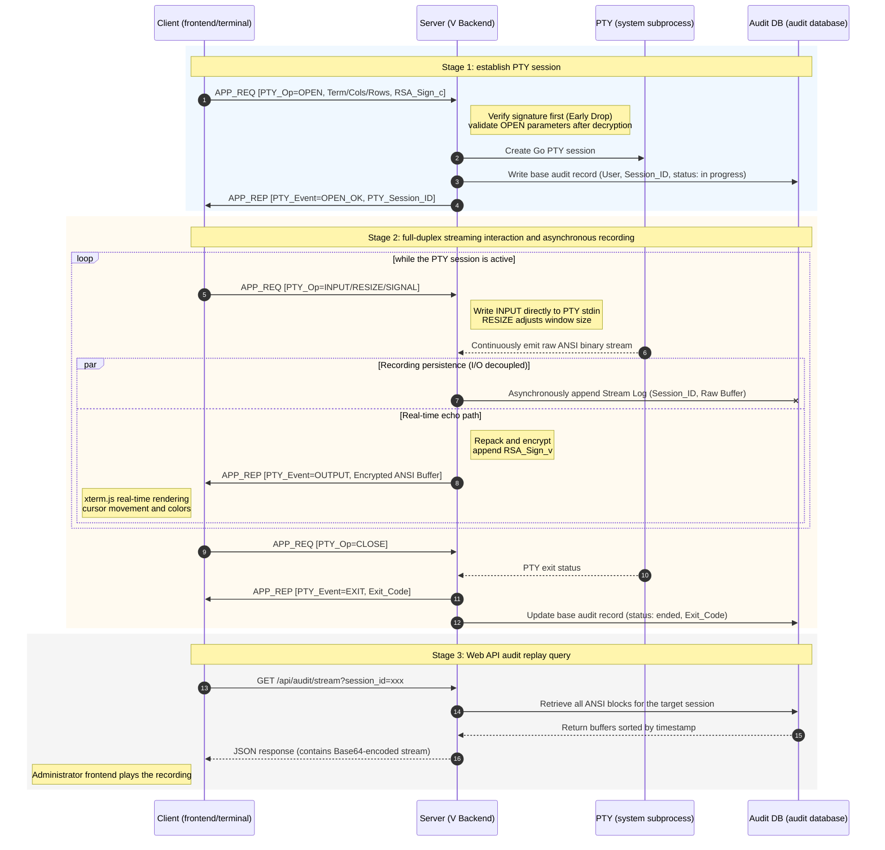
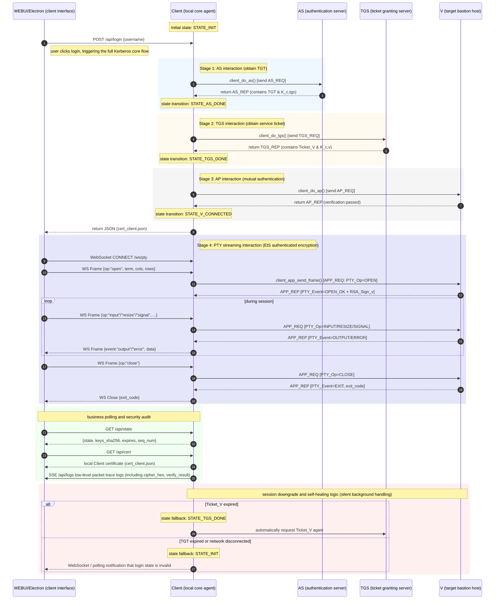

<style>
#write h1, 
#write h2 {
    border-bottom: none ! important; /* Completely remove horizontal lines below headings */
    padding-bottom: 0 ! important;   /* Remove padding reserved for underlines */
}
@media print {
    /* Increase paragraph line height */
    #write p, #write li {
        line-height: 1.8 ! important;
    }
    /* Increase spacing above headings to prevent them from touching preceding text */
    #write h1, #write h2, #write h3 {
        margin-top: 1.6em ! important;
        margin-bottom: 0.8em ! important;
    }
    /* Adjust spacing between list items */
    #write li {
        margin-bottom: 0.4em ! important;
    }
}
</style>

# Kerberos-Based Secure Communication System — Detailed Design Specification

## Table of Contents

1. [Global Unified Specification](#chapter-1-global-unified-specification)
2. [Encryption Module Design](#chapter-2-encryption-module-design)
3. [AS Authentication Server Module](#chapter-3-as-authentication-server-module-design)
4. [TGS Ticket Granting Server Module](#chapter-4-tgs-ticket-granting-server-module-design)
5. [V Application Server Module](#chapter-5-v-application-server-module-design)
6. [Client Module](#chapter-6-client-module-design)
7. [Detailed Packet Packing and Unpacking Design](#chapter-7-detailed-packet-packing-and-unpacking-design)
8. [Custom Certificate Design](#chapter-8-custom-certificate-design)
9. [Complete Communication Sequence Specification](#chapter-9-complete-communication-sequence-specification)
10. [Test Case List](#chapter-10-test-case-list)
11. [Project Directory Structure](#chapter-11-recommended-project-directory-structure)
12. [Key Algorithm Pseudocode](#chapter-12-key-algorithm-pseudocode)

---

## Member Responsibilities

|    Team Member    |                         Responsibility                         |
| :------------: | :--------------------------------------------------: |
| Feng Shijie (Team Lead) |     Responsible for AS, TGS, and V communication encryption logic and V service deployment      |
| Shi Boxuan, Tao Fangyang | Responsible for Client-side communication encryption logic and RESTful API interface design |
| Sarah Tanujaya |                Responsible for Client WebUI design                |

---

## Technology Stack

- Golang
- typescript (Xterm.js)
- Electron
- python

## Overall Requirements

Implement a Kerberos encrypted authentication system.

Implement end-to-end encrypted communication between C and V.

Use RSA digital signatures to provide bidirectional non-repudiation.

Implement multithreaded concurrent processing.

On top of the implemented Kerberos foundation, build a zero-trust access auditing system based on `Xterm.js` and `Go PTY`: Kerberos provides identity authentication and encrypted communication guarantees, RSA signatures provide bidirectional non-repudiation, and the V server records every PTY input/output frame from the Client in the background and stores it in the database.

## Source Code Management

Use git for version control and source code management. Enable branch protection on the remote repository and forbid `git push --force`.

# Chapter 1 Global Unified Specification

## Design Principles and Mandatory Constraints

In a distributed security system, any inconsistency in detail may lead to severe security vulnerabilities or interoperability failures. Therefore, this project defines the following mandatory engineering constraints, which all development members must strictly follow.

**Byte order constraint**: All integer fields (`uint8_t`, `uint16_t`, `uint32_t`, `uint64_t`) must strictly use **Big-Endian / Network Byte Order** during network transmission. For example, C/C++ should use `htonl()`/`ntohl()` or self-implemented macros for conversion; Python should explicitly specify big endian with format strings such as `struct.pack('>I', val)`.

**Memory alignment constraint**: All protocol structures must be wrapped with `#pragma pack(push, 1)` / `#pragma pack(pop)`. Compiler-inserted padding bytes are strictly forbidden. The protocol specification defines exact byte-offset layouts, and any padding will shift fields incorrectly.

**Version compatibility constraint**: The protocol version is fixed at `0x01`. If protocol fields need to be extended in the future, the version number must also be incremented and the memory layout diagrams in this document must be updated. When parsing packets, any receiver that encounters an unsupported version must immediately return `ERR_VERSION_UNSUPPORTED` and discard the packet.

## Network and Packet Packing/Unpacking Errors (-1000 Range)

A unified error-code system is the foundation for system debuggability. All functions on all nodes return `uint32_t`, where `0` (`KRB_OK`) indicates success and all negative values indicate different categories of errors. Error codes are grouped by module to make it easier to locate the affected layer quickly.

### Design Principles and Mandatory Constraints

| Error Code | Macro Definition | Applicable Module | Trigger Scenario | Handling Strategy |
|--------|--------|----------|----------|----------|
| `0` | `KRB_OK` | Global | Operation succeeded | Continue execution |
| `-1001` | `ERR_MAGIC_MISMATCH` | Unpacking | The first 2 received bytes are not `0x4B45`, indicating a non-Kerberos packet or severely corrupted data | Immediately discard the packet, record a WARN-level log including peer IP, and close the connection |
| `-1002` | `ERR_VERSION_UNSUPPORTED` | Unpacking | The Version field value is not `0x01` | Send an error response, disconnect, and record a log including the actual version number |
| `-1003` | `ERR_MSG_TYPE_INVALID` | Unpacking | MSG_TYPE is outside the defined range `0x01`~`0x04` | Discard the packet and record a WARN log |
| `-1004` | `ERR_PAYLOAD_TOO_LARGE` | Unpacking | The `TotalLength` field value exceeds the preset upper limit, recommended 64KB | Refuse to read subsequent bytes, disconnect, and record a WARN log |
| `-1005` | `ERR_REPLAY_TIMESTAMP` | Anti-Replay | The packet timestamp differs from the current server time by more than 5 seconds, whether earlier or later | Discard the packet, return a `-1005` error response, and record a WARN log including the time difference |
| `-1006` | `ERR_REPLAY_SEQ` | Anti-Replay | This `SEQ_NUM` has already been processed within the sliding window, indicating a duplicate sequence number | Discard the packet, return a `-1006` error response, and record a WARN log |
| `-1007` | `ERR_BUF_TOO_SMALL` | Packing/Unpacking | The output buffer provided by the caller is too small to hold the packed result | Return an error code; the caller should expand the buffer and retry, up to 3 times |
| `-1008` | `ERR_SOCKET_SEND` | Network Layer | The `send()` system call returns -1 or sends fewer bytes than expected | Retry up to 3 times with a 100ms interval; on failure, clean up connection resources and record an ERROR log |
| `-1009` | `ERR_SOCKET_RECV` | Network Layer | `recv()` returns 0, meaning the peer closed normally, or -1, meaning a system error| Clean up all resources for the connection, such as Session and buffers, and record an INFO/ERROR log |
| `-1010` | `ERR_THREAD_CREATE` | Concurrency | Thread-pool worker thread creation failed due to insufficient system resources | Return an error, push an alert to the management interface, and record an ERROR log |

### Kerberos Protocol Errors (-2000 Range)

| Error Code | Macro Definition | Applicable Module | Trigger Scenario | Handling Strategy |
|--------|--------|----------|----------|----------|
| `-2001` | `ERR_CLIENT_NOT_FOUND` | AS | `ID_Client` does not exist in the AS client database | Return an AS error packet without revealing the specific reason, and record a WARN log |
| `-2002` | `ERR_TICKET_EXPIRED` | TGS / V | `Ticket.TS + Ticket.Lifetime < current time`; the ticket has expired | Return a ticket-expired error response; the Client should repeat the AS or TGS stage |
| `-2003` | `ERR_TICKET_INVALID` | TGS / V | Ticket decryption failed due to key mismatch, or decrypted field lengths are invalid | Return a ticket-invalid error and record a SECURITY log for a suspected forgery attack |
| `-2004` | `ERR_AUTH_MISMATCH` | TGS / V | `Authenticator.ID_Client` is inconsistent with `Ticket.ID_Client` | Reject the request and record a SECURITY log for identity-forgery indicators |
| `-2005` | `ERR_AD_MISMATCH` | TGS / V | `Authenticator.AD_c`, the client IP, is inconsistent with `Ticket.AD_c` | Reject the request and record a SECURITY log for man-in-the-middle attack indicators |
| `-2006` | `ERR_KEY_DERIVE` | AS / TGS | `krb_rand_bytes()` failed to generate random bytes, so the Session Key cannot be generated | Return a server error, alert operations, and record an ERROR log |
| `-2007` | `ERR_SESSION_NOT_FOUND` | V | A business message was received, but no Session for the corresponding Client was found; the Client has not completed AP authentication| Require the Client to repeat the AP authentication stage |

### Encryption Module Errors (-3000 Range)

| Error Code | Macro Definition | Applicable Module | Trigger Scenario | Handling Strategy |
|--------|--------|----------|----------|----------|
| `-3001` | `ERR_DES_KEY_LEN` | DES | The provided key length is not equal to 8 bytes | Reject the encryption operation; the caller must check key-source logic |
| `-3002` | `ERR_DES_PADDING` | DES | PKCS7 padding calculation error due to plaintext length overflow or alignment-logic error | Return an error; the caller should check the plaintext buffer |
| `-3003` | `ERR_DES_DECRYPT_FAIL` | DES | PKCS7 validation failed after decryption: padding byte value is invalid (<1 or >8), or padding content is inconsistent | Discard the decrypted result and return an error; record a SECURITY log on the TGS/V side for suspected ciphertext tampering|
| `-3004` | `ERR_RSA_KEY_INVALID` | RSA | Any of `n`/`e`/`d` in the RSA Key structure is zero, or the structure is uninitialized | Reject all operations involving this key and record an ERROR log |
| `-3005` | `ERR_RSA_SIGN_FAIL` | RSA | An internal error occurred during RSA modular exponentiation, such as big-integer overflow | Return an error; the caller must not send messages with an invalid signature |
| `-3006` | `ERR_RSA_VERIFY_FAIL` | RSA | Signature verification failed: the decrypted EMSA encoding does not match the recomputed Hash | Immediately reject the request and record a SECURITY log for suspected message forgery or private-key leakage |
| `-3007` | `ERR_HMAC_MISMATCH` | HMAC | The received MAC value does not match the recomputed HMAC | Discard the entire message and record a SECURITY log for message tampering |
| `-3008` | `ERR_SHA256_FAIL` | SHA-256 | Internal SHA-256 calculation error, extremely rare and usually indicating a memory error| Return an error and record an ERROR log |

### Certificate Errors (-4000 Range)

| Error Code | Macro Definition | Applicable Module | Trigger Scenario | Handling Strategy |
|--------|--------|----------|----------|----------|
| `-4001` | `ERR_CERT_EXPIRED` | Certificate Management | The certificate `expire` date is earlier than the current system date | Reject communication associated with this certificate and push a certificate-expiration alert to the WebUI |
| `-4002` | `ERR_CERT_SIG_INVALID` | Certificate Management | The certificate `sign` field cannot pass RSA verification using the certificate's own public key | Reject communication and record a SECURITY log for certificate tampering or forgery |
| `-4003` | `ERR_CERT_ID_MISMATCH` | Certificate Management | The `id` field in the certificate is inconsistent with `ID_Client` in the Ticket | Reject communication and record a SECURITY log |
| `-4004` | `ERR_CERT_LOAD_FAIL` | Certificate Management | The certificate JSON file does not exist, has an invalid format, or is missing fields | If a critical certificate fails to load during node startup, startup should be terminated with an error |

**After a responder function receives an error code, the response packet must set `msg_type` in the `Protocol Header` to `0xff`, write the error code into `PayLoad` as `int32_t`, send it, and then call the `close TCP stream` function.**

---

## Common Module Function Interfaces (C/C++ Examples)

These functions are implemented by the `common/` module and shared by all nodes. The interface design follows the single-responsibility principle: each function does exactly one thing, making independent unit-test verification easier.

(The C/C++ examples are for reference only. Different languages may use different implementation styles.)

### `krb_pack()` — Packet Packing Function

**Function description**: Assemble the business-layer serialized Payload byte stream with the 20-byte Kerberos protocol header to generate a complete packet byte stream that can be sent directly over TCP. The function automatically fills `Magic Number`, `Version`, and `TotalLength`; it fills the `TIMESTAMP` field using the current Unix timestamp passed by the caller, and sets the reserved `ADDITION` field to 0.

```c
int32_t krb_pack(
    uint8_t        msg_type,     // [in] packet type:0x01 = AS_REQ, 0x02 = AS_REP, 0x03 = TGS_REQ,
                                 //                 0x04 = TGS_REP, 0x05 = AP_REQ, 0x06 = AP_REP, 0x07 = business message,0xff = invalid packet
    uint32_t       seq_num,      // [in] sequence number; the caller maintains a monotonically increasing counter and increments it after each call
    uint32_t       timestamp,    // [in] current Unix timestamp, obtained by calling time(NULL)
    const uint8_t* payload,      // [in] start pointer of the serialized Payload byte array
    uint32_t       payload_len,  // [in] valid byte length of Payload
    uint8_t*       out_buf,      // [out] output buffer allocated by the caller; size must be >= 20 + payload_len
    uint32_t*      out_len       // [out] actual total byte count of the output packet (= 20 + payload_len)
);
// Return value:KRB_OK(0) | ERR_MSG_TYPE_INVALID(-1003) | ERR_BUF_TOO_SMALL(-1007)
```

**Implementation notes**: Header fields must be written using the `WRITE_U16_BE` / `WRITE_U32_BE` macros to perform byte-order conversion. Direct `memcpy` after structure assignment is forbidden.

The `TotalLength` field counts only Payload bytes and does not include the 20-byte header itself.

---

### `krb_unpack()` — Packet Unpacking Function (Header Parsing)

**Function description**: Parse the fixed-length 20-byte protocol header from the TCP receive buffer. This function is responsible only for parsing the header and not for reading the Payload; the caller should continue calling `krb_recv_full()` according to `header.total_len` to read the Payload.

```c
int32_t krb_unpack(
    const uint8_t* raw,            // [in] raw receive buffer containing at least 20 bytes
    uint32_t       raw_len,        // [in] valid byte count of the raw buffer; must be >= 20
    Ker_Header*    header_out      // [out] parsed header structure allocated by the caller and filled by the function
);
// Return value:KRB_OK(0) | ERR_MAGIC_MISMATCH(-1001) | ERR_VERSION_UNSUPPORTED(-1002)
//         | ERR_MSG_TYPE_INVALID(-1003) | ERR_PAYLOAD_TOO_LARGE(-1004)
```

**Parsed fields have already been byte-order converted**: After the caller obtains `Ker_Header`, all fields are already in host byte order and can be used directly for logical comparison without another `ntohl`.

---

### `krb_recv_full()` — Guaranteed Full Receive

**Function description**: A TCP `recv()` call does not guarantee that all bytes will be received in one call; a "TCP split packet" may occur. This function repeatedly calls `recv()` until `need` bytes have been read or an error occurs. It is the basic utility function for TCP receive logic on all nodes.

```c
int32_t krb_recv_full(
    int       fd,    // [in] socket file descriptor
    uint8_t*  buf,   // [out] receive buffer
    uint32_t  need   // [in] number of bytes to receive
);
// Return value:KRB_OK(0) | ERR_SOCKET_RECV(-1009)
```

---

### `krb_antireplay_check()` — Anti-Replay Verification (Pass)

**Function description**: Determine whether a packet is a replay attack by combining a timestamp window and a sequence-number sliding window. The timestamp tolerance threshold is fixed at 5 seconds, and the sequence-number window size is 1024, implemented as a circular queue. This function is thread-safe and contains a mutex.

```c
// Anti-replay context; one instance per listening port, initialized by calling krb_antireplay_init() during node initialization
typedef struct {
    uint32_t        window[1024];    // circular queue of processed SEQ_NUM values
    uint32_t        window_head;     // queue head pointer
    uint32_t        window_count;    // current number of elements in the queue
    pthread_mutex_t lock;            // mutex protecting window
} AntiReplay_Ctx;

int32_t krb_antireplay_init(AntiReplay_Ctx* ctx);

int32_t krb_antireplay_check(
    uint32_t        timestamp,  // [in] TIMESTAMP field in the packet header, already converted to host byte order
    uint32_t        seq_num,    // [in] SEQ_NUM field in the packet header, already converted to host byte order
    AntiReplay_Ctx* ctx         // [in/out] anti-replay window bound to one sender/security context; the function locks internally
);
// Return value:KRB_OK(0) | ERR_REPLAY_TIMESTAMP(-1005) | ERR_REPLAY_SEQ(-1006)
```

**Implementation details**: The timestamp check uses `abs((int32_t)(timestamp - (uint32_t)time(NULL))) > 5`. The sequence-number check scans the `window[1024]` array sequentially; linear scanning is acceptable for a small window. If a duplicate is found, reject it; otherwise, write the new SEQ into the window and evict the oldest record. `ctx` must not be shared blindly across all clients in a service instance; it should be maintained per "sender identity + current security context", for example separately for `Client->AS`, `Client->TGS`, and `Client->V(APP)`.

---

### Certificate Management Interface

```c
// certificate memory structure, see Chapter 8
typedef struct { ... } Cert_t;

int32_t cert_load(const char* json_path, Cert_t* out);
// Load a certificate from a JSON file and parse id, public_key (n/e), expire, and sign fields into the structure
// Returns: KRB_OK | ERR_CERT_LOAD_FAIL(-4004) | ERR_CERT_SIG_INVALID(-4002)

int32_t cert_verify(const Cert_t* cert);
// Verify certificate validity period (expire >= current date) and self-signature, using the certificate's own public key to verify the sign field
// Returns: KRB_OK | ERR_CERT_EXPIRED(-4001) | ERR_CERT_SIG_INVALID(-4002)

int32_t cert_get_pubkey(const Cert_t* cert, RSA_Key_t* out_pub);
// Extract the public key from Cert_t into an RSA_Key_t structure, filling only n and e fields
// Returns: KRB_OK | ERR_RSA_KEY_INVALID(-3004)

int32_t cert_find_by_id(const char* id, const Cert_t* cert_db, uint32_t db_count, Cert_t* out);
// Search the in-memory certificate database array by the id field and copy the result to out
// Returns: KRB_OK | ERR_CLIENT_NOT_FOUND(-2001)
```

---

## Common Protocol Header Structure

```c
#pragma pack(push, 1)
struct Ker_Header {
    uint16_t magic;      // fixed value 0x4B45, identifying a Kerberos protocol packet
    uint8_t  version;    // protocol version, currently fixed at 0x01
    uint8_t  msg_type;   // packet type, see the table below
    uint32_t total_len;  // Payload byte count, excluding the 20-byte header itself
    uint32_t seq_num;    // sequence number maintained by the current sender, monotonically increasing within the same sender-side security session, used for anti-replay
    uint32_t timestamp;  // sender's current Unix timestamp, used for clock synchronization and anti-replay
    uint32_t addition;   // reserved field, currently filled with 0x00000000, for future version extensions
};
#pragma pack(pop)
// sizeof(Ker_Header) must be exactly 20 bytes; verify it at compile time with static_assert
```

| `msg_type` Value | Meaning |
|:---:|---|
| `0x01` | AS_REQ(Client → AS) |
| `0x02` | AS_REP(AS → Client) |
| `0x03` | TGS_REQ(Client → TGS) |
| `0x04` | TGS_REP(TGS → Client) |
| `0x05` | AP_REQ(Client → V) |
| `0x06` | AP_REP(V → Client) |
| `0x07` | Business message (Client → V, after authentication) |
| `0xff` | Error response (issued by any node) |

---

## Unified Log Format Specification

Logs are the core mechanism for system debugging and acceptance. All nodes use the same structured log format to ensure that `grep` or simple log analysis tools can locate end-to-end issues.

**Log line format**:

```
[TIMESTAMP_ISO8601] [LEVEL] [NODE] [CLIENT_ID] [MSG_TYPE] [SEQ=N] [FUNC_NAME] MESSAGE
```

**Field descriptions**:

- `TIMESTAMP_ISO8601`: Millisecond precision, for example `2026-05-01T10:23:45.123Z`.
- `LEVEL`: `DEBUG` / `INFO` / `WARN` / `ERROR` / `SECURITY`. The `SECURITY` level is dedicated to security events such as signature verification failure, suspected identity forgery, and HMAC verification failure.
- `NODE`: Node identifier, such as `AS`, `TGS`, `V`, or `CLIENT_1`.
- `CLIENT_ID`: The client ID associated with the current operation. Use `-` when there is no association.
- `MSG_TYPE`: The packet type currently being processed, such as `AS_REQ` or `AP_REQ`. Use `-` when there is no association.

**Example**:

```
[2026-05-01T10:23:45.123Z] [INFO]     [AS]      [CLIENT_1] [AS_REQ]  [SEQ=42]  [krb_handle_as_req]
    TGT issued successfully. K_c_tgs_sha256=a1b2c3d4..., lifetime=28800s, expire=1746441825

[2026-05-01T10:23:45.456Z] [SECURITY] [V]       [CLIENT_2] [AP_REQ]  [SEQ=7]   [krb_rsa_verify]
    RSA signature verification FAILED. err=-3006. Possible forgery attack. client_ip=192.168.1.102

[2026-05-01T10:23:45.789Z] [WARN]     [TGS]     [CLIENT_3] [TGS_REQ] [SEQ=15]  [krb_antireplay_check]
    Replay attack detected. ERR_REPLAY_TIMESTAMP. ts_diff=8s, client_ip=192.168.1.103

[2026-05-01T10:23:46.001Z] [INFO]     [CLIENT_1] [-]        [-]       [-]       [client_do_ap]
    AP authentication complete. Double-sided RSA verification passed. Session established.
```

**Notes**:

- Logs must **not record any plaintext keys** such as Kc, K_c,tgs, or K_c,v. If a key must be logged for debugging, only its SHA-256 digest may be recorded, represented by the first 8 bytes in hexadecimal.
- Logs must **not record complete plaintext CLI commands**. Only the command hash and execution result status, success or failure, should be recorded.
- Performance-sensitive cryptographic paths, such as DES encryption/decryption and RSA modular exponentiation, must record `DEBUG`-level elapsed-time logs in the format `[elapsed=12.3ms]`.
- Logs must be persisted to a separate `security.log` file, and this file must not be deletable through the WebUI.

---

## Configuration File Template

Each node uses a JSON configuration file. The path is specified by the command-line argument `--config`, and by default the node looks for `config.json` in the current directory.

```json
{
  "node_id": "AS",
  "listen_host": "0.0.0.0",
  "listen_port": 8881,
  "thread_pool_size": 8,
  "anti_replay_window_size": 1024,
  "ticket_lifetime_sec": 28800,
  "max_clients": 16,
  "cert_path": "./certs/as_cert.json",
  "privkey_path": "./keys/as_priv.json",
  "log_level": "INFO",
  "log_file": "./logs/as.log",
  "security_log_file": "./logs/security.log",
  "webui_host": "0.0.0.0",
  "webui_port": 9881,
  "k_tgs_path": "./keys/k_tgs.bin",
  "client_db": [
    { "id": "CLIENT_1", "kc_path": "./keys/kc_client1.bin", "cert_path": "./certs/client1_cert.json" },
    { "id": "CLIENT_2", "kc_path": "./keys/kc_client2.bin", "cert_path": "./certs/client2_cert.json" },
    { "id": "CLIENT_3", "kc_path": "./keys/kc_client3.bin", "cert_path": "./certs/client3_cert.json" },
    { "id": "CLIENT_4", "kc_path": "./keys/kc_client4.bin", "cert_path": "./certs/client4_cert.json" }
  ]
}
```

> A TGS node additionally contains the `"k_v_path"` field, which is the long-term key path shared with V. A V node additionally contains `"k_v_path"` and `"cli_whitelist"`. A Client node contains remote address configuration such as `"as_host"`, `"as_port"`, `"tgs_host"`, `"tgs_port"`, `"v_host"`, and `"v_port"`.

---

# Chapter 2 Encryption Module Design

## Overview

> **Core constraint: calling any third-party encryption/decryption library is forbidden.** This includes but is not limited to OpenSSL, PyCryptodome, javax.crypto, BouncyCastle, CryptoJS, and similar libraries. All cryptography-related functions, including DES, SHA-256, HMAC, and RSA, must be implemented manually starting from algorithm primitives.

The encryption module is independent of other business modules and is located under `common/crypto/`, making it easy to compile and test separately.

Each algorithm has a corresponding unit test file, with test cases covering normal paths, boundary conditions, and error paths.

### Notes

In the code implementation, the following algorithms, except RSA-2048, must ultimately interoperate with standard-library encryption/decryption functions. In other words, the self-implemented cryptographic algorithms and third-party standard algorithms must be callable across each other and parse successfully.

**Pay attention to the following:**

- **Byte padding**: for example, **PKCS7 padding** and **PKCS#1 v1.5 encoding (signature padding)**.
- **Byte order**: use **big endian** uniformly.
- **Ciphertext blocks**: when padding ciphertext, **convert everything to a `uint8/bytes` binary stream; `hex` or other encodings are forbidden**.

### Acceptance Requirements

**Algorithm acceptance standard**: passing the corresponding test modules under the root `/test` directory is the baseline; optimize runtime as much as possible.

Because binary data cannot be printed directly, when running test files, input ciphertext as a Hex string according to the console prompt.

In all other cases, ciphertext must uniformly use a `uint8/bytes` binary stream.

---

## DES-CBC

### Algorithm Background

DES is a classic block symmetric encryption algorithm. This project uses a **64-bit key (8 bytes, including parity bits) and CBC (Cipher Block Chaining) mode**.

CBC mode XORs the previous ciphertext block with the current plaintext block before encryption, causing identical plaintext at different positions to produce different ciphertext, thereby effectively resisting plaintext pattern attacks seen in ECB mode.

Core DES parameters:
- **Key length**: 64 bits (8 bytes, with 56 actual effective key bits).
- **Block size**: 64 bits (8 bytes).
- **Number of rounds**: 16 Feistel round functions.
- **Subkey generation**: Generate sixteen 48-bit subkeys from the original key through PC-1, left shifts, and PC-2.

### Context Structure

```c
#pragma pack(push, 1)
typedef struct {
    uint64_t sub_keys[16];  // sixteen 48-bit round subkeys, stored in the low 48 bits of uint64_t
    uint8_t  iv[8];         // initialization vector for CBC mode; must be set before encryption
    uint8_t  key[8];        // stores the original 64-bit key, including parity bits
} DES_Ctx;
#pragma pack(pop)
```

### Function Interface

```c
// Initialize the context: generate subkeys and store key and iv in ctx
// key: 8-byte key; iv: 8-byte initialization vector, used during encryption and must match during decryption
int32_t des_init(const uint8_t key[8], const uint8_t iv[8], DES_Ctx* ctx);
// Returns: KRB_OK | ERR_DES_KEY_LEN(-3001)

// Single-block encryption, an internal primitive not exposed directly: perform 16 DES rounds on an 8-byte plaintext block
int32_t des_encrypt_block(const uint8_t in[8], DES_Ctx* ctx, uint8_t out[8]);

// Single-block decryption, an internal primitive: perform 16 DES rounds on an 8-byte ciphertext block
int32_t des_decrypt_block(const uint8_t in[8], DES_Ctx* ctx, uint8_t out[8]);

// CBC-mode encryption, external interface
// plain: plaintext byte array; plain_len: plaintext byte count, any length; the function applies PKCS7 padding internally
// cipher: output ciphertext buffer allocated by the caller; size >= plain_len + 8, allowing at most one extra padding block
// cipher_len: actual output ciphertext byte count (= ((plain_len / 8) + 1) * 8), always a multiple of 8
int32_t des_cbc_encrypt(
    const uint8_t* plain, uint32_t plain_len,
    DES_Ctx* ctx,
    uint8_t* cipher, uint32_t* cipher_len
);
// Returns: KRB_OK | ERR_DES_KEY_LEN | ERR_DES_PADDING(-3002) | ERR_BUF_TOO_SMALL(-1007)

// CBC-mode decryption, external interface
// cipher: ciphertext, must be a multiple of 8; otherwise treated as ERR_DES_DECRYPT_FAIL
// plain: output plaintext buffer allocated by the caller; size >= cipher_len
// plain_len: plaintext byte count after removing PKCS7 padding
int32_t des_cbc_decrypt(
    const uint8_t* cipher, uint32_t cipher_len,
    DES_Ctx* ctx,
    uint8_t* plain, uint32_t* plain_len
);
// Returns: KRB_OK | ERR_DES_KEY_LEN | ERR_DES_DECRYPT_FAIL(-3003)
```

### Implementation Notes

**S-Box (substitution box)**: DES uses 8 fixed S-Boxes, each mapping a 6-bit input to a 4-bit output. These can be directly hardcoded as lookup tables.

**Subkey generation (Key Schedule)**:
1. Apply the PC-1 permutation to the 64-bit original key to obtain `C0(28bit)` and `D0(28bit)`.
2. Perform circular left shifts according to the per-round shift table to obtain `C1..C16` and `D1..D16`.
3. In each round, compress `Ci || Di` through the PC-2 permutation into the 48-bit subkey `K1..K16`.

**Round function F**: In each round, first expand the right half block `R` to 48 bits through E expansion, XOR it with the subkey, split it into 8 S-Boxes, then apply the P permutation to output 32 bits and complete the Feistel structure swap with the left half.

**PKCS7 padding**: The value of each padding byte equals the number of bytes to pad. If the plaintext length is exactly a multiple of 8, an additional 8 bytes of padding, all with value `0x08`, must still be appended. During decryption, take the last byte value `n` and verify that the last `n` bytes all equal `n`; otherwise report `ERR_DES_DECRYPT_FAIL`.

**IV transmission convention**: During encryption, the encrypting party generates a random 8-byte IV by calling `krb_rand_bytes(iv, 8)`, prepends the IV **in plaintext** to the ciphertext, and sends them together. The actual sent data is `IV(8 bytes) || ciphertext`. The decrypting party reads the first 8 bytes as the IV and the remaining bytes as ciphertext. This convention avoids a separate IV field, but increases total ciphertext length by 8 bytes; the `Cipher_Len` field in each Payload includes these 8 IV bytes.

---

## SHA-256

### Algorithm Background

SHA-256 is a hash function in the SHA-2 family and outputs a fixed 256-bit (32-byte) digest. In this project it is used in two scenarios: (1) hashing messages before RSA signatures; (2) serving as the underlying hash function for HMAC-SHA256. SHA-256 security is based on preimage resistance, meaning it is difficult to recover original data from a digest, and collision resistance, meaning it is difficult to find two different inputs that produce the same digest.

### Context Structure

```c
typedef struct {
    uint32_t h[8];          // eight 32-bit hash state values (H0~H7), initialized to the fractional parts of the square roots of the first 8 primes
    uint8_t  buf[64];       // 512-bit (64-byte) message block buffer for streaming processing
    uint64_t total_bits;    // total number of processed message bits, used in final padding
    uint32_t buf_len;       // current number of valid bytes filled in buf
} SHA256_Ctx;
```

### Function Interface

```c
// One-shot calculation interface, internally creates a temporary ctx; the most commonly used interface
int32_t sha256(const uint8_t* data, uint32_t len, uint8_t digest[32]);
// Returns: KRB_OK | ERR_SHA256_FAIL(-3008)

// Streaming interface, used to process large data in chunks
int32_t sha256_init(SHA256_Ctx* ctx);    // Initialize H0~H7 to standard initial values and zero other fields
int32_t sha256_update(SHA256_Ctx* ctx, const uint8_t* data, uint32_t len);  // Append data
int32_t sha256_final(SHA256_Ctx* ctx, uint8_t digest[32]);   // Perform padding and output the final digest
```

### Implementation Notes

**Initial hash values (H0~H7)**: These are the first 32 bits of the fractional parts of the square roots of the first 8 prime numbers (2, 3, 5, 7, 11, 13, 17, 19), hardcoded as follows:
```
H0=0x6a09e667, H1=0xbb67ae85, H2=0x3c6ef372, H3=0xa54ff53a,
H4=0x510e527f, H5=0x9b05688c, H6=0x1f83d9ab, H7=0x5be0cd19
```

**64 round constants (K[0]~K[63])**: The first 32 bits of the fractional parts of the cube roots of the first 64 prime numbers, also hardcoded as a constant array.

**Message padding rule (FIPS 180-4)**: Append `0x80` to the end of the message, then append enough `0x00` bytes so that the total length modulo 512 equals 448, leaving 64 bits to record the original message length. Finally, append the original message bit length as a 64-bit big-endian value.

**Compression function**: Each round uses 6 logical functions: `Ch(e,f,g)=(e&f)^(~e&g)`, `Maj(a,b,c)=(a&b)^(a&c)^(b&c)`, `Σ0(a)=ROTR(2,a)^ROTR(13,a)^ROTR(22,a)`, `Σ1(e)=ROTR(6,e)^ROTR(11,e)^ROTR(25,e)`, `σ0(x)=ROTR(7,x)^ROTR(18,x)^SHR(3,x)`, and `σ1(x)=ROTR(17,x)^ROTR(19,x)^SHR(10,x)`, where `ROTR(n,x)` is a 32-bit circular right rotation.

---

## RSA-2048

> **Note**: Standard RSA-2048 needs to handle complex ASN.1 structures and is relatively complicated to implement, so the algorithm is only required to provide parameters such as n, e, and d.
>
> However, PKCS#1 v1.5 encoding padding is still required during signing, because the RSA digital signature `Sign` is defined as 256 bytes.

### Algorithm Background

RSA is one of the most widely used asymmetric cryptographic algorithms. Its security is based on the computational difficulty of factoring large integers.

In this project, **RSA is used only for digital signatures**. The Client signs each message with its own RSA private key, and the V server verifies the signature using the public key in the Client certificate, ensuring message non-repudiation, meaning the Client cannot deny having sent the message.

RSA-2048 parameters:
- **Modulus n**: 2048 bits (256 bytes), equal to the product of two 1024-bit primes p and q.
- **Public exponent e**: usually 65537 (`0x010001`).
- **Private exponent d**: satisfies `e*d ≡ 1 (mod φ(n))`, where φ(n) = (p-1)(q-1).
- **Signing process**: `s = m^d mod n`, where m is the hash value encoded with PKCS#1 v1.5.
- **Signature verification process**: `m' = s^e mod n`, then compare whether m' equals the expected `PKCS#1 v1.5` encoding.

### Big Integer Structure

A 2048-bit integer is represented by 32 unsigned 64-bit integers, called limbs, stored in big-endian order, where limbs[0] is the most significant 64 bits:

```c
typedef struct {
    uint64_t limbs[32];  // 32 * 64 = 2048 bits; limbs[0] is the most significant limb
} BigInt2048;

typedef struct {
    BigInt2048 n;    // modulus
    BigInt2048 e;    // public exponent, used for signature verification
    BigInt2048 d;    // private exponent, used for signing; this field is zero in public-key structures
    // Optional: store p and q for CRT optimization; can be omitted in the course project
} RSA_Key_t;
```

### Function Interface

```c
// Modular exponentiation: result = base^exp mod mod, the core primitive used by signing/verification
// Use the left-to-right binary fast modular exponentiation algorithm (Left-to-Right Binary Exponentiation)
int32_t rsa_modexp(
    const BigInt2048* base, const BigInt2048* exp,
    const BigInt2048* mod,  BigInt2048* result
);
// Returns: KRB_OK | ERR_RSA_KEY_INVALID(-3004)

// Big-integer addition: result = a + b; carry must be handled, and the result may exceed 2048 bits, so the caller must be careful
int32_t bigint_add(const BigInt2048* a, const BigInt2048* b, BigInt2048* result);

// Big-integer multiplication: multiply two 2048-bit numbers; the result is 4096 bits for temporary intermediate values
// Note: modular exponentiation needs multiply-then-mod; intermediate results may require 4096-bit space
// In the course project, schoolbook multiplication (schoolbook O(n^2)) can be used and provides sufficient performance
int32_t bigint_mul_mod(const BigInt2048* a, const BigInt2048* b,
                       const BigInt2048* mod, BigInt2048* result);

// Big-integer modulo: result = a mod n
int32_t bigint_mod(const BigInt2048* a, const BigInt2048* n, BigInt2048* result);

// RSA signing: encode msg_hash (32 bytes) with PKCS#1 v1.5, then sign with the private key
// sig: output signature; the caller allocates a 256-byte buffer
// sig_len: fixed output 256 (2048/8); zero-pad even if high bits are zero
int32_t rsa_sign(
    const uint8_t*   msg_hash,   // [in] SHA-256 digest, 32 bytes
    uint32_t         hash_len,   // [in] fixed at 32
    const RSA_Key_t* priv_key,   // [in] private-key structure containing valid n and d
    uint8_t*         sig,        // [out] signature output, 256 bytes
    uint32_t*        sig_len     // [out] fixed at 256
);
// Returns: KRB_OK | ERR_RSA_KEY_INVALID(-3004) | ERR_RSA_SIGN_FAIL(-3005)

// RSA signature verification: use the public key to recover the hash from the signature and compare it with the recomputed hash
int32_t rsa_verify(
    const uint8_t*   msg_hash,   // [in] SHA-256 digest of the message, 32 bytes
    uint32_t         hash_len,   // [in] fixed at 32
    const RSA_Key_t* pub_key,    // [in] public-key structure containing valid n and e
    const uint8_t*   sig,        // [in] signature to verify, 256 bytes
    uint32_t         sig_len     // [in] fixed at 256
);
// Returns: KRB_OK | ERR_RSA_KEY_INVALID(-3004) | ERR_RSA_VERIFY_FAIL(-3006)
```

### PKCS#1 v1.5 Encoding (Signature Padding)

Before signing, the 32-byte hash value must be encoded into the 256-byte EM (Encoded Message) format:

```
EM = 0x00 || 0x01 || PS || 0x00 || DigestInfo || Hash
```

Where:

- `PS`: Padding string, all bytes are `0xFF`, length = 256 - 3 - 19 (DigestInfo prefix) - 32 (Hash) = **202 bytes**.

- `DigestInfo`: the DER-encoded SHA-256 prefix, fixed at 19 bytes:

  ```
  30 31 30 0d 06 09 60 86 48 01 65 03 04 02 01 05 00 04 20
  ```

- `Hash`: 32-byte SHA-256 digest.

During verification, after the public key recovers EM, check `EM[0]=0x00` and `EM[1]=0x01`, find the first byte that is not `0xFF`, which must be `0x00`, verify that the next 19 bytes match the `DigestInfo` prefix, and treat the last 32 bytes as the hash carried in the signature to compare against the recomputed message hash.

### Key Generation Strategy

Generating an RSA-2048 key pair, which requires finding two 1024-bit primes, takes about 1 to 3 minutes on a typical CPU, depending on random number quality and the number of primality tests. It is **strongly recommended** to pre-generate key pairs for all nodes during initial deployment, save them as JSON files containing hexadecimal strings for n, e, and d, and load them directly at runtime to avoid regeneration on every startup.

Primality testing uses the **Miller-Rabin** algorithm, running 20 rounds for each 1024-bit prime candidate, with a false-positive probability below 4^-20, approximately 10^-12.

---

## Random Number Generation

All key generation and IV generation must use a cryptographically secure pseudorandom number generator (CSPRNG):

```c
// Generate len bytes of cryptographically secure random data and write it into buf
// Internal implementation: read /dev/urandom on Linux/macOS; call BCryptGenRandom on Windows
int32_t krb_rand_bytes(uint8_t* buf, uint32_t len);
// Returns: KRB_OK | ERR_KEY_DERIVE(-2006)if the system entropy source is unavailable
```

---

# Chapter 3 AS Authentication Server Module Design

## Module Responsibility Overview

AS is the root of trust for the entire Kerberos system. It is the only server that knows each client's long-term key Kc and the only server that can issue TGTs (Ticket Granting Tickets).

The AS module design follows the principle of least privilege:
- AS does not store complete Session Key records, avoiding large-scale key leakage if the key database is stolen.
- AS exposes only the AS_REQ → AS_REP interaction externally and provides no other query or modification interfaces.
- WebUI interfaces show only summary information and do not expose any plaintext keys.

## Internal Data Structures

```go
// Consistent with Chapter 9: Kstring = uint16 length + UTF-8 bytes
type KString struct {
    Len  uint16
    Data []byte
}

// Consistent with Chapter 9.1: fixed 20-byte protocol header
type KerHeader struct {
    Magic     uint16
    Version   uint8
    MsgType   uint8
    TotalLen  uint32
    SeqNum    uint32
    Timestamp uint32
    Addition  uint32
}

// Message 1: AS_REQ (Client -> AS)
type ASReqPayload struct {
    IDClient KString // ID_Client
    IDTGS    KString // ID_TGS
    TS1      uint32  // TS1
}

// Message 2 outer layer: AS_REP (AS -> Client) outer transport
type ASRepPayloadWire struct {
    CipherLen uint32 // Cipher_Len
    EncPart   []byte // Enc_Part(DES, Kc)
}

// Message 2 inner plaintext: after decrypting AS_REP Enc_Part
type ASRepPlain struct {
    KeyCTGS   [8]byte // Key_c_tgs
    IDTGS     KString  // ID_TGS
    TS2       uint32   // TS2
    Lifetime  uint32   // Lifetime
    TicketLen uint32   // Ticket_Len
    TicketTGS []byte   // Ticket_TGS(ciphertext black box)
}

// Ticket_TGS plaintext, visible only after TGS decryption, but constructed by AS
type TicketTGSPlain struct {
    KeyCTGS  [8]byte // Key_c_tgs
    IDClient KString  // ID_Client
    ADc      uint32   // AD_c
    IDTGS    KString  // ID_TGS
    TS2      uint32   // TS2
    Lifetime uint32   // Lifetime
}

type ASClientSecret struct {
    IDClient string
    Kc       [8]byte
    ADc      uint32
}

type ASState struct {
    SeqNum  uint32
    Clients map[string]ASClientSecret
    Ktgs    [8]byte
}
```

## Core Processing Functions

| Function Signature (Go) | Comment |
|---|---|
| `func ParseASReqPayload(raw []byte) (ASReqPayload, int32)` | Parse `ID_Client + ID_TGS + TS1` according to the Chapter 9 "Message 1" layout. |
| `func BuildTicketTGSPlain(c ASClientSecret, idTGS string, keyCTGS [8]byte, ts2 uint32, lifetime uint32) ([]byte, int32)` | Assemble the `Ticket_TGS` plaintext fields (`Key_c_tgs/ID_Client/AD_c/ID_TGS/TS2/Lifetime`). |
| `func BuildASRepPlain(keyCTGS [8]byte, idTGS string, ts2 uint32, lifetime uint32, ticketTGS []byte) ([]byte, int32)` | Assemble the `AS_REP` inner plaintext, Chapter 9 Message 2 layer 2. |
| `func BuildASRepPayload(encPart []byte) ([]byte, int32)` | Assemble the `AS_REP` outer layer `Cipher_Len + Enc_Part`. |
| `func HandleASReq(h KerHeader, payload []byte, st *ASState) (respMsgType uint8, respPayload []byte, code int32)` | Handle `AS_REQ` and return `AS_REP` or a `0xff` error payload. |
| `func BuildErrorPayload(code int32) []byte` | Generate an error payload (`int32`) according to the unified specification. |

## 3.4 WebUI API Interface

The AS WebUI runs on a separate HTTP port, 9881 by default, and provides read-only monitoring and debugging interfaces without control operations.

| Path | Method | Description | Returned JSON Key Fields |
|------|------|------|-------------------|
| `GET /api/status` | GET | Overall AS node status | `{node_id, uptime_s, total_tgt_issued, total_auth_fail, thread_pool_size, thread_pool_busy, client_count}` |
| `GET /api/auth_log?limit=100&offset=0` | GET | Authentication logs, paginated and reverse chronological| `{total, logs: [{ts, client_id, result, tgt_sha256, lifetime}]}` |
| `GET /api/clients` | GET | Registered client list | `{clients: [{id, cert_id, cert_expire}]}` |
| `GET /api/cert/:id` | GET | Get the specified client certificate | `{id, public_key:{n,e}, expire, sign}` |
| `GET /api/keys_summary` | GET | Distributed key summaries, excluding plaintext| `{keys: [{client_id, k_ctgs_sha256, issued_at, expire_at}]}` |

---

# Chapter 4 TGS Ticket Granting Server Module Design

## Module Responsibility Overview

TGS is the core of Kerberos single sign-on (SSO).

It accepts the TGT held by the Client and issues the Service Ticket required for the client to access a specific service (V), without requiring the user to provide a password again.

The existence of TGS enables horizontal scaling: no matter how many V servers are added, the Client only needs to request the corresponding ticket from the same TGS and does not need to re-authenticate for each service.

## Internal Data Structures

```go
type KString struct {
    Len  uint16
    Data []byte
}

type KerHeader struct {
    Magic     uint16
    Version   uint8
    MsgType   uint8
    TotalLen  uint32
    SeqNum    uint32
    Timestamp uint32
    Addition  uint32
}

// Message 3: TGS_REQ (Client -> TGS)
type TGSReqPayload struct {
    IDV        KString // ID_V
    TicketLen  uint32  // Ticket_Len
    TicketTGS  []byte  // Ticket_TGS
    AuthLen    uint32  // Auth_Len
    AuthCipher []byte  // Authenticator_c(ciphertext)
}

// Authenticator_c plaintext, Message 3 inner layer
type AuthenticatorCTGSPlain struct {
    IDClient KString // ID_Client
    ADc      uint32  // AD_c
    TS3      uint32  // TS3
}

// Ticket_TGS plaintext, decrypted by TGS
type TicketTGSPlain struct {
    KeyCTGS  [8]byte // Key_c_tgs
    IDClient KString  // ID_Client
    ADc      uint32   // AD_c
    IDTGS    KString  // ID_TGS
    TS2      uint32   // TS2
    Lifetime uint32   // Lifetime
}

// Message 4 outer layer: TGS_REP (TGS -> Client)
type TGSRepPayloadWire struct {
    CipherLen uint32 // Cipher_Len
    EncPart   []byte // Enc_Part(DES, K_c_tgs)
}

// Message 4 inner plaintext
type TGSRepPlain struct {
    KeyCV      [8]byte // Key_c_v
    IDV        KString  // ID_V
    TS4        uint32   // TS4
    Lifetime   uint32   // Lifetime
    TicketVLen uint32   // Ticket_V_Len
    TicketV    []byte   // Ticket_V(ciphertext black box)
}

// Ticket_V plaintext, decrypted by V
type TicketVPlain struct {
    KeyCV     [8]byte // Key_c_v
    IDClient  KString  // ID_Client
    ADc       uint32   // AD_c
    IDV       KString  // ID_V
    TS4       uint32   // TS4
    Lifetime  uint32   // Lifetime
}

type ServiceSecret struct {
    IDV string
    Kv  [8]byte
}

type TGSState struct {
    SeqNum   uint32
    Ktgs     [8]byte
    Services map[string]ServiceSecret
}
```

## Core Processing Functions

| Function Signature (Go) | Comment |
|---|---|
| `func ParseTGSReqPayload(raw []byte) (TGSReqPayload, int32)` | Parse `ID_V/Ticket_Len/Ticket_TGS/Auth_Len/Authenticator_c` according to Chapter 9 "Message 3". |
| `func DecodeTicketTGS(ticketCipher []byte, ktgs [8]byte) (TicketTGSPlain, int32)` | Decrypt and parse the `Ticket_TGS` plaintext structure. |
| `func DecodeAuthenticatorCTGS(authCipher []byte, keyCTGS [8]byte) (AuthenticatorCTGSPlain, int32)` | Decrypt and parse `Authenticator_c` plaintext, Message 3 inner layer. |
| `func BuildTicketVPlain(idClient string, adC uint32, idV string, keyCV [8]byte, ts4 uint32, lifetime uint32) ([]byte, int32)` | Assemble the `Ticket_V` plaintext structure, Chapter 9 Message 4 layer 3. |
| `func BuildTGSRepPlain(keyCV [8]byte, idV string, ts4 uint32, lifetime uint32, ticketV []byte) ([]byte, int32)` | Assemble the `TGS_REP` inner plaintext, Message 4 layer 2. |
| `func HandleTGSReq(h KerHeader, payload []byte, peerADc uint32, st *TGSState) (respMsgType uint8, respPayload []byte, code int32)` | Handle `TGS_REQ` and output `TGS_REP` or a `0xff` error. |

## 4.3 WebUI API Interface

The TGS WebUI is also exposed separately on port 9881.

| Path | Method | Description | Returned Key Fields |
|------|------|------|-------------|
| `GET /api/status` | GET | TGS node status | `{node_id, uptime_s, total_ticket_v_issued, total_auth_fail}` |
| `GET /api/tgs_log?limit=100` | GET | TGS request logs | `{logs: [{ts, client_id, id_v, result, k_cv_sha256}]}` |
| `GET /api/services` | GET | Known V server list | `{services: [{id_v, addr}]}` |

---

# Chapter 5 V Application Server Module Design

## Module Responsibility Overview

V is the node that ultimately provides business services to users, and it is also the last line of security defense. V embodies the "Zero Trust" concept: it does not fully trust every subsequent message simply because a Client has passed AP authentication. Instead, every business packet is digitally signed.

This "authorize once, verify signatures dynamically" design means:
- Even if an attacker intercepts the Session Key after AP authentication completes, they cannot forge new CLI commands because they do not have the Client's RSA private key.
- Even if the Client's Session Key leaks, the Client cannot deny commands it signed, because the RSA private key guarantees non-repudiation.

## Internal Data Structures

```go
type KString struct {
    Len  uint16
    Data []byte
}

type KerHeader struct {
    Magic     uint16
    Version   uint8
    MsgType   uint8
    TotalLen  uint32
    SeqNum    uint32
    Timestamp uint32
    Addition  uint32
}

// Message 5: AP_REQ (Client -> V)
type APReqPayload struct {
    TicketVLen uint32 // Ticket_V_Len
    TicketV    []byte // Ticket_V
    AuthLen    uint32 // Auth_Len
    AuthCipher []byte // Authenticator_c(ciphertext)
}

// Message 5 inner layer: Authenticator_c plaintext
type AuthenticatorCVPlain struct {
    IDClient KString // ID_Client
    ADc      uint32  // AD_c
    TS5      uint32  // TS5
}

// Ticket_V plaintext, decrypted by V with Kv
type TicketVPlain struct {
    KeyCV    [8]byte // Key_c_v
    IDClient KString  // ID_Client
    ADc      uint32   // AD_c
    IDV      KString  // ID_V
    TS4      uint32   // TS4
    Lifetime uint32   // Lifetime
}

// Message 6: AP_REP (V -> Client)
type APRepPayloadWire struct {
    CipherLen uint32 // Cipher_Len
    EncPart   []byte // Enc_Part(DES, K_c_v)
}

type APRepPlain struct {
    TS5Plus1 uint32 // TS5 + 1
}

// Message 7 request: APP_REQ (Client -> V)
type APPReqPayload struct {
    IDClient  KString   // ID_Client
    CipherLen uint16    // Cipher_Len
    Cipher    []byte    // Cipher_Data
    RSASignC  [256]byte // RSA_Sign_c
}

type APPReqPlain struct {
    PtyOp        uint8  // PTY_Op: OPEN/INPUT/RESIZE/SIGNAL/CLOSE
    PtySessionID uint32 // PTY_Session_ID
    PayloadLen   uint32 // Payload_Len
    Payload      []byte // Payload
}

// Message 7 response: APP_REP (V -> Client)
type APPRepPayload struct {
    CipherLen uint16    // Cipher_Len
    Cipher    []byte    // Cipher_Data
    RSASignV  [256]byte // RSA_Sign_v
}

type APPRepPlain struct {
    PtyEvent     uint8  // PTY_Event: OPEN_OK/OUTPUT/EXIT/ERROR
    PtySessionID uint32 // PTY_Session_ID
    ExitCode     int32  // Exit_Code: valid only for EXIT events
    PayloadLen   uint32 // Payload_Len
    Payload      []byte // Payload
}

type SessionContext struct {
    IDClient string
    ADc      uint32
    KeyCV    [8]byte
    ExpireAt uint32
}

type VState struct {
    SeqNum   uint32
    IDV      string
    Kv       [8]byte
    Sessions map[string]SessionContext
}
```

## Core Processing Functions

| Function Signature (Go) | Comment |
|---|---|
| `func ParseAPReqPayload(raw []byte) (APReqPayload, int32)` | Parse `Ticket_V_Len/Ticket_V/Auth_Len/Authenticator_c` according to Chapter 9 "Message 5". |
| `func DecodeTicketV(ticketCipher []byte, kv [8]byte) (TicketVPlain, int32)` | Decrypt and parse `Ticket_V` plaintext. |
| `func DecodeAuthenticatorCV(authCipher []byte, keyCV [8]byte) (AuthenticatorCVPlain, int32)` | Decrypt and parse `Authenticator_c` plaintext in the AP stage. |
| `func BuildAPRepPayload(ts5 uint32, keyCV [8]byte) ([]byte, int32)` | Construct `AP_REP` (`Cipher_Len + DES(Key_c_v, TS5+1)`). |
| `func ParseAPPReqPayload(raw []byte) (APPReqPayload, int32)` | Parse `ID_Client/Cipher_Len/Cipher_Data/RSA_Sign_c` according to Chapter 9 "APP_REQ outer layer". |
| `func DecryptAPPReqPlain(cipher []byte, keyCV [8]byte) (APPReqPlain, int32)` | Decrypt `Cipher_Data`, then parse `PTY_Op/PTY_Session_ID/Payload_Len/Payload`. |
| `func BuildAPPRepPayload(ptyEvent uint8, ptySessionID uint32, exitCode int32, payload []byte, keyCV [8]byte, signV func([]byte) [256]byte) ([]byte, int32)` | Construct and sign the `APP_REP` outer layer. |

## Business Sequence Diagram

The business layer uses PTY session frame semantics: `APP_REQ` sends control frames (`OPEN/INPUT/RESIZE/SIGNAL/CLOSE`), and `APP_REP` returns event frames (`OPEN_OK/OUTPUT/EXIT/ERROR`).

For auditing, the user's PTY input/output stream is written to the database as logs, and WEB API interfaces are provided.



## WebUI API Interface

| Path                          | Method | Description                   | Returned Key Fields                                                 |
| ----------------------------- | ---- | ---------------------- | ------------------------------------------------------------ |
| `GET /api/status`             | GET  | V node status             | `{node_id, uptime_s, active_sessions, total_pty_frames, total_rejected_frames}` |
| `GET /api/auth_log?limit=100` | GET  | AP authentication logs            | `{logs: [{ts, client_id, client_ip, result, rsa_verify_result}]}` |
| `GET /api/pty_log?limit=100`  | GET  | PTY frame execution logs         | `{logs: [{ts, client_id, pty_session_id, frame_type, frame_size, rsa_ok, result}]}` |
| `GET /api/sessions`           | GET  | Active Session list      | `{sessions: [{client_id, client_ip, k_cv_sha256, expire_at, last_io_ts, total_frames}]}` |
| `GET /api/cert/:id`           | GET  | Client certificate             | `{id, public_key:{n,e}, expire, sign}`                       |
| `POST /api/verify_cert`       | POST | Manually verify certificate, for debugging | `{id, result:"ok"/"fail", reason}`                           |

---

# Chapter 6 Client Module Design

## Module Responsibility Overview

The Client is the entry point for user interaction with the entire Kerberos security system. It encapsulates the complete Kerberos three-stage authentication process and provides secure CLI command transmission after authentication completes. The Client hides low-level encryption, signature, and packet-packing details from users and provides a concise WebUI for operation.

The most sensitive material held by the Client is its own RSA private key. This private key must be strictly stored locally, must not be transmitted over the network, and must not be exposed in logs. Recording even its hash value is not recommended.

## Client State Machine

The Client lifecycle is a strict state machine:

```
STATE_INIT
    │── (user clicks login) → client_do_as()
    ↓
STATE_AS_DONE (holds TGT and K_c,tgs)
    │── client_do_tgs()
    ↓
STATE_TGS_DONE (holds Ticket_V and K_c,v)
    │── client_do_ap()
    ↓
STATE_V_CONNECTED (Session established; business messages can be sent)
    │── client_app_send_frame()/client_app_recv_frame() (can be called repeatedly)
    │
    ├── (Ticket_V expired) ──→ STATE_TGS_DONE (repeat TGS + AP)
    ├── (TGT expired)     ──→ STATE_INIT     (repeat the full flow)
    └── (network disconnected)     ──→ STATE_INIT     (reconnect and authenticate)

STATE_ERROR (any unrecoverable error) ──→ display error information and wait for the user to log in again
```

## Sequence Diagram




## Internal Data Structures

```python
from dataclasses import dataclass, field
from typing import Literal, Optional

ClientState = Literal["STATE_INIT", "STATE_AS_DONE", "STATE_TGS_DONE", "STATE_V_CONNECTED", "STATE_ERROR"]

@dataclass
class KString:
    length: int
    data: bytes

@dataclass
class KerHeader:
    magic: int
    version: int
    msg_type: int
    total_len: int
    seq_num: int
    timestamp: int
    addition: int

@dataclass
class ASReqPayload:
    id_client: KString
    id_tgs: KString
    ts1: int

@dataclass
class ASRepPayloadWire:
    cipher_len: int
    enc_part: bytes

@dataclass
class ASRepPlain:
    key_c_tgs: bytes        # 32 bytes
    id_tgs: KString
    ts2: int
    lifetime: int
    ticket_len: int
    ticket_tgs: bytes

@dataclass
class TGSReqPayload:
    id_v: KString
    ticket_len: int
    ticket_tgs: bytes
    auth_len: int
    authenticator_c: bytes

@dataclass
class TGSRepPayloadWire:
    cipher_len: int
    enc_part: bytes

@dataclass
class TGSRepPlain:
    key_c_v: bytes          # 32 bytes
    id_v: KString
    ts4: int
    lifetime: int
    ticket_v_len: int
    ticket_v: bytes

@dataclass
class APReqPayload:
    ticket_v_len: int
    ticket_v: bytes
    auth_len: int
    authenticator_c: bytes

@dataclass
class APRepPayloadWire:
    cipher_len: int
    enc_part: bytes

@dataclass
class APPReqPayload:
    id_client: KString
    cipher_len: int         # uint16
    cipher_data: bytes
    rsa_sign_c: bytes       # 256 bytes

@dataclass
class APPReqPlain:
    pty_op: int             # uint8
    pty_session_id: int     # uint32
    payload_len: int        # uint32
    payload: bytes

@dataclass
class APPRepPayload:
    cipher_len: int         # uint16
    cipher_data: bytes
    rsa_sign_v: bytes       # 256 bytes

@dataclass
class APPRepPlain:
    pty_event: int          # uint8
    pty_session_id: int     # uint32
    exit_code: int          # int32, only valid when pty_event=EXIT
    payload_len: int
    payload: bytes

@dataclass
class ClientConfig:
    client_id: str
    ad_c: int
    as_addr: tuple[str, int]
    tgs_addr: tuple[str, int]
    v_addr: tuple[str, int]
    cert_path: str
    privkey_path: str

@dataclass
class TicketBundle:
    key_c_tgs: bytes = b""
    ticket_tgs: bytes = b""
    key_c_v: bytes = b""
    ticket_v: bytes = b""
    tgt_expire: int = 0
    tv_expire: int = 0

@dataclass
class ClientRuntime:
    state: ClientState = "STATE_INIT"
    seq_num: int = 1
    session_id: Optional[str] = None
    bundle: TicketBundle = field(default_factory=TicketBundle)
```

## Core Flow Functions

| Function Signature (Python) | Comment |
|---|---|
| `def pack_as_req(id_client: str, id_tgs: str, ts1: int) -> bytes:` | Encode the `AS_REQ` Payload according to Chapter 9 Message 1. |
| `def unpack_as_rep(payload: bytes, kc: bytes) -> ASRepPlain:` | Unpack and decrypt `AS_REP` according to Chapter 9 Message 2. |
| `def pack_tgs_req(id_v: str, ticket_tgs: bytes, key_c_tgs: bytes, id_client: str, ad_c: int, ts3: int) -> bytes:` | Encode `TGS_REQ` according to Chapter 9 Message 3, including encrypted `Authenticator_c`. |
| `def unpack_tgs_rep(payload: bytes, key_c_tgs: bytes) -> TGSRepPlain:` | Unpack and decrypt `TGS_REP` according to Chapter 9 Message 4. |
| `def pack_ap_req(ticket_v: bytes, key_c_v: bytes, id_client: str, ad_c: int, ts5: int) -> bytes:` | Encode `AP_REQ` according to Chapter 9 Message 5. |
| `def verify_ap_rep(payload: bytes, key_c_v: bytes, ts5: int) -> int:` | Verify `TS5+1` according to Chapter 9 Message 6. |
| `def pack_app_req(id_client: str, seq_num: int, key_c_v: bytes, pty_op: int, pty_session_id: int, payload: bytes, sign_fn) -> bytes:` | Encode according to the Chapter 9 `APP_REQ` structure and append `RSA_Sign_c`. |
| `def unpack_app_rep(payload: bytes, key_c_v: bytes, verify_fn) -> APPRepPlain:` | Unpack, verify signature, and decrypt according to Chapter 9 `APP_REP`. |
| `def client_do_as(rt: ClientRuntime, cfg: ClientConfig, username: str, password: str) -> int:` | AS-stage orchestration function, messages 1/2. |
| `def client_do_tgs(rt: ClientRuntime, cfg: ClientConfig, id_v: str) -> int:` | TGS-stage orchestration function, messages 3/4. |
| `def client_do_ap(rt: ClientRuntime, cfg: ClientConfig) -> int:` | AP-stage orchestration function, messages 5/6. |
| `def client_app_send_frame(rt: ClientRuntime, cfg: ClientConfig, pty_op: int, pty_session_id: int, payload: bytes) -> int:` | Business-frame sending function (`msg_type=0x07`). |
| `def client_app_recv_frame(rt: ClientRuntime, cfg: ClientConfig) -> APPRepPlain:` | Business-frame receiving function (`msg_type=0x07`). |

## WebUI API Interface (Client)

Note that the Client frontend only needs to integrate with the following web APIs. Other servers deploy their own WebUIs for monitoring and debugging, and they are not exposed externally.

The client WEB API listens on port 9883:

| Path | Method | Description | Request/Response |
|------|------|------|-----------|
| `POST /api/login` | POST | Trigger AS → TGS → AP three-stage authentication | Request: `{username,password}`; returns: `{state, tgt_expire, tv_expire}` |
| `GET /api/state` | GET | Current Client status | `{state, k_ctgs_sha256, k_cv_sha256, tgt_expire, tv_expire}` |
| `GET /api/cert` | GET | This Client certificate | `{id,issuer, public_key:{n,e}, expire, sign}` |
| `SSE /api/logs` | SSE | Communication packet records, returned to the WebUI in real time | `{logs: [{packet_ascii,decode_packet_ascii}]}` |
| `WS /ws/pty` | WebSocket | Long-lived PTY connection session for sending/receiving terminal frames | C->S: `{op, session_id, data(base64), cols, rows, signal}`; S->C: `{event, session_id, data(base64), exit_code}` |

> Note that the Client network core agent performs network packet packing after obtaining and parsing JSON data through the WEB API.
>
> The password obtained by `/api/login` must be **8 bytes** to match DES encryption requirements.
>
> `/ws/pty` convention: browser-side binary data is uniformly placed in the `data` field as `base64`. The Client core agent decodes it locally and packs it according to the PTY frame format of APP_REQ/APP_REP in Chapter 9.

### `/ws/pty` Frame Semantics (WebUI <-> Client)

| Direction | Field | Semantics |
|------|------|------|
| Web -> Client | `op` | `open` / `input` / `resize` / `signal` / `close` |
| Web -> Client | `session_id` | May be omitted or set to `0` for `open`; all other frames must carry the assigned session ID |
| Web -> Client | `data` | Raw keyboard input in base64 for `input`; may be empty for `open` |
| Web -> Client | `cols, rows` | Required for `open/resize`; terminal window size |
| Web -> Client | `signal` | Required for `signal` frames: `INT/TERM/KILL` |
| Client -> Web | `event` | `open_ok` / `output` / `exit` / `error` |
| Client -> Web | `session_id` | Session ID confirmed by the server |
| Client -> Web | `data` | Base64 data for `output/error` |
| Client -> Web | `exit_code` | Required for `exit` events; omitted for other events |

## UI Design

The UI is divided into multiple pages: the login page, terminal page, and log page:

- **Login page**: Calls the `/api/login` interface to start the Kerberos login authentication logic.

- **Terminal page**: Based on `xterm.js`, establishes a long-lived connection through `WS /ws/pty`, sends input/resize/signal frames, and receives ANSI output frames in real time.

- **Log page**: Displays network packets sent and received by the Client in real time through SSE.

  - **Packet display**: For every packet sent or received, the Client should convert the **complete Packet directly into an ASCII string** and send it back to the client frontend through `/api/logs`. The interface style should reference Wireshark's "packet list + detail panel" layout.
  - **Packed/unpacked comparison**: Display **Raw Packet** on the left and **Decoded Packet** on the right:
    - **Raw Packet:**
      Display the ASCII byte dump of the undecrypted packet.
    - **Decoded Packet:**
      Display the decrypted packet layout by ASCII-encoding the raw binary stream based on the struct.
      It should reflect the physical layout, but should not use JSON / Key-Value structured display.
  
  
  The UI style should reference packet capture tools such as Wireshark and tcpdump:
  
  

# Chapter 7 Detailed Packet Packing and Unpacking Design

## TCP Packet Coalescing/Splitting Problem and Solution

TCP is a byte-stream protocol and does not guarantee that each `recv()` call receives a complete application-layer message. For example, one `send(2000 bytes)` may cause the receiver to receive 1000 bytes in each of two `recv()` calls. This phenomenon is called "TCP packet coalescing"; more accurately here, it is "TCP packet splitting".

This protocol solves the problem with **two-step receiving**:
1. **Step 1**: `krb_recv_full(fd, buf, 20)` — ensure the fixed-length 20-byte header is fully received.
2. **Step 2**: Parse the header to obtain `total_len`, then call `krb_recv_full(fd, payload_buf, total_len)` to ensure the full Payload is received.

`krb_recv_full()` internally loops over `recv()` calls to guarantee that the specified number of bytes is read:

```c
int32_t krb_recv_full(int fd, uint8_t* buf, uint32_t need) {
    uint32_t received = 0;
    while (received < need) {
        int n = recv(fd, buf + received, need - received, 0);
        if (n <= 0) {
            // n == 0: peer closed the connection normally
            // n < 0: system error, such as EINTR or ECONNRESET
            return ERR_SOCKET_RECV;
        }
        received += (uint32_t)n;
    }
    return KRB_OK;
}
```

## Complete Packet Packing Flow

```c
// Example: sending AP_REQ:

// 1. Construct Payload, handled by the business layer
uint8_t payload[4096];
uint32_t payload_len = 0;

// Write Ticket_Len, 4-byte big endian
WRITE_U32_BE(payload + payload_len, ticket_v_len);  payload_len += 4;
// Write Ticket_V, ciphertext copied as-is
memcpy(payload + payload_len, ticket_v, ticket_v_len);  payload_len += ticket_v_len;
// Write Auth_Len
WRITE_U32_BE(payload + payload_len, auth_cipher_len);  payload_len += 4;
// Write Authenticator_c ciphertext
memcpy(payload + payload_len, auth_cipher, auth_cipher_len);  payload_len += auth_cipher_len;
// Write Sig_Len
WRITE_U32_BE(payload + payload_len, sig_len);  payload_len += 4;
// Write Signature_c
memcpy(payload + payload_len, sig, sig_len);  payload_len += sig_len;

// 2. Pack the packet, adding the header
uint8_t out_buf[5000];
uint32_t out_len = 0;
krb_pack(0x05, ctx->seq_num++, (uint32_t)time(NULL), payload, payload_len, out_buf, &out_len);

// 3. Send
send(fd, out_buf, out_len, 0);
```

## Complete Packet Unpacking Flow

```c
// Common receive logic, used by worker threads on all nodes:

uint8_t header_buf[20];
Ker_Header hdr;

// Step 1: Receive header
if (krb_recv_full(fd, header_buf, 20) != KRB_OK) { /* close connection */ }

// Step 2: Parse header; byte-order conversion is completed internally
if (krb_unpack(header_buf, 20, &hdr) != KRB_OK) { /* discard */ }

// Step 3: Prevent oversized Payload attacks
if (hdr.total_len > MAX_PAYLOAD_LEN /* 64KB */) { return ERR_PAYLOAD_TOO_LARGE; }

// Step 4: Allocate and receive Payload
uint8_t* payload = malloc(hdr.total_len);
if (krb_recv_full(fd, payload, hdr.total_len) != KRB_OK) { free(payload); /* close connection */ }

// Step 5: Anti-replay, timestamp and sequence-number checks
if (krb_antireplay_check(hdr.timestamp, hdr.seq_num, &node_replay_ctx) != KRB_OK) {
    free(payload);
    // Optional: send an error response
    return; 
}

// Step 6: Dispatch processing according to msg_type
switch (hdr.msg_type) {
    case 0x01: handle_as_req(fd, payload, hdr.total_len, state); break;
    case 0x03: handle_tgs_req(fd, payload, hdr.total_len, state); break;
    // ...
}
free(payload);
```

## Byte-Order Conversion Macros

```c
/* Big-endian write macros, writing integers to the address pointed to by buf; buf type is uint8_t**/
#define WRITE_U8_BE(buf, val)   ((buf)[0] = (uint8_t)(val))
#define WRITE_U16_BE(buf, val)  ((buf)[0] = (uint8_t)((val) >> 8), \
                                 (buf)[1] = (uint8_t)((val) & 0xFF))
#define WRITE_U32_BE(buf, val)  ((buf)[0] = (uint8_t)((val) >> 24), \
                                 (buf)[1] = (uint8_t)((val) >> 16), \
                                 (buf)[2] = (uint8_t)((val) >> 8),  \
                                 (buf)[3] = (uint8_t)((val) & 0xFF))
#define WRITE_U64_BE(buf, val)  /* Similarly for 8 bytes, written from the most significant byte to the least significant byte */

/* Big-endian read macros, reading integers from buf and returning host-order integer values*/
#define READ_U8_BE(buf)   ((uint8_t)(buf)[0])
#define READ_U16_BE(buf)  (((uint16_t)(buf)[0] << 8) | (uint16_t)(buf)[1])
#define READ_U32_BE(buf)  (((uint32_t)(buf)[0] << 24) | ((uint32_t)(buf)[1] << 16) | \
                           ((uint32_t)(buf)[2] <<  8) |  (uint32_t)(buf)[3])
#define READ_U64_BE(buf)  /* Similarly for 8 bytes */
```

---

# Chapter 8 Custom Certificate Design

## Role of Certificates

In this project, a certificate is a credential that binds an "identity ID" to an "RSA public key", similar to an identity card in the real world.

Certificates solve the problem that the V server needs to know "which public key to use for signature verification". The public key is provided by the certificate issued by AS, and V obtains the Client's public key by querying the AS certificate interface.

Certificate trust comes from **self-signing**: the `sign` field in the certificate is the subject's signature over the core certificate content (id + issuer + public_key + expire) using its own RSA private key. This means only the party holding the corresponding private key can generate a valid certificate, and if any third party tampers with the certificate content, the `sign` field will fail verification.

> **Note**: The certificate in this project is a simplified "self-signed" certificate, not an X.509 certificate system.
>
> In real-world scenarios, certificates should be issued by a trusted third-party CA (Certificate Authority). In this course project, they are generated and distributed offline by the course organizers.

## Certificate JSON Format

The following is a simple certificate encapsulation using JSON, with an example certificate structure:

```json
{
  "id": "CLIENT_1",
  "issuer": "MY_ROOT_CA",
  "public_key": {
    "n": "00c4d2e3f4a5b6c7d8e9f0a1b2c3d4e5f6a7b8c9d0e1f2a3b4c5d6e7f8a9b0c1d2e3f4a5b6c7d8e9f0a1b2c3d4e5f6a7b8c9d0e1f2a3b4c5d6e7f8a9b0c1d2e3f4a5b6c7d8e9f0a1b2c3d4e5f6a7b8c9d0e1f2a3b4c5d6e7f8a9b0c1d2e3f4a5b6c7d8e9f0a1b2c3d4e5f6a7b8c9d0e1f2a3b4c5d6e7f8a9b0c1...",
    "e": "010001"
  },
  "expire": "2026-12-31",
  "sign": "3a4b5c6d7e8f9a0b1c2d3e4f5a6b7c8d9e0f1a2b3c4d5e6f7a8b9c0d1e2f3a4b5c6d7e8f9a0b1c2d3e4f5a6b7c8d9e0f1a2b3c4d5e6f7a8b9c0d1e2f3..."
}
```

**Field descriptions**:
- `id`: Unique subject identifier. Clients use `CLIENT_1` through `CLIENT_4`, and the V server uses `verify_server`.
- `issuer`: Issuer field, the identifier of the CA organization, serving as the institutional endorsement for the certificate signature.
- `public_key.n`: RSA modulus, 2048 bits, represented as a hexadecimal string of 512 hexadecimal characters.
- `public_key.e`: RSA public exponent, usually `010001`, decimal 65537.
- `expire`: Certificate validity period, formatted as `YYYY-MM-DD`; set to a sufficiently long period in the course project, such as `2027-12-31`.
- `sign`: RSA signature by the subject over the SHA-256 hash of the string `id + issuer + json(public_key) + expire`, Base64 encoded.

## Certificate Generation Script (Offline, Python Reference Implementation)

Certificate **generation** is an offline one-time operation. Libraries may be used to assist generation, but only during initialization and not in the submitted system code:

```python
import json
from datetime import datetime
from cryptography.hazmat.primitives.asymmetric import rsa, padding
from cryptography.hazmat.primitives import hashes


def gen_rsa_pair():
    # Generate a 2048-bit RSA key
    priv = rsa.generate_private_key(public_exponent=65537, key_size=2048)
    pub = priv.public_key()
    numbers = pub.public_numbers()
    # Extract n and e as hexadecimal strings
    n_hex = format(numbers.n, "x")
    e_hex = format(numbers.e, "x").zfill(6)  # usually 010001
    return priv, {"n": n_hex, "e": e_hex}


def create_certificate(entity_id, issuer, expire_date, priv_key, pub_data):
    # 1. Construct certificate body, the part to be signed
    cert_body = {
        "id": entity_id,
        "issuer": issuer,
        "public_key": pub_data,
        "expire": expire_date,
    }
    # 2. Convert the body to a stable string for signing; sorting keys is recommended to ensure uniqueness
    data_to_sign = json.dumps(cert_body, sort_keys=True).encode()
    # 3. Calculate signature, using the private key for RSA-PSS or PKCS1v15 signing
    signature = priv_key.sign(
        data_to_sign,
        padding.PKCS1v15(),  # Simple and direct, matching the classic RSA signature reviewed in 408 coursework
        hashes.SHA256(),
    )
    # 4. Assemble the complete certificate
    cert_body["sign"] = signature.hex()
    return cert_body


# --- Generate Client certificate --
client_priv, client_pub = gen_rsa_pair()
client_cert = create_certificate(
    "CLIENT_001", "MY_ROOT_CA", "2026-12-31", client_priv, client_pub
)
# --- Generate V (bastion host) certificate --
v_priv, v_pub = gen_rsa_pair()
v_cert = create_certificate("SERVER_V_001", "MY_ROOT_CA", "2026-12-31", v_priv, v_pub)
# Save results
with open("cert_client.json", "w") as f:
    json.dump(client_cert, f, indent=2)
with open("cert_v.json", "w") as f:
    json.dump(v_cert, f, indent=2)
print("Certificates generated successfully.")

```

---

# Chapter 9 Complete Communication Sequence Specification and Packet Format

Based on the three-stage division in the course PPT, this chapter provides complete field descriptions, encryption keys, and processing logic for each message, so developers can directly refer to it during implementation.

## Data Type Alias Definitions

Define aliases for the following data types used by the protocol to avoid ambiguity:

| **Type Name**   |                    **Description (Description)**                    |
| -------------- | :----------------------------------------------------------: |
| **uint8/byte** |                 8-bit unsigned integer / byte (Byte)                 |
| **uint16**     |            16-bit unsigned integer, big endian, used for length prefixes            |
| **uint32**     |      32-bit unsigned integer, big endian, used for timestamps, lengths, and sequence numbers      |
| **uint64**     |                   64-bit unsigned integer, big endian                    |
| **int32**      |              32-bit signed integer, big endian, error code               |
| **Kstring**    | Variable-length string structure: a `uint16` length followed by `N` bytes of UTF-8 characters. Physical layout: (string_len(uint16)\|\|string_data). Note for C/C++ implementations: string_data does not include the terminator '\0'. The `Kstring` type is used only for packing and unpacking in TCP streams |

## Common Protocol Packet Header (Protocol Header)

Header shared by all protocols:

- During packet parsing, first try to parse the fixed **20-byte** header and first check whether the Magic Number is valid.
- Select the corresponding structure for parsing according to the packet type.
- Use TotalLength as the byte length for reading the PayLoad to prevent TCP packet splitting.

**The following header and PayLoad memory layouts must be strictly aligned**, and **compiler-inserted implicit padding is not allowed:**


```cpp
#pragma pack(push, 1)
struct Ker_Header {
    uint16_t magic;      // fixed value 0x4B45, identifying a Kerberos protocol packet
    uint8_t  version;    // protocol version, currently fixed at 0x01
    uint8_t  msg_type;   // packet type, see the table below
    uint32_t total_len;  // Payload byte count, excluding the 20-byte header itself
    uint32_t seq_num;    // sequence number maintained by the current sender, monotonically increasing within the same sender-side security session, used for anti-replay
    uint32_t timestamp;  // sender's current Unix timestamp, used for clock synchronization and anti-replay
    uint32_t addition;   // reserved field, currently filled with 0x00000000, for future version extensions
};
#pragma pack(pop)
// sizeof(Ker_Header) must be exactly 20 bytes; verify it at compile time with static_assert
```

| `msg_type` Value | Meaning                           |
| :-----------: | ------------------------------ |
|    `0x01`     | AS_REQ(Client → AS)          |
|    `0x02`     | AS_REP(AS → Client)          |
|    `0x03`     | TGS_REQ(Client → TGS)        |
|    `0x04`     | TGS_REP(TGS → Client)        |
|    `0x05`     | AP_REQ(Client → V)           |
|    `0x06`     | AP_REP(V → Client)           |
|    `0x07`     | Business message (Client → V, after authentication) |
|    `0xff`     | Error response (issued by any node)       |

## Stage 1: Client ↔ AS (Messages 1 and 2)

**Purpose**: The Client proves to AS that it knows the long-term key Kc and obtains the TGT and Session Key K_c,tgs.

---

### Message 1 (AS_REQ): Client → AS

> Note that this Layout view and subsequent sections include only the PayLoad layout and omit the 20-byte Protocol Header.
>
> In other words, the starting Offset of the following section is 0x20.

| **Relative Offset** | **Data Type** | **Field Name** | **Description (Comment)**                                           |
| ------------------------------ | ------------------- | ----------------------- | ------------------------------------------------------------ |
| +0                             | **Kstring**         | **ID_Client**           | Client identity identifier. Contains a 2-byte length prefix plus a variable-length UTF-8 string.    |
| + (2 + Len_Client)             | **Kstring**         | **ID_TGS**              | Target TGS service identifier. Contains a 2-byte length prefix plus a variable-length UTF-8 string. |
| + (4 + Len_Client + Len_TGS)   | **uint32**          | **TS1**                 | Unix timestamp when the client sends the request, big endian.                   |

```
0                   1                   2                   3
 0 1 2 3 4 5 6 7 8 9 0 1 2 3 4 5 6 7 8 9 0 1 2 3 4 5 6 7 8 9 0 1
+-+-+-+-+-+-+-+-+-+-+-+-+-+-+-+-+-+-+-+-+-+-+-+-+-+-+-+-+-+-+-+-+
|   ID_Client_Len (uint16)      |                               |
+-+-+-+-+-+-+-+-+-+-+-+-+-+-+-+-+                               |
|         ID_Client_Data (string content part of Kstring)                |
|           (example: "Alice" or "client_admin_01")                |
+-+-+-+-+-+-+-+-+-+-+-+-+-+-+-+-+-+-+-+-+-+-+-+-+-+-+-+-+-+-+-+-+
|     ID_TGS_Len (uint16)       |                               |
+-+-+-+-+-+-+-+-+-+-+-+-+-+-+-+-+                               |
|          ID_TGS_Data (string content part of Kstring)                 |
|           (example: "TGS_Hubei_Region" or "TGS_1")               |
+-+-+-+-+-+-+-+-+-+-+-+-+-+-+-+-+-+-+-+-+-+-+-+-+-+-+-+-+-+-+-+-+
|                      TS1 (Client Unix TS)                     |
+-+-+-+-+-+-+-+-+-+-+-+-+-+-+-+-+-+-+-+-+-+-+-+-+-+-+-+-+-+-+-+-+
```

After AS receives it: verify packet validity → look up the record corresponding to ID_Client → generate K_c,tgs, a random 8-byte value → construct Ticket_TGS → encrypt the entire response content with Kc.

---

### Message 2 (AS_REP): AS → Client

This message contains nested encrypted blocks, discussed in three layers:

**Layer 1: Outer transport layout:**

This is the Payload part directly decoded from the TCP stream and contains a large encrypted block.

```
 0                   1                   2                   3
 0 1 2 3 4 5 6 7 8 9 0 1 2 3 4 5 6 7 8 9 0 1 2 3 4 5 6 7 8 9 0 1
+-+-+-+-+-+-+-+-+-+-+-+-+-+-+-+-+-+-+-+-+-+-+-+-+-+-+-+-+-+-+-+-+
|                          Cipher_Len                           |
+-+-+-+-+-+-+-+-+-+-+-+-+-+-+-+-+-+-+-+-+-+-+-+-+-+-+-+-+-+-+-+-+
|                                                               |
|                    Enc_Part (DES-CBC ciphertext)                     |
|          (decryption key: Kc)                                         |
|                                                               |
+-+-+-+-+-+-+-+-+-+-+-+-+-+-+-+-+-+-+-+-+-+-+-+-+-+-+-+-+-+-+-+-+
```

------

#### Layer 2: Plaintext Structure After Decrypting Enc_Part (inner_plain)

This is the layout seen by the client after decrypting with its own key `Kc`.

| **Relative Offset**         | **Data Type**  | **Field Name**     | **Description (Comment)**                            |
| -------------------- | ------------- | -------------- | --------------------------------------------- |
| +0                  | **uint8 [8]** | **Key_c_tgs**  | Session Key assigned by AS to C and TGS. |
| +8                  | **Kstring**   | **ID_TGS**     | Identity identifier of the target TGS, variable-length string.           |
| + (8 + 2 + Len_TGS) | **uint32**    | **TS2**        | Ticket issuance timestamp.                         |
| + (12 + 2 + Len_TGS) | **uint32**   | **Lifetime**   | Ticket validity period, in seconds.                       |
| + (16 + 2 + Len_TGS) | **uint32**   | **Ticket_Len** | Byte count of the following Ticket_TGS ciphertext block.              |
| + (20 + 2 + Len_TGS) | **uint8 []** | **Ticket_TGS** | Ciphertext block encrypted with $K_{tgs}$, treated as a black box by the client. |

```plain
 0                   1                   2                   3
 0 1 2 3 4 5 6 7 8 9 0 1 2 3 4 5 6 7 8 9 0 1 2 3 4 5 6 7 8 9 0 1
+-+-+-+-+-+-+-+-+-+-+-+-+-+-+-+-+-+-+-+-+-+-+-+-+-+-+-+-+-+-+-+-+
|                                                               |
|                  Key_c_tgs (8-byte Session Key)                 |
|                                                               |
+-+-+-+-+-+-+-+-+-+-+-+-+-+-+-+-+-+-+-+-+-+-+-+-+-+-+-+-+-+-+-+-+
|       ID_TGS_Len (uint16)     |                               |
+-+-+-+-+-+-+-+-+-+-+-+-+-+-+-+-+         ID_TGS_String         |
|             (variable length; AS tells the client the current TGS identity)                |
+-+-+-+-+-+-+-+-+-+-+-+-+-+-+-+-+-+-+-+-+-+-+-+-+-+-+-+-+-+-+-+-+
|                      TS2 (Ticket issuance time)                     |
+-+-+-+-+-+-+-+-+-+-+-+-+-+-+-+-+-+-+-+-+-+-+-+-+-+-+-+-+-+-+-+-+
|                    Lifetime (validity period, seconds)                       |
+-+-+-+-+-+-+-+-+-+-+-+-+-+-+-+-+-+-+-+-+-+-+-+-+-+-+-+-+-+-+-+-+
|                          Ticket_Len                           |
+-+-+-+-+-+-+-+-+-+-+-+-+-+-+-+-+-+-+-+-+-+-+-+-+-+-+-+-+-+-+-+-+
|                                                               |
|                  Ticket_TGS (ciphertext encrypted with K_tgs)               |
|            (the client does not decrypt it and forwards it to TGS as-is)                   |
|                                                               |
+-+-+-+-+-+-+-+-+-+-+-+-+-+-+-+-+-+-+-+-+-+-+-+-+-+-+-+-+-+-+-+-+
```

------

#### Layer 3: Internal Structure of Ticket_TGS (Parsed by the TGS Server)

If the TGS server obtains and decrypts the `Ticket_TGS` above, it sees the following layout:

| **Relative Offset**             | **Data Type**  | **Field Name**    | **Description (Comment)**                     |
| ------------------------ | ------------- | ------------- | -------------------------------------- |
| +0                      | **uint8 [8]** | **Key_c_tgs** | Session Key, must match the one decrypted from the outer layer.      |
| +8                      | **Kstring**   | **ID_Client** | **Variable length**: real identity string of the ticket-holding client. |
| + (8 + 2 + Len_C)       | **uint32**    | **AD_c**      | Client network address or permission mask.             |
| + (12 + 2 + Len_C)      | **Kstring**   | **ID_TGS**    | **Variable length**: verifies whether this ticket was issued to this TGS.   |
| + (14 + Len_C + Len_TGS) | **uint32**   | **TS2**       | Issuance timestamp, used to determine expiration.         |
| + (18 + Len_C + Len_TGS) | **uint32**   | **Lifetime**  | Ticket lifetime.                         |

```plain
 0                   1                   2                   3
 0 1 2 3 4 5 6 7 8 9 0 1 2 3 4 5 6 7 8 9 0 1 2 3 4 5 6 7 8 9 0 1
+-+-+-+-+-+-+-+-+-+-+-+-+-+-+-+-+-+-+-+-+-+-+-+-+-+-+-+-+-+-+-+-+
|                                                               |
|                  Key_c_tgs (8-byte Session Key)                 |
|                                                               |
+-+-+-+-+-+-+-+-+-+-+-+-+-+-+-+-+-+-+-+-+-+-+-+-+-+-+-+-+-+-+-+-+
|      ID_Client_Len (uint16)   |                               |
+-+-+-+-+-+-+-+-+-+-+-+-+-+-+-+-+        ID_Client_String       |
|             (variable length; tells TGS the ticket holder's identity)                       |
+-+-+-+-+-+-+-+-+-+-+-+-+-+-+-+-+-+-+-+-+-+-+-+-+-+-+-+-+-+-+-+-+
|           AD_c (4 bytes, user network address or permission mask)                 |
+-+-+-+-+-+-+-+-+-+-+-+-+-+-+-+-+-+-+-+-+-+-+-+-+-+-+-+-+-+-+-+-+
|       ID_TGS_Len (uint16)     |                               |
+-+-+-+-+-+-+-+-+-+-+-+-+-+-+-+-+         ID_TGS_String         |
|             (variable length; verifies whether this ticket was issued to this TGS)                    |
+-+-+-+-+-+-+-+-+-+-+-+-+-+-+-+-+-+-+-+-+-+-+-+-+-+-+-+-+-+-+-+-+
|                      TS2 (Ticket issuance time)                     |
+-+-+-+-+-+-+-+-+-+-+-+-+-+-+-+-+-+-+-+-+-+-+-+-+-+-+-+-+-+-+-+-+
|                    Lifetime (validity period, seconds)                       |
+-+-+-+-+-+-+-+-+-+-+-+-+-+-+-+-+-+-+-+-+-+-+-+-+-+-+-+-+-+-+-+-+
```

---

## Stage 2: Client ↔ TGS (Messages 3 and 4)

**Purpose**: The Client uses the TGT to request a ticket for accessing V from TGS, without providing the password again.

### Message 3 (TGS_REQ): Client → TGS

| **Relative Offset** | **Data Type** | **Field Name** | **Description (Comment)**                                          |
| ------------------------------ | ------------------- | ----------------------- | ----------------------------------------------------------- |
| +0                             | **Kstring**         | **ID_V**                | Target business server identifier requested by the client, variable-length string.          |
| + (2 + Len_V)                  | **uint32**          | **Ticket_Len**          | Byte length of the following `Ticket_TGS` ciphertext block.                        |
| + (6 + Len_V)                  | **uint8 []**         | **Ticket_TGS**          | Ticket obtained from AS, containing the Session Key and other information; the client forwards it as-is. |
| + (6 + Len_V + Ticket_Len)     | **uint32**          | **Auth_Len**            | Byte length of the following `Authenticator_c` ciphertext block.                   |
| + (10 + Len_V + Ticket_Len)    | **uint8 []**         | **Authenticator_c**     | Authenticator encrypted with $K_{c,tgs}$, proving that the client currently holds this key.   |

**Internal Plaintext Layout of Authenticator_c (Encrypted by K_c_tgs)**

When the TGS server decrypts the Authenticator, it sees the following physical structure:

| **Relative Offset**  | **Data Type** | **Field Name**    | **Description (Comment)**                                   |
| ------------- | ------------ | ------------- | ---------------------------------------------------- |
| +0            | **Kstring**  | **ID_Client** | Client identity string. **Must match the record inside the Ticket.** |
| + (2 + Len_C) | **uint32**   | **AD_c**      | Client network address (IPv4)                               |
| + (6 + Len_C) | **uint32**   | **TS3**       | Current Unix timestamp when the client initiates this request, core of anti-replay.   |

```
0                   1                   2                   3
 0 1 2 3 4 5 6 7 8 9 0 1 2 3 4 5 6 7 8 9 0 1 2 3 4 5 6 7 8 9 0 1
+-+-+-+-+-+-+-+-+-+-+-+-+-+-+-+-+-+-+-+-+-+-+-+-+-+-+-+-+-+-+-+-+
|       ID_V_Len (uint16)       |                               |
+-+-+-+-+-+-+-+-+-+-+-+-+-+-+-+-+           ID_V_Data           |
|            (variable-length string, name of the target business server, such as "FileServer")      |
+-+-+-+-+-+-+-+-+-+-+-+-+-+-+-+-+-+-+-+-+-+-+-+-+-+-+-+-+-+-+-+-+
|                          Ticket_Len                           |
+-+-+-+-+-+-+-+-+-+-+-+-+-+-+-+-+-+-+-+-+-+-+-+-+-+-+-+-+-+-+-+-+
|                                                               |
|                  Ticket_TGS (ciphertext encrypted with K_tgs)               |
|            (issued by AS, contains Session Key and client information               |
|                     obtained from Message 2 and sent as-is)                    |
|                                                               |
+-+-+-+-+-+-+-+-+-+-+-+-+-+-+-+-+-+-+-+-+-+-+-+-+-+-+-+-+-+-+-+-+
|                           Auth_Len                            |
+-+-+-+-+-+-+-+-+-+-+-+-+-+-+-+-+-+-+-+-+-+-+-+-+-+-+-+-+-+-+-+-+
|                                                               |
|             Authenticator_c (ciphertext encrypted with K_c_tgs)             |
|                                                               |
+-+-+-+-+-+-+-+-+-+-+-+-+-+-+-+-+-+-+-+-+-+-+-+-+-+-+-+-+-+-+-+-+
```

After TGS receives it: decrypt TGT with K_tgs → obtain K_c,tgs → decrypt Authenticator with K_c,tgs → compare and verify fields → generate K_c,v → construct Ticket_V → encrypt the response.

---

### Message 4 (TGS_REP): TGS → Client

At this stage, the TGS server verifies the client request and issues the **Service Ticket** required to access the business server (ID_V) to the client.

**Layer 1: Outer transport layout**

This is the packet returned by TGS to the client. It contains a block encrypted with `K_c_tgs`, the session key between the client and TGS.

```
 0                   1                   2                   3
 0 1 2 3 4 5 6 7 8 9 0 1 2 3 4 5 6 7 8 9 0 1 2 3 4 5 6 7 8 9 0 1
+-+-+-+-+-+-+-+-+-+-+-+-+-+-+-+-+-+-+-+-+-+-+-+-+-+-+-+-+-+-+-+-+
|                          Cipher_Len                           |
+-+-+-+-+-+-+-+-+-+-+-+-+-+-+-+-+-+-+-+-+-+-+-+-+-+-+-+-+-+-+-+-+
|                                                               |
|                    Enc_Part (DES-CBC ciphertext)                     |
|                        (decryption key: K_c_tgs)                      |
|                                                               |
+-+-+-+-+-+-+-+-+-+-+-+-+-+-+-+-+-+-+-+-+-+-+-+-+-+-+-+-+-+-+-+-+
```

------

#### Layer 2: Plaintext Structure After Decrypting Enc_Part (inner_plain)

After the client decrypts it, it obtains `Key_c_v` for communication with the business server.

| **Relative Offset** | **Data Type** | **Field Name** | **Description (Comment)**                                           |
| ------------------------------ | ------------------- | ----------------------- | ------------------------------------------------------------ |
| +0                            | **uint8 [8]**       | **Key_c_v**             | Session Key for communication between the client and business server V.          |
| +8                            | **Kstring**         | **ID_V**                | Business server identity identifier. Contains a 2-byte length prefix plus a variable-length UTF-8 string. |
| + (8 + 2 + Len_V)             | **uint32**          | **TS4**                 | Unix timestamp when TGS issued this ticket, big endian.                     |
| + (12 + 2 + Len_V)            | **uint32**          | **Lifetime**            | Validity duration of this ticket, in seconds.                                     |
| + (16 + 2 + Len_V)            | **uint32**          | **Ticket_V_Len**        | Byte length of the following `Ticket_V` ciphertext block.                           |
| + (20 + 2 + Len_V)            | **uint8 []**        | **Ticket_V**            | Ciphertext block encrypted with $K_v$; the client treats it as a black box and forwards it later in AP_REQ. |

```
 0                   1                   2                   3
 0 1 2 3 4 5 6 7 8 9 0 1 2 3 4 5 6 7 8 9 0 1 2 3 4 5 6 7 8 9 0 1
+-+-+-+-+-+-+-+-+-+-+-+-+-+-+-+-+-+-+-+-+-+-+-+-+-+-+-+-+-+-+-+-+
|                                                               |
|                  Key_c_v (8-byte Session Key)                   |
|                                                               |
+-+-+-+-+-+-+-+-+-+-+-+-+-+-+-+-+-+-+-+-+-+-+-+-+-+-+-+-+-+-+-+-+
|        ID_V_Len (uint16)      |                               |
+-+-+-+-+-+-+-+-+-+-+-+-+-+-+-+-+           ID_V_String         |
|             (variable length; confirms the service target admitted by this ticket)                     |
+-+-+-+-+-+-+-+-+-+-+-+-+-+-+-+-+-+-+-+-+-+-+-+-+-+-+-+-+-+-+-+-+
|                      TS4 (Ticket issuance time)                     |
+-+-+-+-+-+-+-+-+-+-+-+-+-+-+-+-+-+-+-+-+-+-+-+-+-+-+-+-+-+-+-+-+
|                    Lifetime (validity period, seconds)                       |
+-+-+-+-+-+-+-+-+-+-+-+-+-+-+-+-+-+-+-+-+-+-+-+-+-+-+-+-+-+-+-+-+
|                         Ticket_V_Len                          |
+-+-+-+-+-+-+-+-+-+-+-+-+-+-+-+-+-+-+-+-+-+-+-+-+-+-+-+-+-+-+-+-+
|                                                               |
|                   Ticket_V (ciphertext encrypted with K_v)                 |
|            (the client does not decrypt it and forwards it to Server V as-is)               |
|                                                               |
+-+-+-+-+-+-+-+-+-+-+-+-+-+-+-+-+-+-+-+-+-+-+-+-+-+-+-+-+-+-+-+-+
```

------

#### Layer 3: Internal Structure of Ticket_V (Decrypted by Business Server V)

When business server V receives this ticket and decrypts it with its own key `K_v`, it sees the following layout, which is the same as in Message 2:

| **Relative Offset**           | **Data Type**  | **Field Name**    | **Description (Comment)**                                  |
| ---------------------- | ------------- | ------------- | --------------------------------------------------- |
| +0                    | **uint8 [8]** | **Key_c_v**   | Session Key. The server will use this key to decrypt the client's authenticator. |
| +8                    | **Kstring**   | **ID_Client** | **Variable length**: real identity string of the ticket-holding client.              |
| + (8 + 2 + Len_C)     | **uint32**    | **AD_c**      | Client network address or permission mask.                          |
| + (12 + 2 + Len_C)    | **Kstring**   | **ID_V**      | **Variable length**: verifies whether this ticket was actually issued to this server.        |
| + (14 + Len_C + Len_V) | **uint32**   | **TS4**       | Issuance timestamp.                                        |
| + (18 + Len_C + Len_V) | **uint32**   | **Lifetime**  | Ticket lifetime.                                      |

```
 0                   1                   2                   3
 0 1 2 3 4 5 6 7 8 9 0 1 2 3 4 5 6 7 8 9 0 1 2 3 4 5 6 7 8 9 0 1
+-+-+-+-+-+-+-+-+-+-+-+-+-+-+-+-+-+-+-+-+-+-+-+-+-+-+-+-+-+-+-+-+
|                                                               |
|                  Key_c_v (8-byte Session Key)                   |
|                                                               |
+-+-+-+-+-+-+-+-+-+-+-+-+-+-+-+-+-+-+-+-+-+-+-+-+-+-+-+-+-+-+-+-+
|      ID_Client_Len (uint16)   |                               |
+-+-+-+-+-+-+-+-+-+-+-+-+-+-+-+-+        ID_Client_String       |
|             (variable length; tells the Server the visitor's real identity)                   |
+-+-+-+-+-+-+-+-+-+-+-+-+-+-+-+-+-+-+-+-+-+-+-+-+-+-+-+-+-+-+-+-+
|           AD_c (4 bytes, user network address or permission mask)                 |
+-+-+-+-+-+-+-+-+-+-+-+-+-+-+-+-+-+-+-+-+-+-+-+-+-+-+-+-+-+-+-+-+
|        ID_V_Len (uint16)      |                               |
+-+-+-+-+-+-+-+-+-+-+-+-+-+-+-+-+           ID_V_String         |
|             (variable length; verifies whether this ticket was actually issued to this Server)            |
+-+-+-+-+-+-+-+-+-+-+-+-+-+-+-+-+-+-+-+-+-+-+-+-+-+-+-+-+-+-+-+-+
|                      TS4 (Ticket issuance time)                     |
+-+-+-+-+-+-+-+-+-+-+-+-+-+-+-+-+-+-+-+-+-+-+-+-+-+-+-+-+-+-+-+-+
|                    Lifetime (validity period, seconds)                       |
+-+-+-+-+-+-+-+-+-+-+-+-+-+-+-+-+-+-+-+-+-+-+-+-+-+-+-+-+-+-+-+-+
```

---

## Stage 3: Client ↔ V (Messages 5, 6, and Subsequent Business Messages)

**Purpose**: The Client presents the ticket to V to complete mutual authentication and establish a Session.

### Message 5 (AP_REQ): Client → V

| **Relative Offset** | **Data Type** | **Field Name** | **Description (Comment)**                                           |
| ------------------------------ | ------------------- | ----------------------- | ------------------------------------------------------------ |
| +0                             | **uint32**          | **Ticket_V_Len**        | Byte length of the following `Ticket_V` ciphertext block.                           |
| +4                             | **uint8 []**         | **Ticket_V**            | Service ticket obtained from TGS_REP; the client forwards it as-is.                  |
| + (4 + Ticket_V_Len)           | **uint32**          | **Auth_Len**            | Byte length of the following `Authenticator_c` ciphertext block.                    |
| + (8 + Ticket_V_Len)           | **uint8 []**         | **Authenticator_c**     | **Dynamically generated**: authenticator encrypted with $K_{c,v}$, containing the latest timestamp TS5. |

**Internal Plaintext Layout of Authenticator_c (Encrypted by Key_c_v)**

The layout is unchanged; only the timestamp is updated:

| **Relative Offset** | **Data Type** | **Field Name** | **Description (Comment)**                                     |
| ------------------------------ | ------------------- | ----------------------- | ------------------------------------------------------ |
| +0                             | **Kstring**         | **ID_Client**           | Client identity string. Must match the ID encapsulated inside the Ticket.   |
| + (2 + Len_C)                  | **uint32**          | **AD_c**                | Client network address or permission mask.                            |
| + (6 + Len_C)                  | **uint32**          | **TS5**                 | **Key update**: current Unix timestamp when the client initiates this AP request. |

```
0                   1                   2                   3
 0 1 2 3 4 5 6 7 8 9 0 1 2 3 4 5 6 7 8 9 0 1 2 3 4 5 6 7 8 9 0 1
+-+-+-+-+-+-+-+-+-+-+-+-+-+-+-+-+-+-+-+-+-+-+-+-+-+-+-+-+-+-+-+-+
|                          Ticket_V_Len                         |
+-+-+-+-+-+-+-+-+-+-+-+-+-+-+-+-+-+-+-+-+-+-+-+-+-+-+-+-+-+-+-+-+
|                                                               |
|           Ticket_V (raw data obtained from TGS_REP, including TS4)           |
|                                                               |
+-+-+-+-+-+-+-+-+-+-+-+-+-+-+-+-+-+-+-+-+-+-+-+-+-+-+-+-+-+-+-+-+
|                          Auth_Len                             |
+-+-+-+-+-+-+-+-+-+-+-+-+-+-+-+-+-+-+-+-+-+-+-+-+-+-+-+-+-+-+-+-+
|                                                               |
|        Authenticator_c (ciphertext part, encrypted with Key_c_v, containing TS5)      |
|                                                               |
+-+-+-+-+-+-+-+-+-+-+-+-+-+-+-+-+-+-+-+-+-+-+-+-+-+-+-+-+-+-+-+-+
```

After V receives it: decrypt Ticket_V with K_v → decrypt Authenticator with K_c,v.

### Message 6 (AP_REP): V → Client

```
0                   1                   2                   3
 0 1 2 3 4 5 6 7 8 9 0 1 2 3 4 5 6 7 8 9 0 1 2 3 4 5 6 7 8 9 0 1
+-+-+-+-+-+-+-+-+-+-+-+-+-+-+-+-+-+-+-+-+-+-+-+-+-+-+-+-+-+-+-+-+
|                          Cipher_Len                           |
+-+-+-+-+-+-+-+-+-+-+-+-+-+-+-+-+-+-+-+-+-+-+-+-+-+-+-+-+-+-+-+-+
|                                                               |
|                    Enc_Part (DES-CBC ciphertext)                     |
|         (decryption key: K_c_v)                                       |
|                                                               |
+-+-+-+-+-+-+-+-+-+-+-+-+-+-+-+-+-+-+-+-+-+-+-+-+-+-+-+-+-+-+-+-+
```

Here, Enc_Part contains only one uint32 value, namely `TS5+1`:

After the Client receives it: decrypt Enc_Part → verify `TS5+1 == TS5 + 1` → mutual authentication is complete.

At this point, if all the above protocol steps are normal, **the Kerberos authentication process is complete**.

**Notes:**

- The Client persistently stores Ticket_v in memory or on disk.
- If the connection is interrupted, the message 5/6 handshake must be performed again during reconnection.
- If Ticket_v verification shows that it has expired, the server rejects the connection and the Client must perform Kerberos authentication again to obtain a new Ticket.
- After verification succeeds, V Server creates `sessionContext` in memory to store the mapping between Client_ID and Key_C_V.

---

## Subsequent Business Messages (MsgType = 0x07)

Because Client and V already share Key_c_v, subsequent transport encryption can use it directly for symmetric-key encryption.

To adapt to Go PTY, business messages are changed to a frame-driven session protocol: the Client sends PTY control frames through APP_REQ, and V returns PTY event frames through APP_REP.

### APP_REQ(C -> V)

| **Relative Offset**                | **Type**       | **Field Name**      | **Description**                                              |
| --------------------------- | -------------- | --------------- | ----------------------------------------------------- |
| +0                          | **Kstring**    | **ID_Client**   | **Routing identifier**: Server uses it to retrieve `Key_c_v` and `Pub_c`.  |
| + (2 + Len_ID)              | **uint16**     | **Cipher_Len**  | Length of the following encrypted part (Cipher_Data).                   |
| + (4 + Len_ID)              | **bytes**      | **Cipher_Data** | **Core ciphertext**: encrypted with `Key_c_v`, including IV + business plaintext. |
| + (4 + Len_ID + Cipher_Len) | **bytes(256)** | **RSA_Sign_c**  | **Outer signature**: Client private key signs `Seq_Num || Cipher_Data`.       |

**Plaintext Structure After Decrypting Cipher_Data (PTY Control Frame)**

| **Type**   | **Field Name**         | **Description** |
| ---------- | ------------------ | -------- |
| **uint8**  | **PTY_Op**         | **Opcode**: `0x01=OPEN`, `0x02=INPUT`, `0x03=RESIZE`, `0x04=SIGNAL`, `0x05=CLOSE`. |
| **uint32** | **PTY_Session_ID** | PTY session ID. For `OPEN`, the Client sends 0; V allocates and returns it in `OPEN_OK`. |
| **uint32** | **Payload_Len**    | Byte count of the following Payload. |
| **bytes**  | **Payload**        | Interpreted according to `PTY_Op`: `OPEN`=terminal parameters, `INPUT`=raw keyboard byte stream, `RESIZE`=columns/rows, `SIGNAL`=signal value, `CLOSE`=empty. |

```
 0                   1                   2                   3
  0 1 2 3 4 5 6 7 8 9 0 1 2 3 4 5 6 7 8 9 0 1 2 3 4 5 6 7 8 9 0 1
 +-+-+-+-+-+-+-+-+-+-+-+-+-+-+-+-+-+-+-+-+-+-+-+-+-+-+-+-+-+-+-+-+
 |      ID_Client_Len (uint16)   |                               |
 +-+-+-+-+-+-+-+-+-+-+-+-+-+-+-+-+         ID_Client             |
 |             (used by Server to retrieve Session in memory)                 |
 +-+-+-+-+-+-+-+-+-+-+-+-+-+-+-+-+-+-+-+-+-+-+-+-+-+-+-+-+-+-+-+-+
 |      Cipher_Len (uint16)      |                               |
 +-+-+-+-+-+-+-+-+-+-+-+-+-+-+-+-+                               |
 |                                                               |
 |    Cipher_Data (DES encrypted part, including prepended IV) ----------------.      |
 |                                                 |             |
 +-+-+-+-+-+-+-+-+-+-+-+-+-+-+-+-+-+-+-+-+-+-+-+-+-+             |
 |                                                               |
 |                  RSA_Signature_c (256 Bytes)                  |
|      (signs the protocol-header Seq_Num together with the Cipher_Data above)   |
 |                                                               |
 +-+-+-+-+-+-+-+-+-+-+-+-+-+-+-+-+-+-+-+-+-+-+-+-+-+-+-+-+-+-+-+-+
                                                   |
          .----------------------------------------'
          |  [ decrypted plaintext business payload ]
          |  +-+-+-+-+-+-+-+-+-+-+-+-+-+-+-+-+-+-+-+-+-+-+-+-+-+-+|
          |  | PTY_Op(uint8) |    PTY_Session_ID (uint32)        | |
          |  +-+-+-+-+-+-+-+-+-+-+-+-+-+-+-+-+-+-+-+-+-+-+-+-+-+-+|
          |  |      Payload_Len (uint32)                         | |
          |  +-+-+-+-+-+-+-+-+-+-+-+-+-+-+-+-+-+-+-+-+-+-+-+-+-+-+|
          |  |                Payload (Raw Bytes)                | |
          |  +-+-+-+-+-+-+-+-+-+-+-+-+-+-+-+-+-+-+-+-+-+-+-+-+-+-+|
          '------------------------------------------------------'
```

**Payload Semantics (by PTY_Op)**

| **PTY_Op** | **Payload Structure** |
| ---------- | ---------------- |
| `OPEN`     | `TermLen(uint16) + Term(bytes) + Cols(uint16) + Rows(uint16)` |
| `INPUT`    | `StdinChunk(bytes)` |
| `RESIZE`   | `Cols(uint16) + Rows(uint16)` |
| `SIGNAL`   | `Signal(uint8)`:`1=INT`,`2=TERM`,`3=KILL` |
| `CLOSE`    | empty |

------

**Signature Generation (Client Side)**

Use the **encrypt-then-sign** mode to prevent DoS attacks against RSA decryption.

1. **Business encapsulation and encryption**:

   Concatenate and pad `PTY_Op`, `PTY_Session_ID`, `Payload_Len`, and `Payload`, then use `Key_c_v` to perform DES-CBC encryption and obtain `Cipher_Data`.

2. **Data to be signed**:

   $$M = \text{Seq\_Num} \parallel \text{Cipher\_Data}$$

   *(Note: Including Seq_Num in the hash ensures that even identical commands produce external signatures that vary with the sequence number, preventing replay at the ciphertext layer.)*

3. **Calculate signature**:

   $$\text{Sig\_SK}_c = \text{Sign}_{\text{SK}_c}(\text{SHA256}(M))$$

**Signature Verification (Server Side)**

1. **Preliminary validation**:

   Retrieve Session information according to `ID_Client`. If `Seq_Num` validation fails, such as for a duplicate packet, discard it directly.

2. **Signature verification (before decryption)**:

   Extract 256 bytes from the end of the packet and combine the in-memory `Seq_Num` with the received `Cipher_Data`:

   $$M' = \text{Seq\_Num} \parallel \text{Cipher\_Data}$$

   Verify whether $\text{Ver}_{\text{PK}_c}(\text{Sig\_SK}_c)$ equals $\text{SHA256}(M')$.

3. **Decrypt business data**:

   Only after signature verification succeeds should DES be called to decrypt `Cipher_Data` and dispatch PTY control logic.

---

### APP_REP(V-> C)

| **Relative Offset**    | **Type**       | **Field Name**      | **Description**                                                     |
| --------------- | -------------- | --------------- | ------------------------------------------------------------ |
| +0              | **uint16**     | **Cipher_Len**  | Length of the following encrypted part (Cipher_Data).                          |
| +2              | **bytes**      | **Cipher_Data** | **Core ciphertext**: encrypted with `Key_c_v`, containing IV + ciphertext.          |
| +(2+Cipher_Len) | **bytes(256)** | **RSA_Sign_v**  | **Outer security credential**: V private-key signature over `Seq_Num || Cipher_Data`, used for anti-forgery verification before decryption. |

**Plaintext Structure After Decrypting Cipher_Data (PTY Event Frame)**

| **Type**   | **Field Name**         | **Description** |
| ---------- | ------------------ | -------- |
| **uint8**  | **PTY_Event**      | **Event code**: `0x11=OPEN_OK`, `0x12=OUTPUT`, `0x13=EXIT`, `0x14=ERROR`. |
| **uint32** | **PTY_Session_ID** | PTY session ID. |
| **int32**  | **Exit_Code**      | Exit code, valid only when `PTY_Event=EXIT`; use `-1` for other events. |
| **uint32** | **Payload_Len**    | Following Payload byte count. |
| **bytes**  | **Payload**        | `OUTPUT` is an ANSI byte stream, `ERROR` is an error description byte string, and the rest follow event definitions. |

```
 0                   1                   2                   3
  0 1 2 3 4 5 6 7 8 9 0 1 2 3 4 5 6 7 8 9 0 1 2 3 4 5 6 7 8 9 0 1
 +-+-+-+-+-+-+-+-+-+-+-+-+-+-+-+-+-+-+-+-+-+-+-+-+-+-+-+-+-+-+-+-+
 |      Cipher_Len (uint16)      |                               |
 +-+-+-+-+-+-+-+-+-+-+-+-+-+-+-+-+                               |
 |                                                               |
 |    Cipher_Data (DES encrypted part, including prepended IV) ----------------.      |
 |                                                 |             |
 +-+-+-+-+-+-+-+-+-+-+-+-+-+-+-+-+-+-+-+-+-+-+-+-+-+             |
 |                                                               |
 |                  RSA_Signature_v (256 Bytes)                  |
|      (signs the protocol-header Seq_Num together with the Cipher_Data above)   |
 |                                                               |
 +-+-+-+-+-+-+-+-+-+-+-+-+-+-+-+-+-+-+-+-+-+-+-+-+-+-+-+-+-+-+-+-+
                                                   |
          .----------------------------------------'
          |  [ decrypted plaintext business payload ]
          |  +-+-+-+-+-+-+-+-+-+-+-+-+-+-+-+-+-+-+-+-+-+-+-+-+-+-+|
          |  | PTY_Event(uint8) | PTY_Session_ID (uint32)        | |
          |  +-+-+-+-+-+-+-+-+-+-+-+-+-+-+-+-+-+-+-+-+-+-+-+-+-+-+|
          |  |      Exit_Code (int32, big endian)                      | |
          |  +-+-+-+-+-+-+-+-+-+-+-+-+-+-+-+-+-+-+-+-+-+-+-+-+-+-+|
          |  |      Payload_Len (uint32, big endian)                   | |
          |  +-+-+-+-+-+-+-+-+-+-+-+-+-+-+-+-+-+-+-+-+-+-+-+-+-+-+|
          |  |         Payload (Raw Bytes)                       | |
          |  +-+-+-+-+-+-+-+-+-+-+-+-+-+-+-+-+-+-+-+-+-+-+-+-+-+-+|
          '------------------------------------------------------'
```

**Signature Generation (Server Side)**

When each PTY event is generated, such as OPEN_OK/OUTPUT/EXIT/ERROR, the Server performs the following logic:

1. **Business serialization and encryption**:

   First concatenate the event fields (`PTY_Event`, `PTY_Session_ID`, `Exit_Code`, `Payload_Len`, `Payload`), apply PKCS7 padding, and complete DES-CBC encryption with `Key_c_v` to generate the complete `Cipher_Data`, including the 8-byte IV.

2. **Message payload to be signed (M)**:

   Hash the protocol-header `Seq_Num` concatenated with the newly generated **ciphertext binary stream**.

   $$M = \text{Seq\_Num} \parallel \text{Cipher\_Data}$$

3. **Signature calculation**:

   $$\text{Sig\_SK}_v = \text{Sign}_{\text{SK}_v}(\text{SHA256}(M))$$

   - **$\text{SK}_v$**: RSA private key of Server (V).
   - **$\text{Sig\_SK}_v$**: The generated fixed-length **256-byte** signature, appended directly to the Socket buffer as the tail of the packet.

**Signature Verification and Decryption (Client Side)**

After the Client receives **APP_REP**:

1. **Packet decomposition and hashing**:

   Extract `Seq_Num` and `Cipher_Len` from the header, slice out `Cipher_Data`, and read the trailing 256-byte signature block.

   Calculate the message digest to be verified: $M' = \text{Seq\_Num} \parallel \text{Cipher\_Data}$

2. **Decrypt signature (verify signature first)**:

   $$H_{\text{dec}} = \text{Ver}_{\text{PK}_v}(\text{Sig\_SK}_v)$$

   - **$\text{PK}_v$**: Reserved Server public key.

3. **Compare hash and intercept**:

   Check $H_{\text{dec}} \stackrel{?}{=} \text{SHA256}(M')$.

   - ⛔ **If not equal**: the ciphertext was tampered with during transmission. **Discard the packet directly and strictly forbid calling DES decryption**, preventing padding oracle and other cryptographic side-channel attacks.
   - ✅ **If equal**: send the safe `Cipher_Data` to the DES-CBC module for decryption, then parse the TLV business plaintext.

# Chapter 10 Key Algorithm Pseudocode

## DES Subkey Generation

```
Function DES_KeySchedule(key[8 bytes]) → sub_keys[16]:

    // Step 1: Apply PC-1 permutation to the 64-bit key and remove parity bits to obtain 56 bits
    key56 = PC1_Permute(key)   // 56 bit

    // Step 2: Split into left and right 28-bit halves
    C = key56[0..27]
    D = key56[28..55]

    // Step 3: Shift per round and apply PC-2 compression to obtain sixteen 48-bit subkeys
    shift_table = [1,1,2,2,2,2,2,2,1,2,2,2,2,2,2,1]
    for round = 1 to 16:
        C = LeftRotate28(C, shift_table[round-1])
        D = LeftRotate28(D, shift_table[round-1])
        sub_keys[round-1] = PC2_Permute(C || D)   // 48 bit
```

## Complete DES CBC Encryption Flow

```
Function des_cbc_encrypt(plain, plain_len, key, iv) → cipher, cipher_len:

    // Step 1: PKCS7 padding
    pad_len = 8 - (plain_len mod 8)      // If plain_len is a multiple of 8, pad_len = 8
    padded = plain + byte_array([pad_len] * pad_len)
    padded_len = plain_len + pad_len     // padded_len is necessarily a multiple of 8

    // Step 2: Subkey generation
    sub_keys = DES_KeySchedule(key)

    // Step 3: Prepend IV; IV is sent in plaintext
    cipher = iv                          // Place the 8-byte IV at the beginning of the ciphertext

    // Step 4: CBC-mode encryption, processed block by block
    prev_block = iv                      // Initialize chaining variable
    for i = 0 to (padded_len / 8 - 1):
        block = padded[i*8 .. i*8+7]
        xor_block = block XOR prev_block    // CBC core: XOR with the previous ciphertext block
        cipher_block = DES_Encrypt_Block(xor_block, sub_keys)      // 16 rounds of DES encryption
        cipher += cipher_block
        prev_block = cipher_block

    cipher_len = 8 + padded_len          // IV(8) + encrypted padded plaintext
```

## PKCS7 Padding and Removal

```
Function pkcs7_pad(data, block_size=8) → padded_data:
    pad_len = block_size - (len(data) % block_size)
    // When len(data) is a multiple of block_size, pad_len = block_size, adding a full padding block
    // This ensures padding removal is unambiguous
    return data + bytes([pad_len] * pad_len)

Function pkcs7_unpad(data) → original_data:
    if len(data) == 0 or len(data) % 8 != 0:
        raise ERR_DES_DECRYPT_FAIL    // Ciphertext length must be a multiple of the block size
    pad_len = data[-1]                // The last byte is the padding length
    if pad_len < 1 or pad_len > 8:
        raise ERR_DES_DECRYPT_FAIL    // Invalid padding length
    for i = len(data)-pad_len to len(data)-1:
        if data[i] != pad_len:
            raise ERR_DES_DECRYPT_FAIL    // Padding content is inconsistent
    return data[0 : len(data) - pad_len]
```

## SHA-256 Compression Function

```
Function sha256_compress(H[0..7], block[64 bytes]):
    // Expand message schedule: expand the 64-byte block into sixty-four 32-bit words
    W[0..15] = read 16 uint32 values from block in big-endian order
    for i = 16 to 63:
        s0 = ROTR(7, W[i-15]) XOR ROTR(18, W[i-15]) XOR SHR(3, W[i-15])
        s1 = ROTR(17, W[i-2]) XOR ROTR(19, W[i-2]) XOR SHR(10, W[i-2])
        W[i] = (W[i-16] + s0 + W[i-7] + s1) mod 2^32

    // Initialize working variables
    a,b,c,d,e,f,g,h = H[0],H[1],H[2],H[3],H[4],H[5],H[6],H[7]

    // 64 compression rounds
    for i = 0 to 63:
        S1  = ROTR(6,e) XOR ROTR(11,e) XOR ROTR(25,e)
        ch  = (e AND f) XOR ((NOT e) AND g)
        temp1 = (h + S1 + ch + K[i] + W[i]) mod 2^32
        S0  = ROTR(2,a) XOR ROTR(13,a) XOR ROTR(22,a)
        maj = (a AND b) XOR (a AND c) XOR (b AND c)
        temp2 = (S0 + maj) mod 2^32

        h=g; g=f; f=e; e=(d+temp1) mod 2^32
        d=c; c=b; b=a; a=(temp1+temp2) mod 2^32

    // Update hash state
    H[0..7] = (H[0]+a, H[1]+b, ..., H[7]+h) each modulo 2^32
```

## RSA Signature (PKCS#1 v1.5)

```
Function rsa_sign(msg, priv_key) → sig[256 bytes]:

    // Step 1: Compute message hash
    h = sha256(msg)      // 32 bytes

    // Step 2: EMSA-PKCS1-v1_5 encoding, padded to 256 bytes
    //   DigestInfo prefix, SHA-256 DER encoding, fixed at 19 bytes:
    T = [0x30, 0x31, 0x30, 0x0d, 0x06, 0x09, 0x60, 0x86, 0x48, 0x01,
         0x65, 0x03, 0x04, 0x02, 0x01, 0x05, 0x00, 0x04, 0x20] + h
    //   Total length of T = 19 + 32 = 51 bytes
    ps_len = 256 - 3 - len(T)   // Number of padding bytes = 256 - 3 - 51 = 202 bytes
    EM = [0x00, 0x01] + [0xFF] * ps_len + [0x00] + T
    //   EM length is exactly 256 bytes

    // Step 3: Interpret the 256-byte EM as big integer m
    m = BigIntFromBigEndianBytes(EM)

    // Step 4: Modular exponentiation, the RSA core
    s = rsa_modexp(m, priv_key.d, priv_key.n)

    // Step 5: Convert the result to 256 bytes, zero-padding high bytes
    sig = BigIntToBigEndianBytes(s, 256 bytes)
    return sig
```

## RSA Signature Verification

```
Function rsa_verify(msg, pub_key, sig[256 bytes]) → bool:

    // Step 1: Interpret the signature byte sequence as big integer s
    s = BigIntFromBigEndianBytes(sig)

    // Step 2: Public-key modular exponentiation: recover EM
    m = rsa_modexp(s, pub_key.e, pub_key.n)
    EM_recovered = BigIntToBigEndianBytes(m, 256 bytes)

    // Step 3: Validate EM format
    if EM_recovered[0] != 0x00: raise ERR_RSA_VERIFY_FAIL
    if EM_recovered[1] != 0x01: raise ERR_RSA_VERIFY_FAIL
    // Find the first non-0xFF byte, which should be the 0x00 delimiter
    i = 2
    while EM_recovered[i] == 0xFF: i += 1
    if EM_recovered[i] != 0x00: raise ERR_RSA_VERIFY_FAIL
    i += 1  // Skip the 0x00 delimiter

    // Step 4: Verify DigestInfo prefix
    expected_prefix = [0x30, 0x31, 0x30, 0x0d, ...]  // Same T prefix as during signing, 19 bytes
    if EM_recovered[i:i+19] != expected_prefix: raise ERR_RSA_VERIFY_FAIL
    i += 19

    // Step 5: Extract hash value and compare it with the message hash
    hash_in_sig = EM_recovered[i:i+32]
    hash_of_msg = sha256(msg)
    if hash_in_sig != hash_of_msg: raise ERR_RSA_VERIFY_FAIL   // Timing-safe comparison
    return True
```

## Big Integer Modular Exponentiation (Left-to-Right Binary Fast Exponentiation)

```
Function rsa_modexp(base, exp, mod) → result:
    // Left-to-Right Binary Exponentiation, scanning the exponent from high bits to low bits
    result = BigInt(1)          // Initial value is 1, the zeroth power of any number
    base = base mod mod         // Normalize the base

    // Scan from the most significant bit of exp toward lower bits, 2048 bits total
    for bit_pos = 2047 downto 0:
        result = (result * result) mod mod    // Squaring step
        if bit(exp, bit_pos) == 1:
            result = (result * base) mod mod  // Multiplication step, when the current bit is 1

    return result

// Note: big-integer multiplication and modulo are performance bottlenecks; 2048-bit * 2048-bit produces a 4096-bit intermediate result
// During implementation, bigint_mul and bigint_mod can be merged into bigint_mul_mod to avoid storing intermediate big integers
```

---

*End of document. Version V1.2. If you have questions, refer to the corresponding sections of this document or contact the architecture team lead.*
